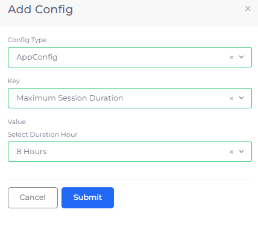
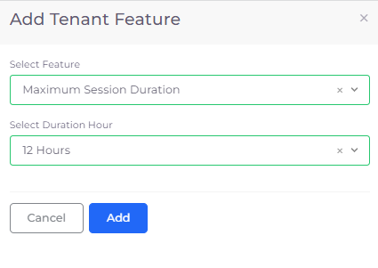
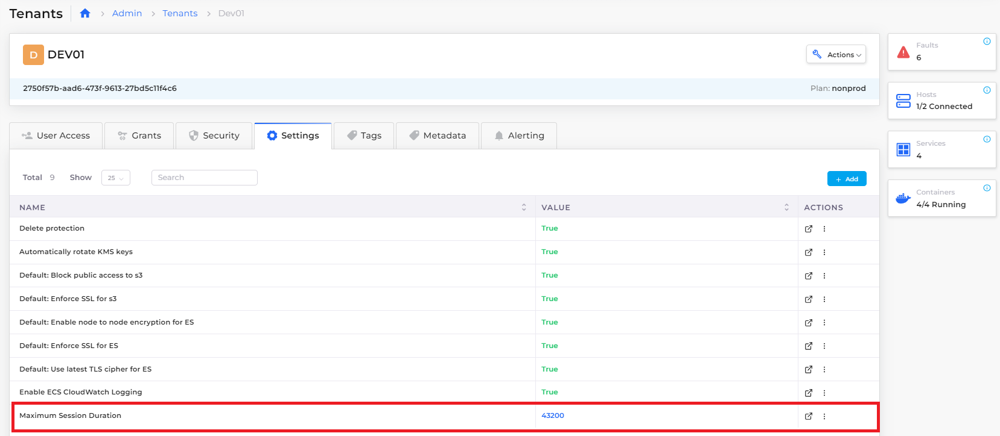

# Set Tenant session duration

Using [AWS Session Management](https://docs.aws.amazon.com/systems-manager/latest/userguide/session-manager.html), you can set session durations for a Tenant. At the end of the session, the Tenant ceases to be active for a particular user, application, or Service.

## Managing Tenant session duration &#x20;

In the DuploCloud Portal, configure the session duration time for all Tenants or for a single Tenant.

For more information about IAM roles and session times in relation to a user, application, or Service, see the [AWS Documentation](https://docs.aws.amazon.com/IAM/latest/UserGuide/id\_roles\_use.html).

### Configuring session duration for all Tenants

1. In the DuploCloud Portal, navigate to **Administrator** -> **System Settings**. The **System Settings** page displays.
2. Click the **System Config** tab.
3.  Click **Add**. The **App Config** pane displays.\

    <figure><figcaption>
<strong>Add Config</strong> pane to set <strong>Key Maximum Session Duration</strong> for all <strong>Tenants</strong> 
</figcaption></figure>
4. From the **Config Type** list box, select **AppConfig**.
5. From the **Key** list box, select **Maximum Session Duration**.
6. From the **Select Duration Hour** list box, select the maximum session time in hours or set a **Custom Duration** in seconds.
7.  Click **Submit**. The **Maximum Session Duration Key** and **Value** are displayed in the **System Config** tab. Note that the **Value** you set for maximum session time in hours is displayed in seconds. You can **Delete** or **Update** the setting in the row's **Actions** menu. \

    <figure><figcaption>
<strong>System Config</strong> tab on <strong>System Settings</strong> page displaying <strong>MaximumSessionDuration</strong> for all Tenants
</figcaption></figure>

### Configuring session duration for a single Tenant

1. In the DuploCloud Portal, navigate to **Administrator** -> **Tenants**. The **Tenants** page displays.
2. From the **Name** column, select the Tenant for which you want to configure session duration time.
3. Click the **Settings** tab.
4.  Click **Add**. The **Add Tenant Feature** pane displays.\

    <figure><figcaption>
Add Tenant Feature pane to set Maximum Session Duration for a single Tenant 
</figcaption></figure>
5. From the **Select Feature** list box, select **Maximum Session Duration**.
6. From the **Select Duration Hour** list box, select the maximum session time in hours or set a **Custom Duration** in seconds.
7.  Click **Add**. The **Maximum Session Duration Name** and **Value** are displayed in the **Settings** tab. Note that the **Value** you set for maximum session time in hours is displayed in seconds. You can **Delete** or **Update** the setting in the row's **Actions** menu. \

    <figure><figcaption>
<strong>Settings</strong> tab on Tenant page displaying <strong>MaximumSessionDuration</strong> for Tenant <strong>dev01</strong> 
</figcaption></figure>
