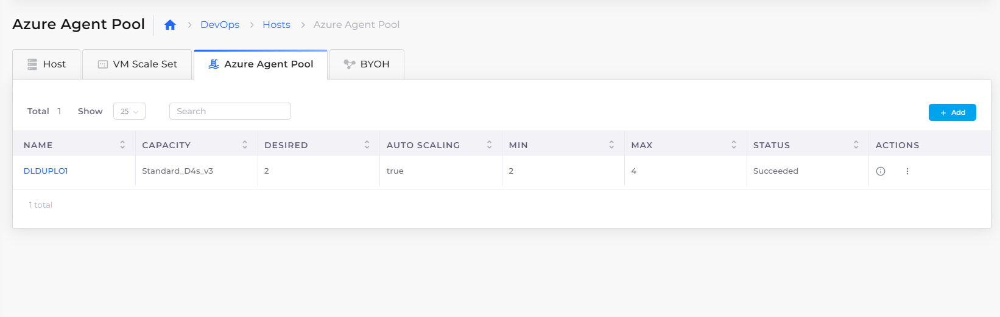

# Agent pool

When you create agent pools to run Azure Kubernetes (AKS) workloads, you create groups of agents available to a pipeline. When you run the pipeline, the pipeline selects the agent that best meets the performance demands of that pipeline.

Agent pools can be [autoscaled](broken-reference) when the **Enable Autoscaling** option is selected in the DuploCloud Portal. Each agent pool contains nodes backed by virtual host machines.

Use the DuploCloud Portal **Hosts** page to create and edit Azure agent pools.

## Creating an agent pool

Create an Azure agent pool for an existing Host in the DuploCloud Portal:

1. Select **Devops** -> **Hosts** from the navigation menu.
2. Select the **Azure Agent Pool** tab. The **Azure Agent Pool** page is displayed.
3. Click **Add**. The **Add Azure Agent Pool** page is displayed.
4.  Provide inputs for the **Instance Type**, **Min Capacity**, and **Max Capacity** fields.

    <figure><figcaption>
Input fields on the <strong>Add Azure Agent Pool</strong> page with <strong>Enable Autoscaling</strong> selected.
</figcaption></figure>
5. Optionally, select **Enable Autoscaling** to autoscale the pool.
6.  Click **Add**. When the agent pool is created, **Succeeded** is displayed in the **Status** column. It may take some time to create the agent pool.

    <figure><figcaption>
Agent pool with <strong>Succeeded</strong> status
</figcaption></figure>

## Editing an agent pool

Edit an agent pool:

1. Select **Devops** -> **Hosts** from the navigation menu.
2. Select the **Azure Agent Pool** tab. The **Azure Agent Pool** page displays.
3. In the **Name** column, select the agent pool that you want to edit.
4.  Select the **Actions** menu and choose **Edit**.

    <figure><figcaption>
Agent pool with the <strong>Actions</strong> menu
</figcaption></figure>
5. In the **Update agent pool capacity** pane, edit the pool configuration.
6. Click **Update**.

