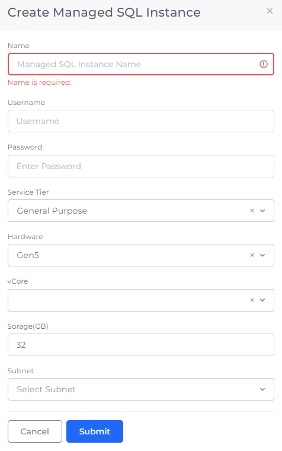

# Azure Managed Instance

## Creating an Azure Managed Instance

1. In the DuploCloud Portal, navigate to **DevOps** --> **Database** --> **Managed Instances**. The **Create Managed SQL Instance** pane displays.
2. Click **Add**.
3. Provide the database **Name**, **Username**, **Password**, and **vCore**. Modify other values as needed.&#x20;
4. Click **Submit**.

<figure><figcaption>
<strong>Create Managed SQL Instance</strong> pane
</figcaption></figure>

## Viewing instance details

You can view Azure Managed Instances and configure other options by selecting the instance you created, from the **Managed Instances** page in the DuploCloud Portal.
