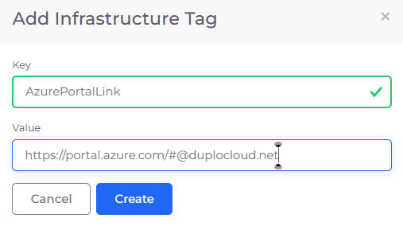
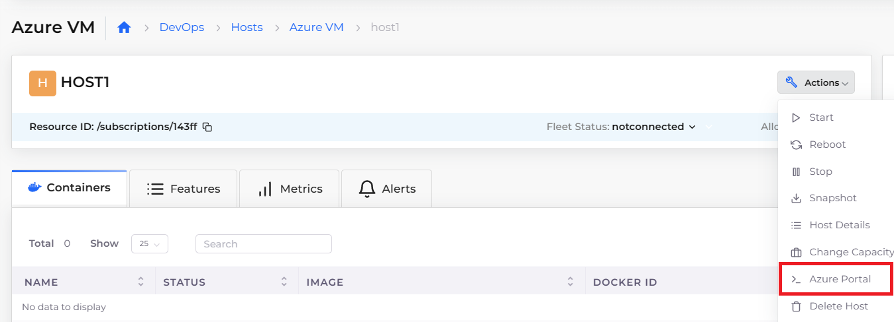

# Azure Portal link

Creating a direct link to the Azure Portal from your DuploCloud Infrastructure saves your time when you work with DuploCloud Azure resources. Instead of toggling between the DuploCloud Portal and the Microsoft Azure Portal, get instant access to the Azure Portal from DuploCloud.


Failure to follow these steps when creating a link to the Azure Portal from the DuploCloud Portal results in the error message:&#x20;

`Error while fetching Azure portal link: Portal url config does not exist`


## Creating a link to the Azure Portal

1. In the DuploCloud Portal, navigate to **Administrator** -> **Infrastructure**. The **Infrastructure** page displays.
2. From the **Name** column, select the Infrastructure for which you want to add a link to the Azure Console.
3. Click the **Metadata** tab.
4. Click **Add**. The **Add Infrastructure Tag** pane displays.
5.  In the **Key** field, enter **AzurePortalLink**.

    

    <figure><figcaption>
<strong>Add infrastructure Tag</strong> pane with <strong>Key AzurePortalLink</strong>
</figcaption></figure>

    

6. In the **Value** field, enter the URL for your Azure Portal.&#x20;
7. Click **Create**.


The **Value** in the example above is DuploCloud's internal Azure Portal link.


## Accessing the Azure Portal

After you [configure Azure Portal link ](azure-portal-link.md#creating-a-link-to-the-azure-portal)to an Infrastructure, access the Azure Console from the DuploCloud Portal in the **Actions** menu for Azure **Hosts**.

1. In the DuploCloud Portal, navigate to **DevOps** -> **Hosts**. The **Hosts** page displays.
2. From the **Name** column, select the Host you are working with.
3. From the **Actions** menu, select **Azure Portal**.

<figure><figcaption>
<strong>HOST1</strong> host page with <strong>Action Menu</strong> displaying <strong>Azure Portal</strong> link
</figcaption></figure>
