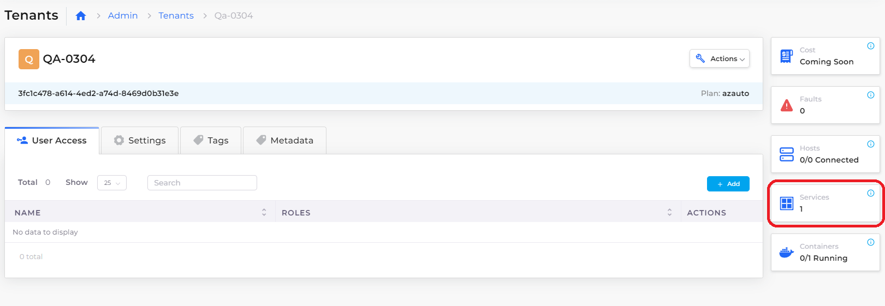

# Containers and Services

## Services <a href="#5-toc-title" id="5-toc-title"></a>

You can deploy any native Docker container in a virtual machine (VM) with the DuploCloud platform. Adding a Service in the DuploCloud Platform is not the same as adding a Kubernetes service.&#x20;

Deploying DuploCloud Services, by clicking the **Add** button in the **AKS/Native** tab, implicitly converts Services into either a deployment set or a StatefulSet. If there are no volume mappings, then the service is mapped to a deployment set. Otherwise, it is mapped to a StatefulSet. Most configuration values are self-explanatory, such as **Images**, **Replicas,** and **Environmental Variables**.

You can supply advanced configuration options in the **Other K8s Config** field. The content of this field maps one-to-one with the Kubernetes API. Configurations for deployment are StatefulSets and are supported by placing the appropriate JSON code in the **Other K8s Config** section. For example, to reference Kubernetes Secrets using a YAML config map, create the following JSON code:&#x20;

```json
"Volumes": [
		{
			"name": "config-volume",
			"configMap": {
				"name": "game-config"
			}
		}
	],
	"VolumesMounts": [
		{
			"name": "config-volume",
			"mountPath": "/etc/config"
		}
	]
}
```

## Adding a DuploCloud Service

1. In the DuploCloud Portal, select **DevOps** -> **Containers** -> **AKS/Native** from the navigation pane.&#x20;
2. Click **Add**. The **Add Service** page displays.
3. Complete the fields on the page, including **Service Name**, **Docker Image** **name**, and number of **Replicas**. Use **Allocation Tags** to deploy the container in a specific set of hosts.&#x20;


Do not use spaces when creating Service or Docker image names.

The number of Replicas that you define must be less than or equal to the number of hosts in the fleet.



### Displaying Services <a href="#7-toc-title" id="7-toc-title"></a>

Once the deployment commands run successfully, click the **Services** tile on the **Tenants** page. Your deployments are displayed and you can now attach [load balancers](load-balancers.md) for the services.

<figure><figcaption><p><strong>Tenants</strong> page with <strong>Services</strong> tile</p></figcaption></figure>

### &#x20;<a href="#7-toc-title" id="7-toc-title"></a>
