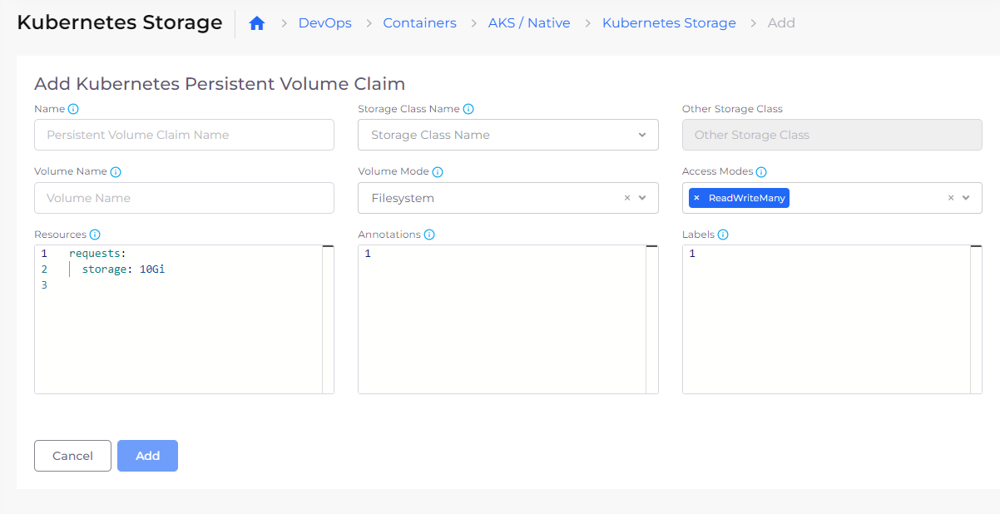
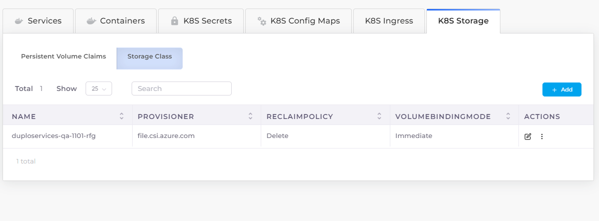
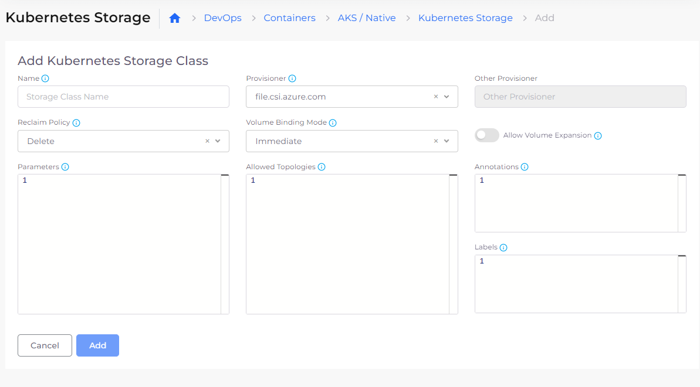

# Configuring Azure Services

## Plans 

The DuploCloud Portal comes configured with a default Plan. A [Plan](../../../getting-started/application-focussed-interface/plan.md) configures your Tenants using a set of templates whose parameters are applied to the Tenants in your [Infrastructure](../infrastructure.md).

## Tenants 

To add a Tenant, navigate to **Administrator** -> **Tenant** in the DuploCloud Portal and click **Add**.

Each [Tenant ](../tenants.md)is mapped to a Namespace in Kubernetes. For example, if a Tenant is called **Analytics** in DuploCloud, the Kubernetes Namespace is called `duploservices-analytics`.&#x20;

All application components within the Analytics Tenant are placed in the `duploservices-analytics` namespace. Since nodes cannot be part of a Kubernetes Namespace, DuploCloud creates a `tenantname` label for all the nodes that are launched within the Tenant. For example, a node launched in the Analytics Tenant is labeled`tenantname: duploservices-analytics`.&#x20;

Any Pods that are launched using the DuploCloud UI have an appropriate Kubernetes `nodeSelector` that ties the Pod to the nodes within the Tenant. If you are deploying via `kubectl,`ensure that your deployment is using the proper `nodeSelector`.

### Kubectl token and config

DuploCloud provides a way to connect directly to the Cluster namespace using the `kubectl` token.&#x20;

1. In the DuploCloud Portal, navigate to **DevOps** --> **Containers** --> **AKS/Native** .
2. Select **KubeCtl Token.**
3. Enter the following commands:

 (3).png>)

After entering these commands,  `kubectl` is configured to access the Kubernetes cluster for your Tenant namespace.

## Hosts 

Once the Tenant is created:

1. In the DuploCloud Portal, navigate to **DevOps -> Hosts**. The **Azure VM** page displays.&#x20;
2. Select the Tenant that you created from the **Tenant** list box.&#x20;
3. Click **Add**.

<figure><figcaption>
<strong>Azure VM</strong> hosts page
</figcaption></figure>

## Configure Kubernetes Storage

You can configure the Storage Class and Persistent Volume Claims (PVCs) from the DuploCloud Portal.&#x20;

1. In the DuploCloud Portal, navigate to **DevOps** --> **Containers** --> **AKS/Native**.
2.  Click the **K8S Storage** tab. The **Kubernetes Storage** page displays. From this page, you define your Kubernetes [**Persistent Volume Claims**](https://kubernetes.io/docs/concepts/storage/persistent-volumes/) and [**Storage Classes**](https://kubernetes.io/docs/concepts/storage/storage-classes/). The **Persistent Volume Claims** option is selected by default.

    <figure><figcaption>
The <strong>Persistent Volume Claims</strong> option on the <strong>Kubernetes Storage</strong> page
</figcaption></figure>
3.  Click **Add**. The **Add Kubernetes Persistent Volume Claim** page displays.

    <figure><figcaption>
The <strong>Add Kubernetes Persistent Volume Claim</strong> page
</figcaption></figure>
4. Define the PVC **Name**, **Storage Class Name**, **Volume Name**, **Volume Mode**, and other details such as volume **Access Modes**.
5. Click **Add**.
6.  On the **Kubernetes Storage** page, select the **Storage Class** option.&#x20;

    <figure><figcaption>
The <strong>Storage Class</strong> option on the <strong>Kubernetes Storage</strong> page
</figcaption></figure>
7.  Click **Add**. The **Add Kubernetes Storage Class** page displays.

    <figure><figcaption>
The <strong>Add Kubernetes Storage Class</strong> page
</figcaption></figure>
8. Define the Storage Class **Name**, **Provisioner**, **Reclaim Policy**, and **Volume Binding Mode.** Select other options, such as whether to **Allow Volume Expansion**.
9. Click **Add**.

Reference these [storage option examples](storage-options.md) as you create your PVCs and Storage Classes.

## Add Services

### Docker 

You can deploy any native Docker container in a virtual machine (VM) with the DuploCloud platform.&#x20;

1. In the DuploCloud Portal, select **DevOps** -> **Containers** -> **AKS/Native** from the navigation pane.&#x20;
2. Click **Add**. The **Add Service** page displays.
3. Complete the fields on the page, including **Service Name**, **Docker Image** **name**, and number of **Replicas**. Use **Allocation Tags** to deploy the container in a specific set of hosts.&#x20;


Do not use spaces when creating Service or Docker image names.

The number of Replicas that you define must be less than or equal to the number of hosts in the fleet.


<figure><figcaption>
<strong>Add Service</strong> page
</figcaption></figure>

## Setting Docker registry credentials 

Set Docker credentials:

1. In the DuploCloud Portal, navigate to **DevOps** --> **Containers** --> **AKS/Native**.
2. Click the options menu ( ⁞ ) and select **Docker Credentials**. The **Set Docker registry Creds** pane opens.
3. Supply your Docker credentials and click **Submit**.
