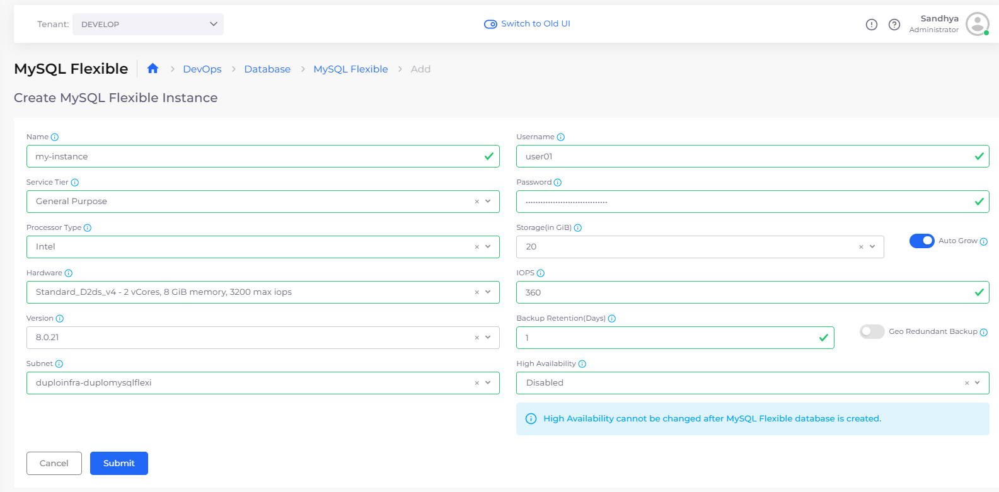
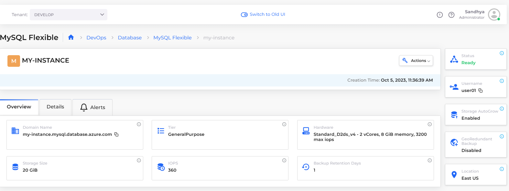
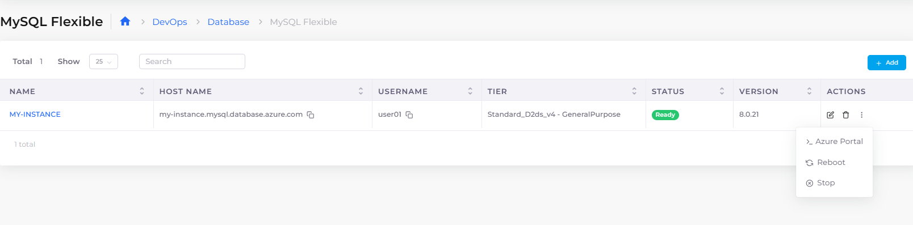

# MySQL Flexible Server

Use a [Microsoft Azure MySQL Flexible Server](https://learn.microsoft.com/en-us/azure/mysql/flexible-server/overview) managed database service in DuploCloud. Flexible Server is designed for more granular control and flexibility over database management functions and configuration settings and allows users access to High Availability (HA) in both single availability zones and across multiple availability zones. Flexible servers provide better cost optimization and are ideal for workloads that don’t need continuous full-compute capacity.

## Creating a MySQL Flexible Server

1. In the DuploCloud Portal, navigate to **DevOps** --> **Database** --> **MySQL Flexible.**
2. Click **Add**. The **MySQL FLexible** page displays.
3. Provide the database **Name**, **User Name**, **Service Tier**, **Password**, Database **Version**, and other required fields. As you complete the fields on the page, additional fields display, such as **High Availability**, if applicable.
4. Click **Submit**.


You cannot change the value of the High Availability field, once the MySQL Flexible Server is created.


<figure><figcaption>
<strong>MySQL Flexible</strong> page
</figcaption></figure>

## Viewing a MySQL Flexible Server

You can view details and configure other options by selecting the MySQL Flexible Server you created, from the **MySQL Flexible** page in the DuploCloud Portal.

<figure><figcaption>
<strong>MySQL Flexible</strong> page with <strong>Overview</strong> tab displayed
</figcaption></figure>

## Additional supported actions

From the **MySQL Flexible** page, you can click the **Actions** menu for each **Flexible Server** and select the appropriate option to enter the **Azure Portal**, **Reboot** the server, or **Stop** the server.

<figure><figcaption>
<strong>MySQL Flexible</strong> page with <strong>Actions</strong> menu expanded, displaying options for the <strong>MY-INSTANCE</strong> Flexible Server
</figcaption></figure>

