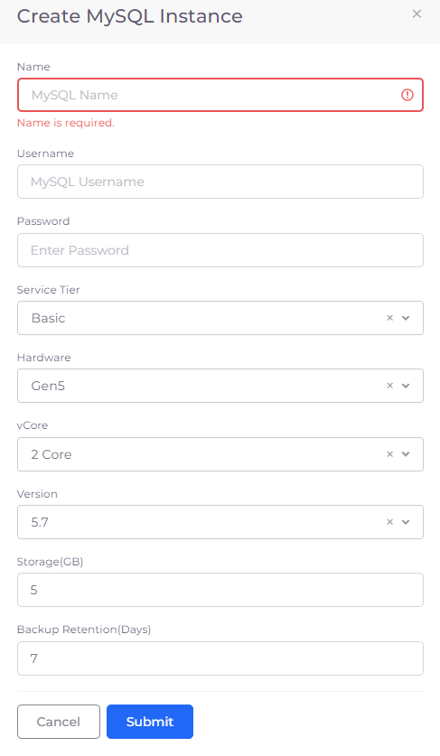

# MySQL Server database

## Creating a MySQL instance

1. In the DuploCloud Portal, navigate to **DevOps** --> **Database** --> **MySQL.**
2. Click **Add**.
3. Provide the database **Name**, **Username**, **Password**, and Database **Version**.&#x20;
4. Click **Submit**.

<figure><figcaption>
<strong>Create MySQL Instance</strong> pane
</figcaption></figure>

## Viewing database details

You can view database details and configure other options by selecting the MySQL instance you created, from the **MySQL** page in the DuploCloud Portal.
