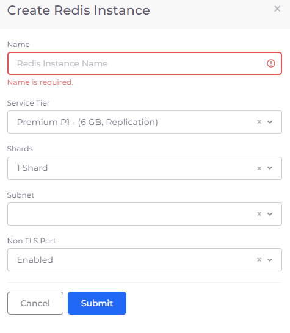
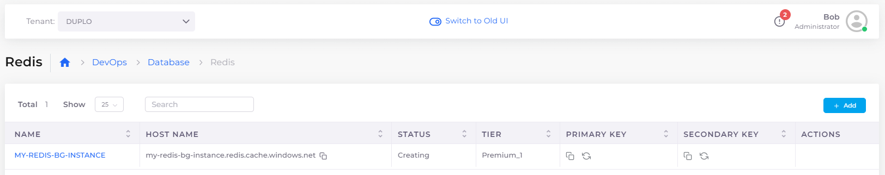
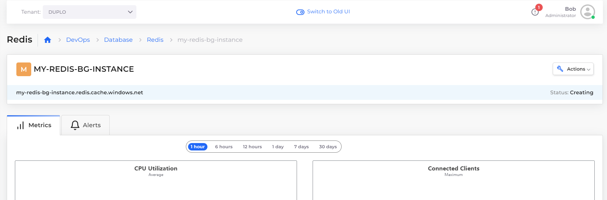
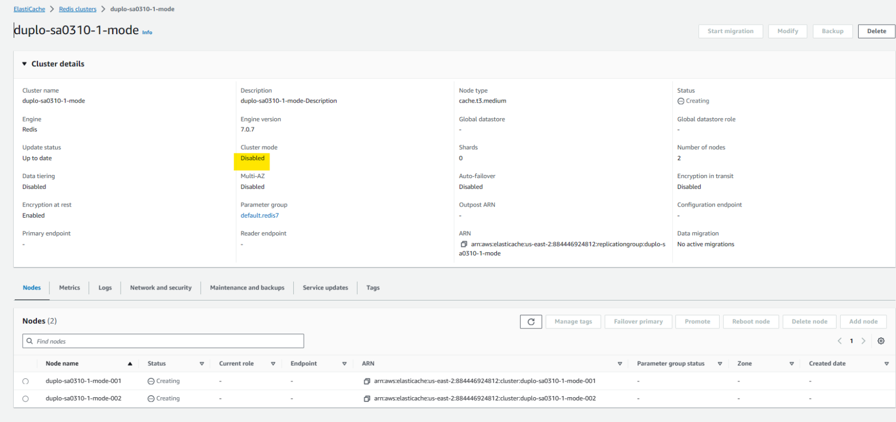

# Redis database

## Creating a Redis database instance

1. In the DuploCloud Portal, navigate to **DevOps** --> **Database** --> **Redis**. The **Create Redis Instance** pane displays.
2. Click **Add**.
3. Provide the database **Name.**
4. From the **Subnet** list box, select an available subnet you have defined in your Infrastructure.&#x20;
5. Modify values for **Service Tier**, **Shards**, and **Non TLS Port**, as needed.
6. Click **Submit**.

<figure><figcaption>
<strong>Create Redis Instance</strong> pane
</figcaption></figure>

### Viewing Database details

View **Metrics** and **Alerts** by selecting the Redis instance you created, from the Redis page in the DuploCloud Portal.

<figure><figcaption>
<strong>Redis</strong> page in DuploCloud Portal
</figcaption></figure>

<figure><figcaption>
<strong>Metrics</strong> and <strong>Alerts</strong> tabs for Redis database instance
</figcaption></figure>

## Enabling Cluster Mode for a Redis database

You may want to enable Cluster Mode for the Redis database to scale for your performance requirements. For more information on this topic, see the [Azure Documentation](https://learn.microsoft.com/en-us/azure/azure-cache-for-redis/cache-how-to-scale?tabs=scale-up-and-down-with-basic-standard-and-premium).


You enable Cluster Mode using the Azure Portal. See [this topic](../../use-cases/azure-portal-link.md) in the DuploCloud documentation to get a link to the Azure Portal in DuploCloud.


1. In the DuploCloud Portal, navigate to **DevOps** -> **Databases**.
2. Select **Redis**.
3. Select the database for which you want to enable Cluster Mode from the **Name** column.
4. Click the **Actions** menu, and select **Azure Portal**. A browser launches and redirects you to the Azure Portal for log-in.
5. Enable Cluster Mode for the Redis database in the Azure Portal.

<figure><figcaption>
<strong>Cluster mode</strong> <strong>Disabled</strong> in the Azure Portal for Redis database <strong>duplo-sa0310-1-mode</strong>
</figcaption></figure>
