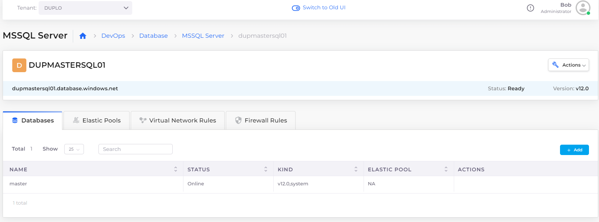

# MSSQL Server database

### Creating the MSSQL Server

1. In the DuploCloud Portal, navigate to **DevOps** --> **Database** --> **MSSQLServer.**
2. Provide the database **Name**, **Username**, **Password**, and Database **Version**.&#x20;
3. Click **Submit**.

 (1) (1).png>)

### Viewing database details

You can view database details and configure **Elastic Pools**, **Network Rules**, and **Firewall Rules** by selecting the database from the **MSSQL Server** page in the DuploCloud Portal and clicking the appropriate tab.

<figure><figcaption>
<strong>MSSQL Server</strong> page
</figcaption></figure>
