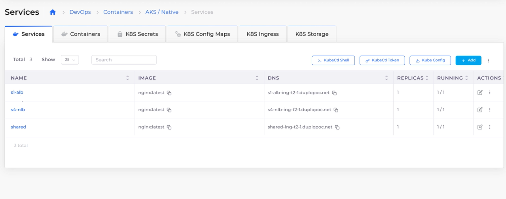
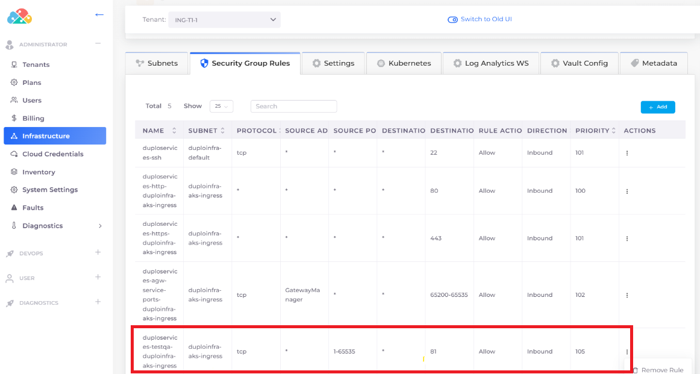
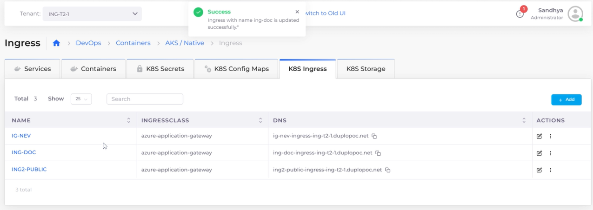

# Ingress

Ingress controllers abstract the complexity of routed Kubernetes application traffic, providing a bridge between Kubernetes services and services that you define.

As an example, this procedure guides you through enabling and configuring Ingress to support two load balancers:

* An Application Load Balancer (ALB). An ALB provides outbound connections to cluster nodes inside the AKS virtual network, translating the private IP address to a public IP address as part of its Outbound Pool.
* A Network Load Balancer (NLB). An NLB distributes traffic across several servers by using the TCP/IP networking protocol. By combining two or more computers that are running applications into a single virtual cluster, NLB provides reliability and performance for web servers and other mission-critical servers.


To add an SSL certificate to a service using Kubernetes Ingress, see Using the SSL certificate for Ingress in DuploCloud in the [Import SSL Certificates](../prerequisites/import-ssl-certificates.md) prerequisite for Azure in DuploCloud.


## Enable the Ingress Controller

Before you add an Ingress rule, you need to enable the Ingress Controller for the application gateway.

1. In the DuploCloud Portal, navigate to **Administrator** -> **Infrastructure**.
2. Select the Infrastructure from the **Name** column.
3. Click the **Settings** tab.
4. Click **Add**. The **Infra-Set Custom Data** pane displays.
5. In the **Setting Name** field, select **Enable App Gateway Ingress Controller**. Click **Enable** and **Set**. In the **Settings** tab, the **Enable App Gateway Ingress Controller** setting contains the **true** value.

<figure><figcaption>
<strong>Enable App Gateway Ingress Controller</strong> configured with <strong>true</strong> value
</figcaption></figure>

## Adding a Load Balancer Listener using the K8S NodePort

Add a load balancer listener that uses the Kubernetes NodePort (K8S NodePort).


Using Kubernetes Health Check allows AKS's Application Load Balancer to determine whether your service is running properly.&#x20;


### Before you begin

You must create [Services](./) to run the ALB and NLB load balancers. In this example, we name these services **s1-alb** and **s4-nlb**, respectively.&#x20;

<figure><figcaption>
<strong>Services</strong> running ALB and NLB
</figcaption></figure>

### Adding a Load Balancer Listener

1. In the DuploCloud Portal, navigate **DevOps** -> **Containers -> AKS/Native**.
2. On the **Services** page, select the Service name in the **Name** column.
3.  Click the **Load Balancers** tab.

    <figure><figcaption>
<strong>Load Balancer</strong> tab on the <strong>AKS Service</strong>s page
</figcaption></figure>
4. Click **Configure Load Balancer**. The **Add Load Balancer Listener** pane appears.
5. In the **Select Type** field, select **K8S Node Port**.&#x20;
6. In the **Health Check** field, add the Kubernetes Health Check URL for this container.&#x20;
7. Complete the other fields in the **Add Load Balancer Listener** and click **Add**.

## Add the Kubernetes Ingress rule

Add an Ingress rule to listen on port 80 (in this example) using both ALB and NLB load balancers.


If you use a port other than 80, you must define an additional Security Group rule for that port. See [this section](ingress.md#adding-a-security-group-rule-for-a-port-value-other-than-80) for more information.



DuploCloud Platform supports defining multiple paths in Ingress.


1. In the DuploCloud Portal, navigate to **DevOps -> Containers -> AKS / Native.**
2. Click the **K8S Ingress** tab.
3. Click **Add**. The **Add Kubernetes Ingress** page displays.
4.  Supply the **Ingress Name**, select the Ingress Controller **azure-application-gateway**, and set **Visibility** to **Public**.

    <figure><figcaption>
<strong>Add Kubernetes Ingress</strong> page for AKS
</figcaption></figure>
5. Click **Add Rule**. The **Add Ingress Rule** pane displays. Specify a unique **Path** identifier.
6.  In the **Service Name** field, select **s1-alb:80**. Click **Add Rule** to add the ALB load balancer.

    <figure><figcaption>
<strong>Add Ingress Rule</strong> pane
</figcaption></figure>
7. Add another rule by clicking **Add Rule**. The **Add Ingress Rule** pane displays. In the **Service Name** field, select **s4-nlb:80**. Click **Add Rule** to add the NLB load balancer.
8. On the **Add Kubernetes Ingress** page, **Add** to finish setting up the load balancer rules.

### Adding a Security Group Rule


Port **80** is configured by default when adding Ingress. If you want to use a custom port number other than **80**, set up an additional Security Group Rule for the custom port using this procedure.&#x20;


1. In the DuploCloud Portal, navigate to **Administrator** -> **Infrastructure**.
2. Select the Infrastructure from the **Name** column.
3. Click the **Security Group Rules** tab.&#x20;
4.  Click **Add**. The **Add Infrastructure Security** pane displays.

    <figure><figcaption>
<strong>Add Infrastructure Security</strong> pane
</figcaption></figure>
5. Define the rule and click **Add**. The rule is added to the **Security Group Rules** list.

<figure><figcaption>
<strong>Security Group Rules</strong> tab with rule for port <strong>81</strong>
</figcaption></figure>

## View Ingress

Once Ingress is configured, you can access Services based on the rules for each **DNS**.

<figure><figcaption>
<strong>K8S Ingress</strong> tab on the AKS <strong>Ingress</strong> page 
</figcaption></figure>

By executing `curl` commands, you can see the difference in the output for each service. Configured services are accessed based on the DNS name specified in the DuploCloud Portal and the paths that you configured when you added Ingress rules.

> `>curl http://sample-ingress.qaapps.duplocloud.net/path1/` \
> `this is service1`\
> \
> `>curl http://sample-ingress.qaapps.duplocloud.net/path2/` \
> `this is service2`\
> \
> `>curl -H "Host: example.com" http://sample-ingress.qaapps.duplocloud.net/ this is service3`
