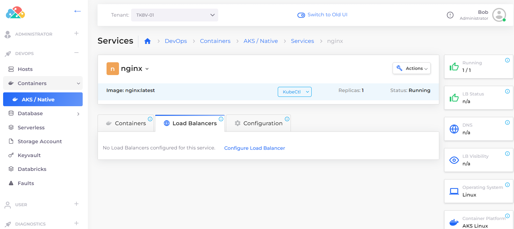

# Load Balancers

Load Balancers are essential when running a service. They expose the containers and images in which your application resides. And when your containers are run inside a private network, you need a load balancer to listen on the correct ports to access the application.

## Add a Load Balancer Listener&#x20;

Add a load balancer listener that uses the Kubernetes NodePort (K8S NodePort).


Using Kubernetes Health Check allows AKS's Application Load Balancer to determine whether your service is running properly.&#x20;


### Before you begin

You must create [Services ](broken-reference)before adding load balancers and listeners. In this example, we name these services **s1-alb** and **s4-nlb**, respectively.&#x20;

<figure><figcaption>
<strong>Services</strong> running ALB and NLB
</figcaption></figure>

### Adding a Load Balancer Listener

1. In the DuploCloud Portal, navigate **DevOps** -> **Containers** -> **AKS/Native**.
2. On the **Services** page, select the Service name in the **Name** column.
3.  Click the **Load Balancers** tab.

    <figure><figcaption>
<strong>Load Balancer</strong> tab on the <strong>AKS Service</strong>s page
</figcaption></figure>
4. Click **Configure Load Balancer**. The **Add Load Balancer Listener** pane appears.
5. Select a type (such as **K8S Node Port)** in the **Select Type** field.&#x20;
6. Add the Kubernetes Health Check URL for this container in the **Health Check** field.&#x20;
7. Complete the other fields in the **Add Load Balancer Listener** and click **Add**.

## Configuring a Load Balancer using rules

Rules specify specific configurations for various types of Load Balancers.

See the [Ingress ](ingress.md)use case for an example of how to configure Load Balancers using rules for an inbound Application Load Balancer (ALB) and an outbound Network Load Balancer (NLB).&#x20;
