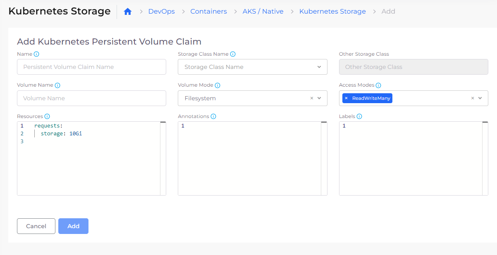
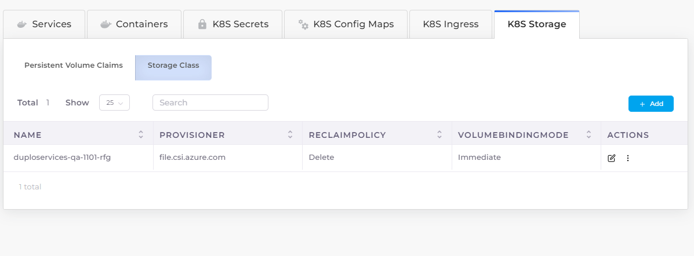
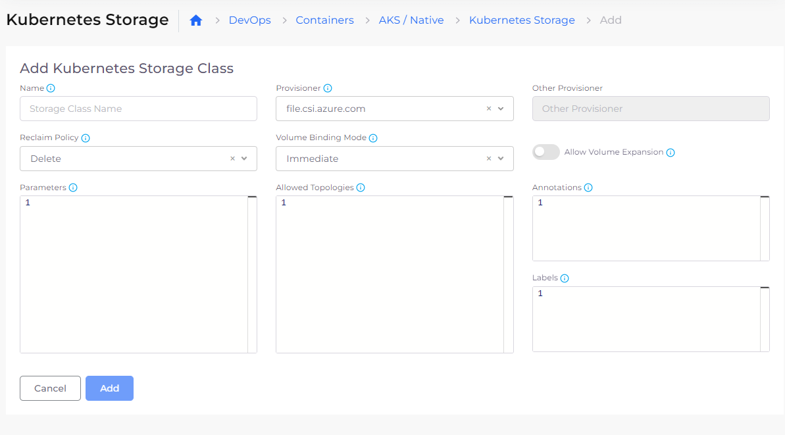

# Storage

## Configure Kubernetes Storage

You can configure the Storage Class and Persistent Volume Claims (PVCs) from the DuploCloud Portal.&#x20;

1. In the DuploCloud Portal, navigate to **DevOps** --> **Containers** --> **AKS/Native**.
2.  Click the **K8S Storage** tab. The **Kubernetes Storage** page displays. From this page, you define your Kubernetes [**Persistent Volume Claims**](https://kubernetes.io/docs/concepts/storage/persistent-volumes/) and [**Storage Classes**](https://kubernetes.io/docs/concepts/storage/storage-classes/). The **Persistent Volume Claims** option is selected by default.

    <figure><figcaption>
The <strong>Persistent Volume Claims</strong> option on the <strong>Kubernetes Storage</strong> page
</figcaption></figure>
3.  Click **Add**. The **Add Kubernetes Persistent Volume Claim** page displays.

    <figure><figcaption>
The <strong>Add Kubernetes Persistent Volume Claim</strong> page
</figcaption></figure>
4. Define the PVC **Name**, **Storage Class Name**, **Volume Name**, **Volume Mode**, and other details such as volume **Access Modes**.
5. Click **Add**.
6.  On the **Kubernetes Storage** page, select the **Storage Class** option.&#x20;

    <figure><figcaption>
The <strong>Storage Class</strong> option on the <strong>Kubernetes Storage</strong> page
</figcaption></figure>
7.  Click **Add**. The **Add Kubernetes Storage Class** page displays.

    <figure><figcaption>
The <strong>Add Kubernetes Storage Class</strong> page
</figcaption></figure>
8. Define the Storage Class **Name**, **Provisioner**, **Reclaim Policy**, and **Volume Binding Mode.** Select other options, such as whether to **Allow Volume Expansion**.
9. Click **Add**.

Reference these [storage option examples](storage-options.md) as you create your PVCs and Storage Classes.
