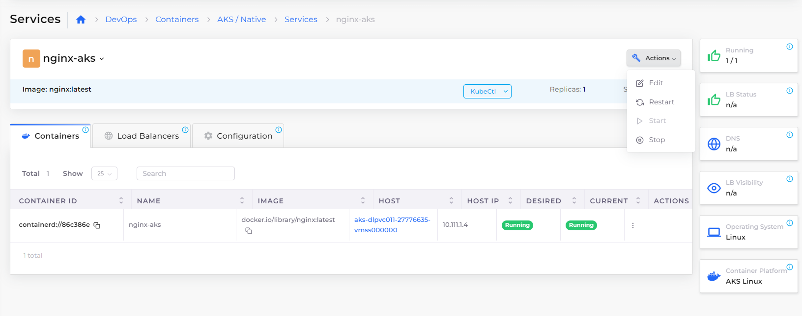

# Mounting ConfigMaps and Secrets as files

In Kubernetes, you can mount application configurations or secrets as files.&#x20;

## Creating and Mounting a Kubernetes ConfigMap


Before you create and mount the Kubernetes [ConfigMap](https://kubernetes.io/docs/concepts/configuration/configmap/), you must create a DuploCloud [Service](broken-reference).&#x20;


### Creating a Kubernetes ConfigMap

1. In the DuploCloud Portal, navigate to the **DevOps -> Containers -> AKS / Native** page
2. Click the **K8S Config Maps** tab.
3. Click **Add**. The Add Kubernetes Config Map pane displays.&#x20;
4. **Name** the ConfigMap you want to create, such as **my-config-map**.
5. Add a **Data** key/value pair for each file in your config map, separated by a colon (**`:`**). The key is the file name, and the value is the file's contents.
6. Click **Create**.


### Editing the DuploCloud Service

1. In the DuploCloud Portal, navigate to the **DevOps -> Containers -> AKS/ Native** page.
2. Click the **Services** tab.
3. Select the service you want to modify from the **Name** column.
4. Click the **Actions** menu and select **Edit**.

<figure><figcaption><p><strong>Actions</strong> menu on the <strong>Services</strong> page</p></figcaption></figure>

###

### Mounting the Kubernetes ConfigMap as a volume

1. On the **Edit Service: **_**service\_name**_** Basic Options** page, click **Next** to navigate to the **Advanced Options** page.
2. On the **Advanced Options** page, in the **Volumes** field, enter the configuration YAML to mount the ConfigMap as a volume.&#x20;

#### Example: mounting a ConfigMap as a volume

For example, to mount a config map named `my-config-map` to a directory named `/app/my-config`, enter the following YAML code block in the **Volumes** field:

```yaml
- Name: my-config
  Path: /app/my-config
  Spec:
    ConfigMap:
      Name: my-config-map
```

<figure><figcaption><p>Mouting ConfigMap as a volume in the <strong>Advanced Options</strong> page </p></figcaption></figure>

#### Example: adding a Key value to select individual ConfigMap items

If you want to select individual ConfigMap items, specifying the subpath for mounting, you can use a different configuration.  For example, if you want the key named `my-file-name` to be mounted to `/app/my-config/config-file` ,  use the following YAML:

```yaml
  Path: /app/my-config
  Spec:
    ConfigMap:
      Name: my-config-map
      Items:
      - Key: my-file-name
        Path: config-file
```

## Creating and Mounting a Kubernetes Secret

Before you create and mount a [Kubernetes Secret](https://kubernetes.io/docs/concepts/configuration/secret/), you must create a DuploCloud [Service](broken-reference).

### Creating a Kubernetes Secret&#x20;

1. In the DuploCloud Portal, navigate to the **DevOps -> Containers -> AKS/ Native** page.
2. Click the **K8S Secrets** tab.
3. Click **Add**. The **Add Kubernetes Secret** pane displays.
4. Enter the **Secret Name that** you want to create, such as **my-secret-files**.
5. Add **Secret Details** such as a data key/value pair for each file in your secret. The key is the file name, and the value is the file's contents, separated by a colon (**`:`**).&#x20;
6. Click **Add** to create the secret.


### Creating a multi-line Kubernetes Secret

1. Follow the steps in [Creating a Kubernetes Secret](mounting-config-as-files.md#creating-a-kubernetes-secret), defining a Key value using the `PRIVATE_KEY_FILENAME`  in the **Secret Details** field, as shown below.&#x20;
2. Click **Add** to create the multi-line secret.


### Mount a Kubernetes Secret as a volume

1. In the DuploCloud Portal, [edit the DuploCloud Service](mounting-config-as-files.md#editing-the-duplocloud-service).
2. On the **Edit Service: **_**service\_name**_** Basic Options** page, click **Next** to navigate to the **Advanced Options** page.
3. On the **Advanced Options** page, in the **Volumes** field, enter the configuration YAML to mount the Secret as a volume.&#x20;

#### Example: mounting a Kubernetes Secret as a volume

For example, to mount a Secret named `my-secret-files` to a directory named `/app/my-config`, enter the following YAML code block in the **Volumes** field:

```yaml
- Name: my-config
  Path: /app/my-config
  Spec:
    Secret:
      SecretName: my-secret-files
```


#### Example: adding a Key value to select individual Secret items&#x20;

If you want to select individual Secret items, specifying the subpath for mounting, you can use a different configuration.  For example, if you want the key named `secret-file` to be mounted to `/app/my-config/config-file` ,  use the following YAML:

```yaml
- Name: my-config
  Path: /app/my-config
  Spec:
    Secret:
      SecretName: my-secret-files
      Items:
      - Key: secret-file
        Path: config-file
```
