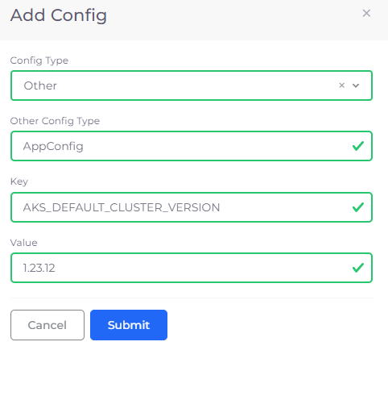
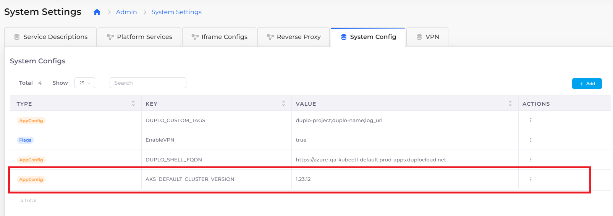

# Set the AKS cluster version

DuploCloud contains many features that leverage Kubernetes in your cloud environment. In order to create Kubernetes clusters with DuploCloud Azure, you must set the default version of your AKS cluster in DuploCloud's configuration.


If you do not set the default AKS cluster version, or keep it updated to your current AKD cluster version release, DuploCloud may be unable to create Kubernetes clusters.

Failure to create Kubernetes clusters is often indicated by empty values for **Server Endpoint** and **Token**.&#x20;

For example, in the DuploCloud Portal, navigate to **Administrator -> Infrastructure**. Select your Infrastructure **Name** and click the **Kubernetes** tab. If the **Server Endpoint** and **Token** fields are empty, this indicates a failure occurred when attempting to create a Kubernetes cluster.


## Setting the default AKS cluster version for DuploCloud

To set the default AKS cluster version and enable Kubernetes cluster creation:

1. In the DuploCloud Portal, navigate to **Administrator** -> **System Settings**.
2. Click the **System Config** tab.
3. In the **System Configs** section, click **Add**. The **Add Config** pane displays.
4. Select **Other** from the **Config Type** list box.
5. Select **AppConfig** from the **Other Config Type** list box.
6. In the **Key** list box, type **AKS\_DEFAULT\_CLUSTER\_VERSION**.
7.  In the **Value** field, enter the default AKS cluster version number (for example, **1.23.12**). When you upgrade your AKS cluster, you will need to update the value of **AKS\_DEFAULT\_CLUSTER\_VERSION**.

    <figure><figcaption>
<strong>Add Config</strong> pane
</figcaption></figure>
8. Click **Submit**. The key and value are displayed in the **System Config** tab.

<figure><figcaption>
<strong>System Config</strong> tab with <strong>AKS_DEFAULT_VERSION_NUMBER</strong> configured
</figcaption></figure>
