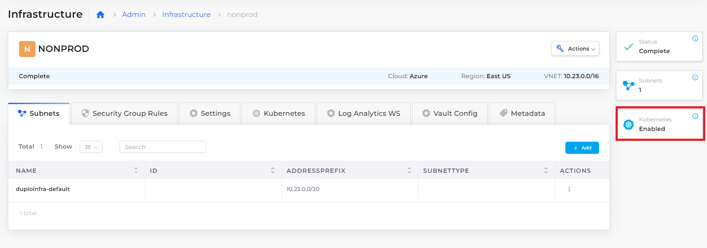

# Step 1:  Create Infrastructure and Plan

Each DuploCloud Infrastructure is a Virtual Private Cloud (VPC) instance that resides in a region containing Kubernetes clusters, AKS clusters, GKE clusters, EKS clusters, or a combination of all of these. An Infrastructure can reside On-Premises (On-Prem) or in a Public Cloud.

After you supply a few basic inputs DuploCloud creates an Infrastructure for you, within Azure as well as within DuploCloud, with a few clicks. Behind the scenes, DuploCloud does a lot with what little you supply — generating subnets, NAT gateway, routes, and a cluster in the region.

With the Infrastructure as your foundation, you can customize an extensible, versatile Platform Engineering development environment by adding Tenants, Plans, Hosts, Services, and more.

## Prerequisites

Before starting this tutorial:

* Learn more about DuploCloud [Infrastructure](../../getting-started/application-focussed-interface/infrastructure.md)s, [Plan](../../getting-started/application-focussed-interface/plan.md)s, and [Tenant](../../getting-started/application-focussed-interface/tenant.md)s.
* Reference the [Access Control](../../administrator-tools/access-control/) documentation to create User IDs with the **Administrator** role. In order to perform the tasks in this tutorial, you must have Administrator privileges.

## Creating a DuploCloud Infrastructure

1. In the DuploCloud Portal, navigate to **Administrator** -> **Infrastructure**.&#x20;
2.  Click **Add**. The **Add Infrastructure** page displays.

     (1).png>)
3. From the table below, enter the values that correspond to the fields on the **Add Infrastructure** page and click **Create** to create the Infrastructure.&#x20;

| Add Infrastructure page field  | Value                            |
| ------------------------------ | -------------------------------- |
| **Name**                       | `nonprod`                        |
| **Subscription**               | _`YOUR_AZURE_SUBSCRIPTION_NAME`_ |
| **VNET CIDR**                  | `10.23.0.0/16`                   |
| **Subset CIDR**                | `10.23.0.0/20`                   |
| **Cloud**                      | `Azure`                          |
| **Region**                     | _`YOUR_GEOGRAPHIC_REGION`_       |

.png>)


While the Infrastructure is being created, a **Pending** status displays in the Infrastructure page **Status** column, often with additional information about what part of the Infrastructure DuploCloud is currently creating.&#x20;

When creation completes, a status of **Completed** displays.&#x20;


## Verifying that a Plan exists for your infrastructure

Every DuploCloud Infrastructure generates a Plan. Plans are sets of templates that are used to configure the Tenants, or workspaces, in your Infrastructure. You will set up Tenants in the next tutorial step.

Before continuing to the next step in this tutorial, however, confirm that a Plan exists that corresponds to your newly created Infrastructure.

1. In the DuploCloud Portal, navigate to **Administrator** -> **Plans**. The **Plans** page displays.
2. Verify that a Plan exists with the name **NONPROD,** the name that you gave to the Infrastructure you created.

## Enabling the AKS Kubernetes Cluster

Once your Infrastructure and Plan have been created, the final step before creating a Tenant is to enable Azure Kubernetes Service (AKS) to connect with Azure cloud management.

1. In the Infrastructure page, in the **Name** column, select the **NONPROD** Infrastructure that you created.
2. Click the **Kubernetes** tab. The following message displays: **Kubernetes cluster is not yet enabled. Click Here to enable the Kubernetes Cluster**.
3. Click on the **Click Here** hyperlink. The **Configure AKS Cluster** pane displays.
4. Accept the default values and click **Create** to enable the AKS service for your Infrastructure.&#x20;

DuploCloud begins creating and configuring an AKS cluster using Kubernetes. You receive an alert message when the Infrastructure has been updated.&#x20;


It may take some time for enablement to complete. Use the **Kubernetes** card in the Infrastructure screen to monitor the status, which should display as **Enabled** when completed. You can also monitor progress by using the **Kubernetes** tab, as DuploCloud generates your **Cluster Name**, **Default VM Size**, **Server Endpoint**, and **Token**.&#x20;


## Check your work

You previously verified that your Infrastructure and Plan were created.

When AKS has been **Enabled**, details are listed in the **Kubernetes** tab. The Infrastructure page also displays the **Enabled** status on the **Kubernetes card**.

.png>)

<figure><figcaption>
Nonprod <strong>Infrastructure</strong> page with <strong>Kubernetes Enabled</strong>
</figcaption></figure>
