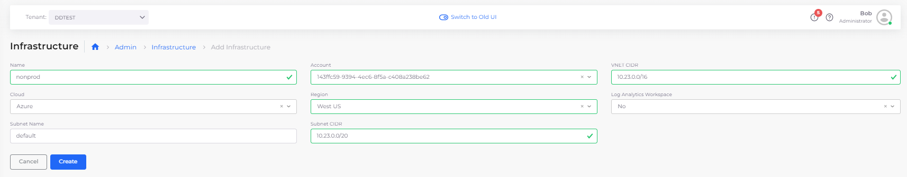

# Step 1:  Create Infrastructure and Plan

Each DuploCloud Infrastructure is a connection to a unique Virtual Private Cloud (VPC) network that resides in a region that can host Kubernetes clusters. An Infrastructure can reside On-Premises (On-Prem) or in a Public Cloud.

After you supply a few basic inputs DuploCloud creates an Infrastructure for you, within Azure and within DuploCloud, with a few clicks. Behind the scenes, DuploCloud does a lot with what little you supply — generating subnets, NAT gateway, routes, and a cluster in the region.

With the Infrastructure as your foundation, you can customize an extensible, versatile Platform Engineering development environment by adding Tenants, Hosts, Services, and more.

_Estimated time to complete Step 1: 40 minutes. Much of this time is consumed by DuploCloud's creation of the Infrastructure and enabling your AKS cluster with Kubernetes._

## Prerequisites

Before starting this tutorial:

* Learn more about DuploCloud [Infrastructure](../../getting-started/application-focussed-interface/infrastructure.md)s, [Plan](../../getting-started/application-focussed-interface/plan.md)s, and [Tenant](../../getting-started/application-focussed-interface/tenant/)s.
* Reference the [Access Control](../../administrator-tools/access-control/) documentation to create User IDs with the **Administrator** role. In order to perform the tasks in this tutorial, you must have Administrator privileges.

## Creating a DuploCloud Infrastructure

1. In the DuploCloud Portal, navigate to **Administrator** -> **Infrastructure**. 
2.  Click **Add**. The **Add Infrastructure** page displays. \

    
3. From the table below, enter the values that correspond to the fields on the **Add Infrastructure** page. Accept all other default values for fields not specified. 
4. Click **Create** to create the Infrastructure. It may take up to half an hour to create the Infrastructure. When creation completes, a status of **Complete** displays. 

## Enable Kubernetes for Azure

1. In the DuploCloud Portal, navigate to **Administrator** -> **Infrastructure**. 
2. Select the Infrastructure you created.
3. Click the **Kubernetes** tab.
4. Select the **Click Here** link. The **Configure AKS Cluster** pane displays.
5. Enter a **Cluster Name**.
6. Select the **Node VM Size** from the list box.
7. Click Create. It may take some time for enablement to complete. Use the **Kubernetes** card in the Infrastructure screen to monitor the status, which should display as **Enabled** when completed. You can also monitor progress by using the **Kubernetes** tab, as DuploCloud generates your **Cluster Name**, **Default VM Size**, **Server Endpoint**, and **Token**. 

| Add Infrastructure page field  | Value                            |
| ------------------------------ | -------------------------------- |
| **Name**                       | `nonprod`                        |
| **Subscription**               | _`YOUR_AZURE_SUBSCRIPTION_NAME`_ |
| **VNET CIDR**                  | `10.23.0.0/16`                   |
| **Subnet CIDR**                | `10.23.0.0/20`                   |
| **Cloud**                      | `Azure`                          |
| **Region**                     | _`YOUR_GEOGRAPHIC_REGION`_       |

.png>)

## Verifying that a Plan exists for your Infrastructure

Every DuploCloud Infrastructure generates a Plan. Plans are sets of templates that are used to configure the [Tenants ](../../getting-started/application-focussed-interface/tenant/)or workspaces, in your Infrastructure. You will set up Tenants in the next tutorial step.

Before proceeding, confirm that a Plan exists that corresponds to your newly created Infrastructure.

1. In the DuploCloud Portal, navigate to **Administrator** -> **Plans**. The **Plans** page displays.
2. Verify that a Plan exists with the name **NONPROD,** the name that you gave to the Infrastructure you created.

DuploCloud begins creating and configuring an AKS cluster using Kubernetes. You receive an alert message when the Infrastructure has been updated. 

## Check your work

You previously verified that your Infrastructure and Plan were created. Now, verify that AKS is Enabled before proceeding to [Create a Tenant](step-2-tenant.md).

From the Infrastructure page, select the Infrastructure (**NONPROD**) that you created. When AKS has been **Enabled**, details are listed in the **Kubernetes** tab on the **Infrastructure** page. This page also displays the **Enabled** status on the **Kubernetes** card.

.png>)

<figure><figcaption>
<strong>NONPROD Infrastructure</strong> page with <strong>Kubernetes Enabled</strong> card
</figcaption></figure>
