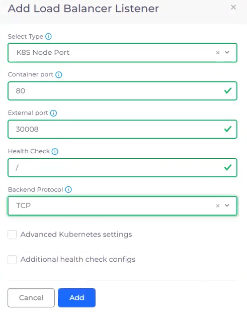
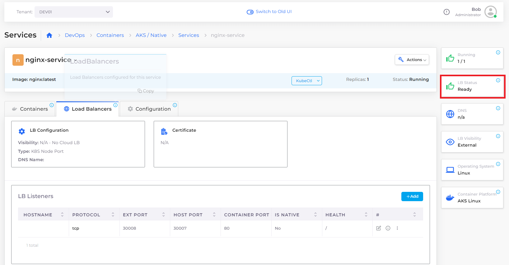
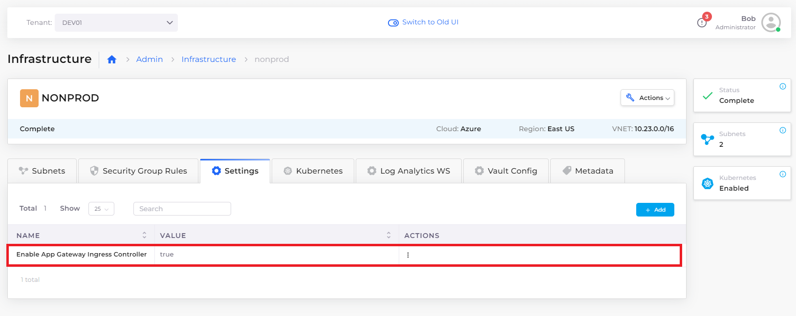
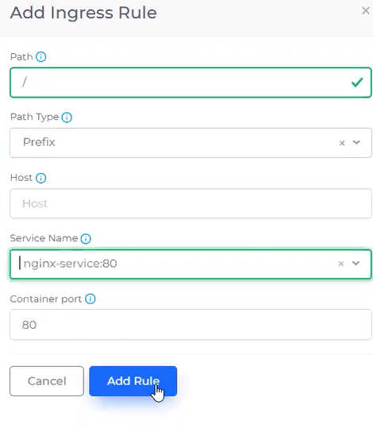
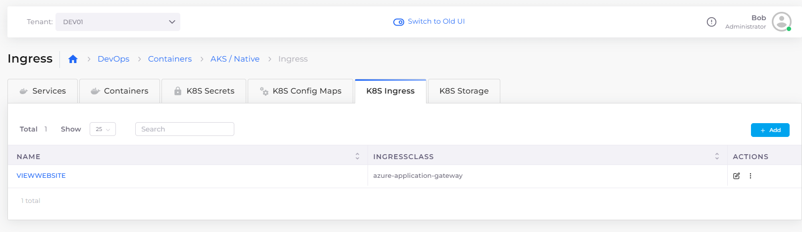

# Step 5: Create a Load Balancer

Now that your service is running, you have a mechanism to expose the containers and images in which your application resides.

But because your containers are running inside a private network, you also need a load balancer to listen on the correct ports in order to access the application.

In this step, we add a Load Balancer Listener to complete this network configuration.

_Estimated time to complete Step 5: 20 minutes._

## Prerequisites

Before creating your DuploCloud load balancer, ensure that:

* All previous steps in this tutorial to create an [Infrastructure and Plan](step-1-infrastructure.md), [Tenant](step-2-tenant.md), [Azure Agent Pool](step-3-create-azure-agent-pool.md), and [Service](step-4-create-app-via-k8s.md) are complete.
* [AKS Kubernetes cluster](step-1-infrastructure.md#enabling-the-aks-kubernetes-cluster) is enabled.
* **DEV01** is selected in the **Tenant** list box, at the top of the DuploCloud Portal.

<figure><figcaption>
<strong>Tenant</strong> list box with Tenant <strong>DEV01</strong> selected
</figcaption></figure>

## Adding and configuring a load balancer

Add a load balancer for your running service that listens on port **80**:

1. In the DuploCloud Portal, navigate to **DevOps** -> **Containers** -> **AKS / Native**.
2. In the **Services** tab, select the **nginx-service** that you started when [creating a service in the previous step](step-4-create-app-via-k8s.md).
3. Click the **Load Balancers** tab.
4. Click the **Configure Load Balancer** link. The **Add Load Balancer Listener** pane displays.
5. Select **K8S Node Port** from the **Select Type** list box.
6. Enter **80** in the **Container port** field.
7. Enter **30008** in the **External port** field.
8. Type **/** (forward-slash) in the **Health Check** field to indicate that the cluster we want Kubernetes to perform Health Checks on is located at the `root` level.
9.  Select **TCP** from the **Backend Protocol** list box.

    <figure><figcaption>
<strong>Add Load Balancer Listener</strong> pane using <strong>K8S Node Port</strong>
</figcaption></figure>
10. Click **Add**. The Load Balancer is created and started. After a few minutes, the **LB Status** card displays a status of **Ready**, indicating that the Load Balancer is ready for use.

<figure><figcaption>
<strong>nginx-service Load Balancers</strong> tab with <strong>LB Status Ready</strong>
</figcaption></figure>

## Enable the Ingress Controller

When we created the Load Balancer Listener, we used the **K8S Node Port** type. Even though the Node Port is ready, before you use it, you must enable the [Kubernetes Ingress Controller](https://kubernetes.io/docs/concepts/services-networking/ingress-controllers/) to open the application gateway.&#x20;

1. In the DuploCloud Portal, navigate to **Administrator** -> **Infrastructure**.
2. Select your Infrastructure from the **Name** column.
3. Click the **Settings** tab.
4. Click **Add**. The **Infra-Set Custom Data** pane displays.
5. In the **Setting Name** field, select **Enable App Gateway Ingress Controller**.&#x20;
6. Click **Enable.**
7. Click **Set**. In the **Settings** tab, the **Enable App Gateway Ingress Controller** setting now contains a value of **true**.

<figure><figcaption>
<strong>NONPROD Infrastructure</strong> page with <strong>Enable App Gateway Ingress Controller</strong> set to <strong>true</strong>
</figcaption></figure>

## Add Kubernetes Ingress

Now that your gateway is established and opened, you add a [Kubernetes Ingress](https://kubernetes.io/docs/concepts/services-networking/ingress/) to expose the backend HTTP routes from outside the cluster to your service.&#x20;

The Ingress object communicates with the Kubernetes NodePort that your Load Balancer Listener uses. Ingress objects are flexible constructs in Kubernetes, and their use here is an example of how DuploCloud leverages the power of Kubernetes constructs while abstracting away their native complexity. To manually create these components (and maintain them) in Kubernetes, takes a significant amount of developer time.

1. In the DuploCloud Portal, navigate to **DevOps** -> **Containers** -> **AKS / Native**.
2. Click the **K8S Ingress** tab.
3. Click **Add**. The **Add Kubernetes Ingress** page displays.
4. In the **Ingress Name** field, type **viewwebsite**.
5. In the **Ingress Controller** list box, select **azure-application-gateway**.
6. In the **Visibility** list box, select **Public**.
7.  Click **Add Rule**. The **Add Ingress Rule** pane displays.

    <figure><figcaption>
<strong>Add Rule</strong> option on the <strong>Add Kubernetes Ingress</strong> page
</figcaption></figure>

8. In the **Path** field, type **/** (forward-slash).
9. In the **Service Name** field, select **nginx-service:80**.&#x20;
10. Click **Add Rule** to add the rule and to close the **Add Ingress Rule** pane. You should be back to viewing the **Add Kubernetes Ingress** page.

    <figure><figcaption>
<strong>Add Ingress Rule</strong> pane
</figcaption></figure>
11. On the **Add Kubernetes Ingress** page, click **Add** to add Ingress. On the **K8S Ingress** tab, the **VIEWWEBSITE** Ingress that you defined, with an **Ingress Class** of **azure-application-gateway**, displays.

<figure><figcaption>
<strong>K8S Ingress</strong> tab displaying <strong>VIEWWEBSITE</strong> Ingress
</figcaption></figure>

## Check your work

Before you proceed to the final step and run your application, ensure that you:

* Configured a Load Balancer Listener that uses [K8S Node Port](step-5-create-a-load-balancer.md#adding-and-configuring-a-load-balancer).
* Enabled the [App Gateway Ingress Controller](step-5-create-a-load-balancer.md#enable-the-ingress-controller).&#x20;
* [Defined an Ingress and a rule](step-5-create-a-load-balancer.md#add-kubernetes-ingress) for your DuploCloud Service to listen on port 80.
