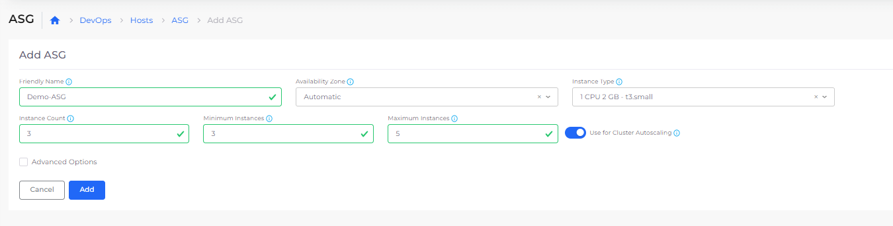
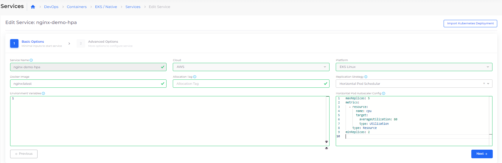
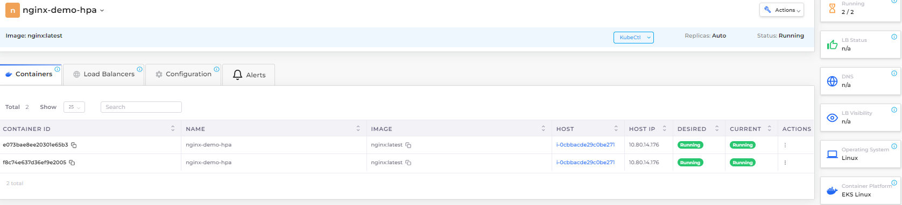
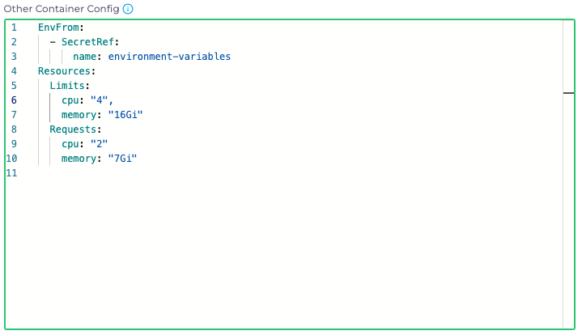

# Autoscaling in Kubernetes

## Kubernetes Cluster Auto Scaler

The Kubernetes Cluster Auto Scaler automatically adjusts the number of nodes in your cluster when pods fail or are rescheduled onto other nodes.&#x20;

### Step1: Enable Cluster AutoScaler in Infrastructure

You can configure Cluster AutoCcaler for the Infrastructure created with EKS Enabled

Enable Cluster Autoscaler from **Administrator** > **Infrastructure** > **Settings**. Add Setting to enable Autoscaler. Refer screenshot

.png>)

### Step2: Configure Auto Scaling Group (ASG)

Navigate to **DevOps** > **Hosts** > **ASG.**  Enable **Use for Cluster Autoscaling** toggle button.

This setting allows managing the cluster auto-scaling.

<figure><figcaption></figcaption></figure>

## Kubernetes Horizontal Pod Autoscaler (HPA)

Horizontal Pod Autoscaler (HPA) automatically scales the Deployment and its ReplicaSet. HPA checks the metrics configured in regular intervals and then scales the replicas up or down accordingly.

#### Configuring Services with HPA

You can configure HPA while creating Deployment Service from DuploCloud Portal.

Navigate **DevOps** > **Containers** > **EKS/Native.**

Create a new Service. Select **Replication Strategy** as _'Horizontal Pod Scheduler'_

Add below sample configuration in the **Horizontal Pod Autoscaler Config** textarea section.  Update minimum/maximum Replica Count, resource section based on the requirement.


```
maxReplicas: 5
metrics:
  - resource:
      name: cpu
      target:
        averageUtilization: 80
        type: Utilization
    type: Resource
minReplicas: 2
```


<figure><figcaption></figcaption></figure>

For HPA Configures Services, **Replica** is set as _Auto_ in DuploCloud Portal

<figure><figcaption></figcaption></figure>

#### Setting Container Configuration

It is important to have the Resources set in the **Other Container Config** so that HPA can work. Below is an example:

<figure><figcaption></figcaption></figure>
