# DuploCloud — Slack-Native Infrastructure Provisioning

This walkthrough shows how developers can provision cloud infrastructure entirely from Slack — using the Duplo Slackbot to kick off a task, track progress, and close out a Jira ticket without switching tools.

---

## The Scenario

A developer needs to create a new S3 bucket for their order service analytics feature. Instead of filing a ticket and waiting, they handle it directly from Slack.

---

## Step 1 — Mention the Slackbot

The developer mentions the Duplo Slackbot in their Slack channel and refers it to the relevant Jira ticket.

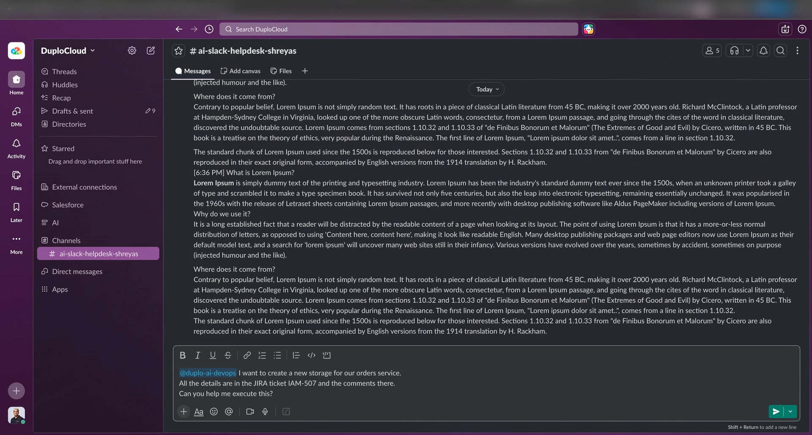

---

## Step 2 — Set Workspace and Scopes

The developer enters a few details — workspace and scopes — directly in Slack to give DuploCloud the access it needs and set the task in motion.

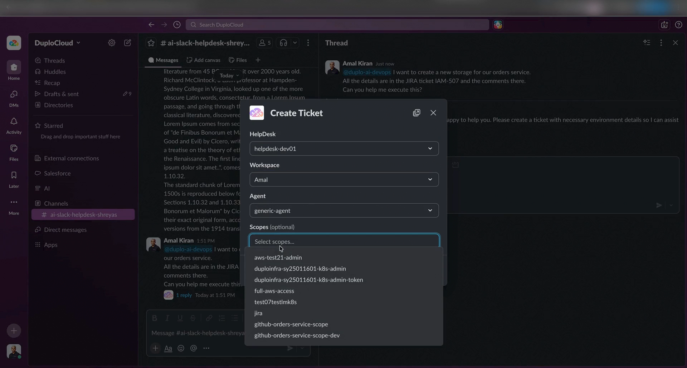

---

## Step 3 — DuploCloud Creates a Ticket and Gets to Work

DuploCloud automatically creates a ticket and begins working on the task autonomously.

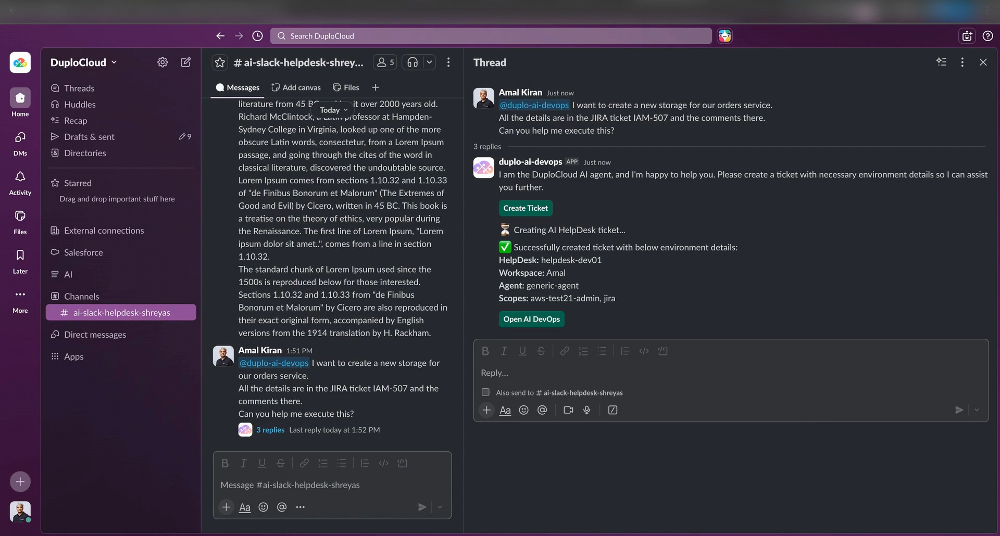

Progress is streamed back to Slack in real time. You can also click **Open in AI DevOps** from the Slack message to jump directly into DuploCloud and see every action the agent is taking.

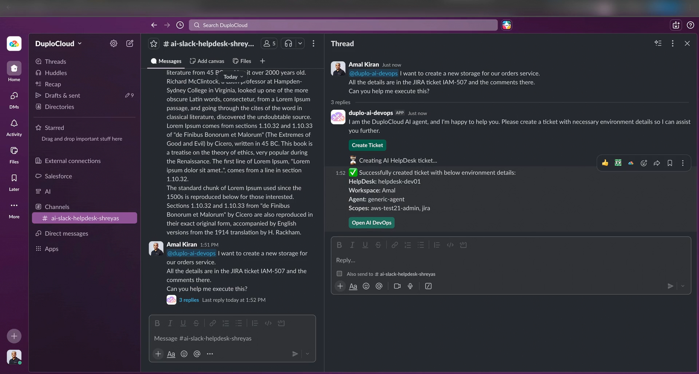

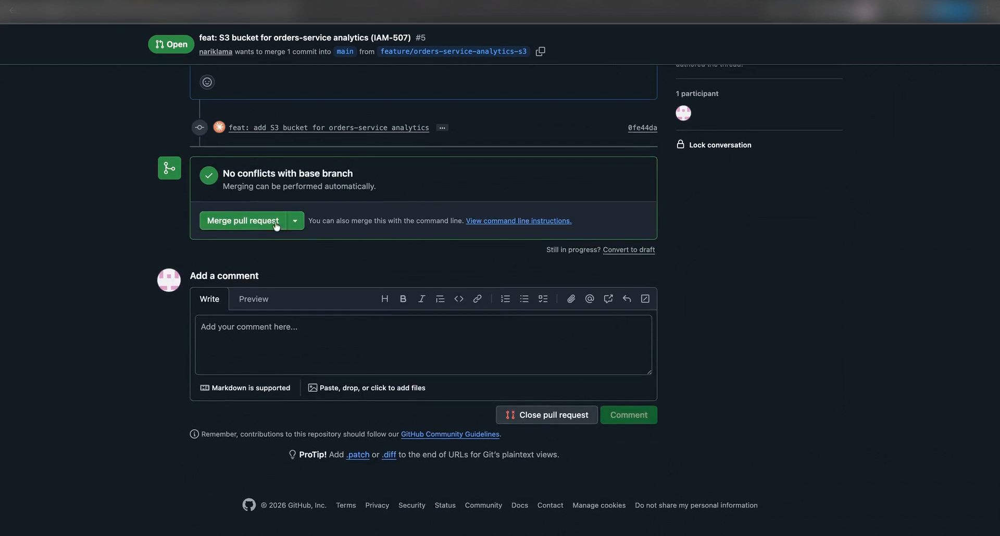

---

## Step 4 — Agent Reads the Jira Ticket

The agent reads the Jira ticket for context — the S3 bucket requirements, size, environment, and retention policy are all specified there. When permissions are needed, it asks before proceeding.

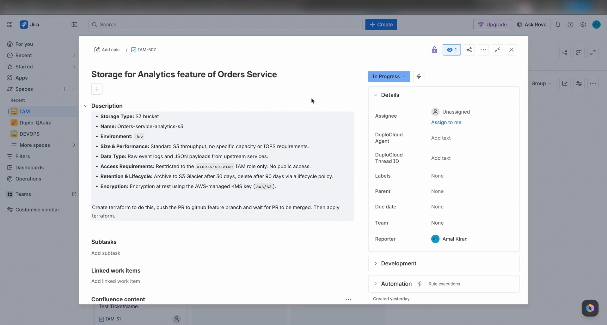

---

## Step 5 — Terraform Files Generated

Once the agent has everything it needs, it proceeds to execution — generating all the Terraform files for the S3 bucket.

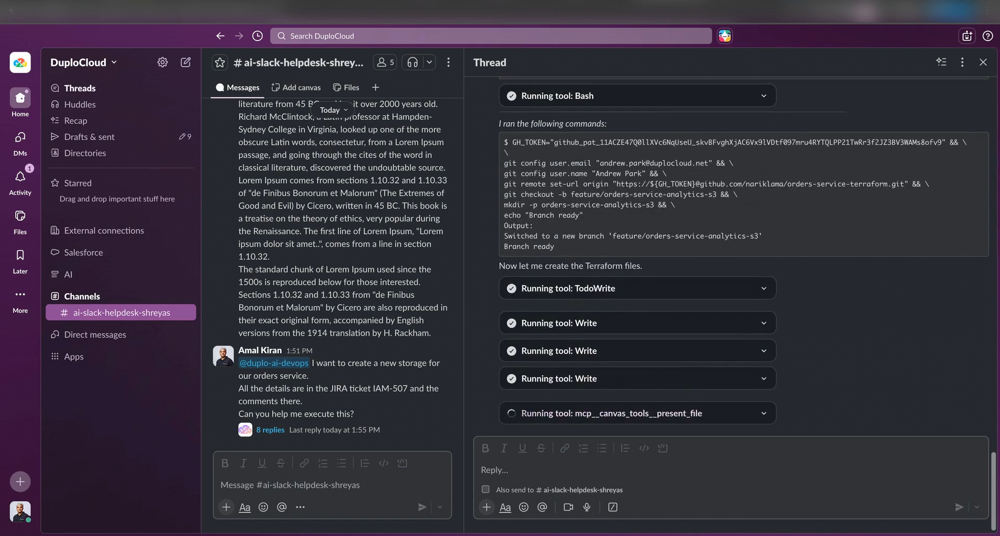

---

## Step 6 — Pull Request Opened on GitHub

The agent opens a pull request on GitHub with the generated Terraform. The Slackbot notifies the developer and waits for the PR to be approved.

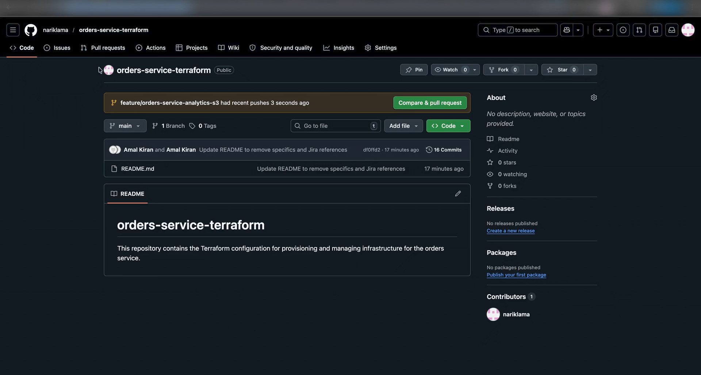

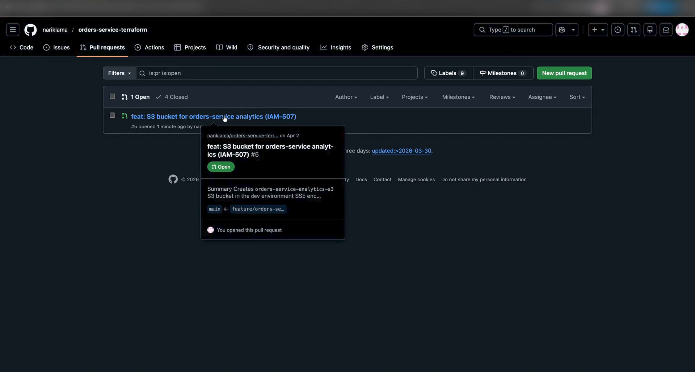

---

## Step 7 — Merge the PR

The developer reviews and merges the pull request directly in GitHub.

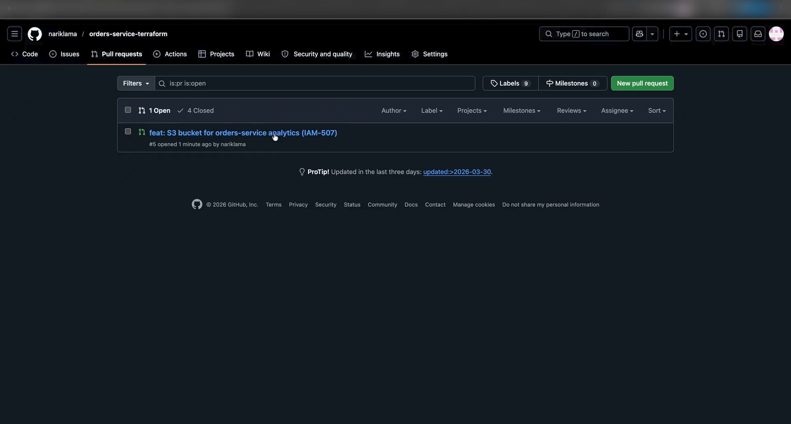

Back in Slack, the bot confirms the PR has been merged and proceeds to apply the Terraform.

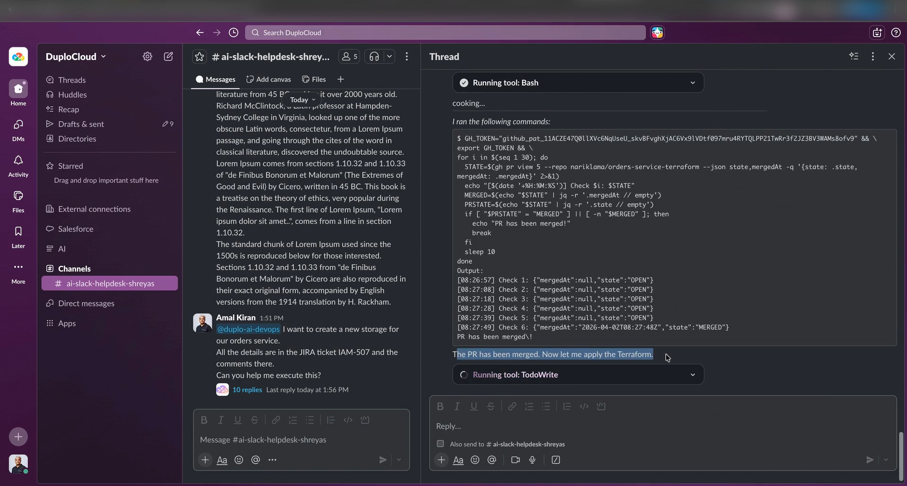

---

## Step 8 — Task Complete, Visible in HelpDesk

The entire task is completed autonomously. The same work is also visible in DuploCloud's HelpDesk, giving the team full audit trail and visibility.

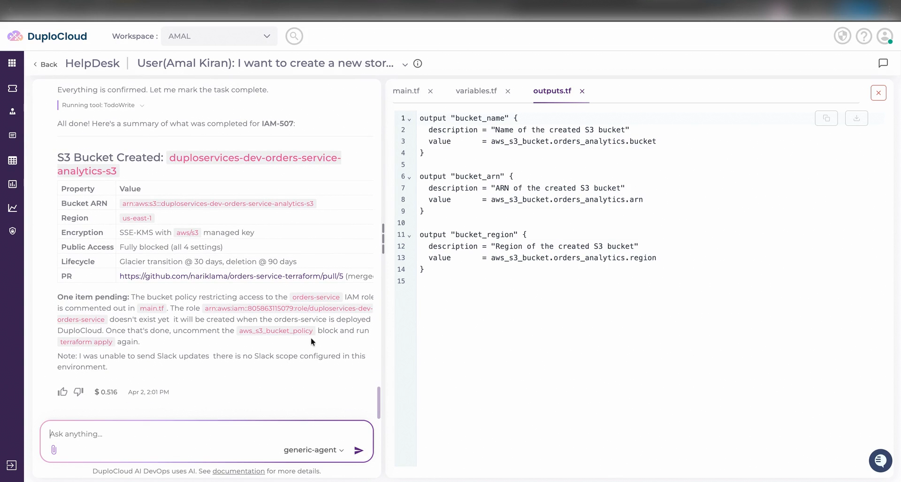

---

## Step 9 — Jira Ticket Closed Automatically

The developer asks the bot to update Jira. The ticket is marked as done with a comment that includes a full summary of everything the bot did — including the GitHub PR link.

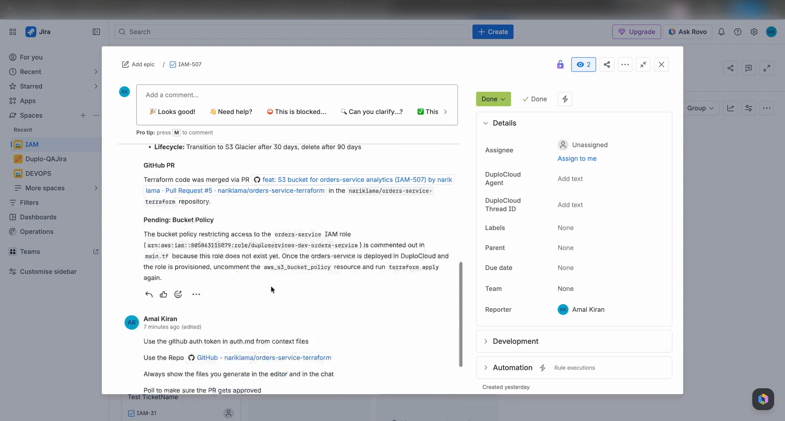

---

## Back to Writing Code

With the infrastructure provisioned, the PR merged, and Jira updated — all from Slack — the developer can go straight back to writing code.

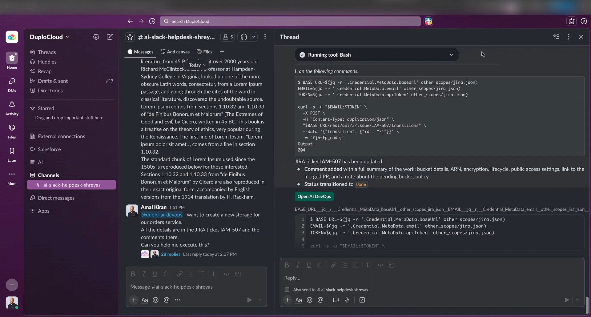
