# DuploCloud — Jira, GitHub, and Slack Integration Demo

This walkthrough demonstrates how DuploCloud connects your existing engineering workflow — from a Jira ticket, through AI-assisted infrastructure provisioning, to a merged GitHub pull request — without leaving your tools.

---

## The Scenario

An engineer needs to create storage for a new analytics feature. They raise a Jira ticket and assign it to the DevOps team.

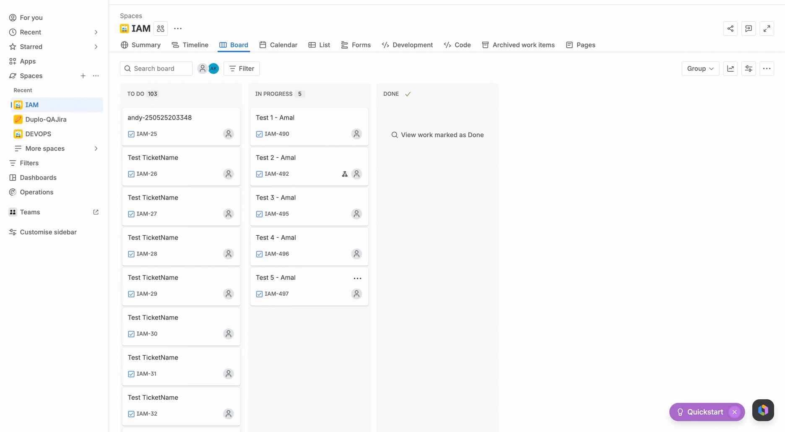

---

## Step 1 — Create a Jira Ticket

The engineer creates a Jira ticket describing the request.

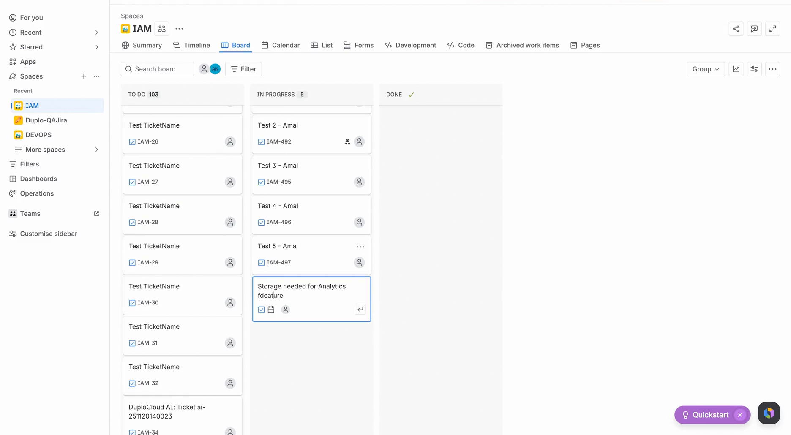

They add a description: *"We need to create new storage for our order service analytics feature"* and assign it to the DevOps team.

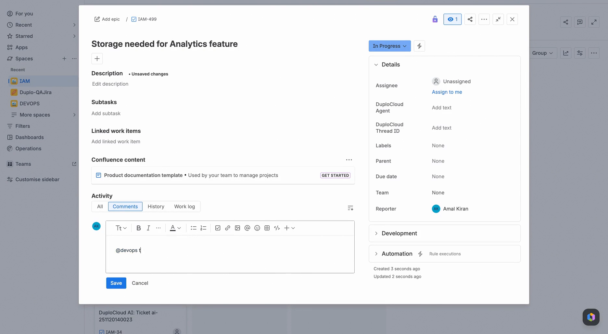

---

## Step 2 — Create a DuploCloud Ticket

The DevOps engineer picks up the Jira ticket and creates a corresponding ticket inside DuploCloud to begin working on it.

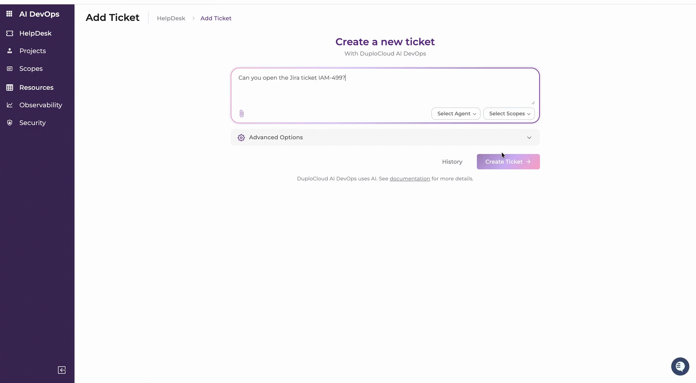

---

## Step 3 — Agent Fetches Ticket Details

The DuploCloud agent automatically fetches all details from the linked Jira ticket.

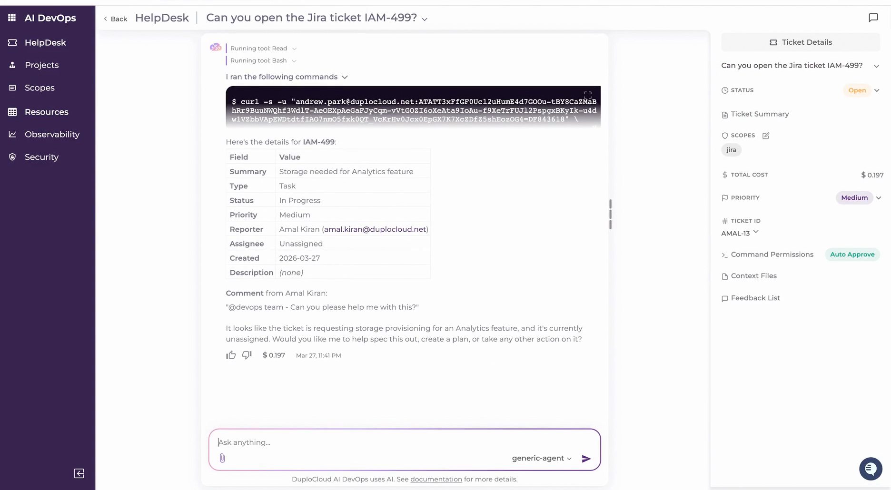

Since the task description is not fully specified, the agent identifies gaps and suggests clarification questions before proceeding.

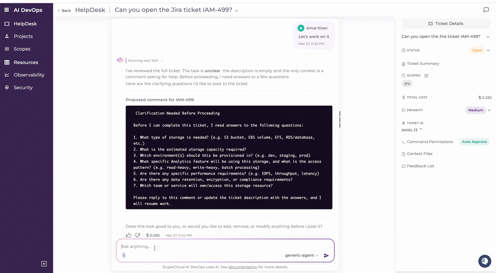

---

## Step 4 — Post Questions to Jira

The DevOps engineer reviews the suggested questions and approves them. DuploCloud automatically posts all questions back into the original Jira ticket.

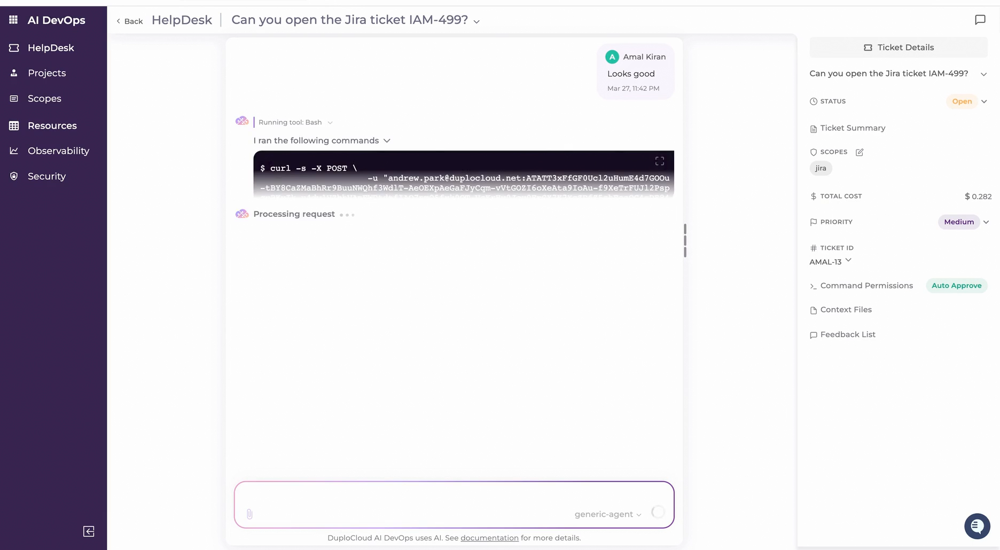

Switching over to Jira confirms all questions are now visible on the ticket.

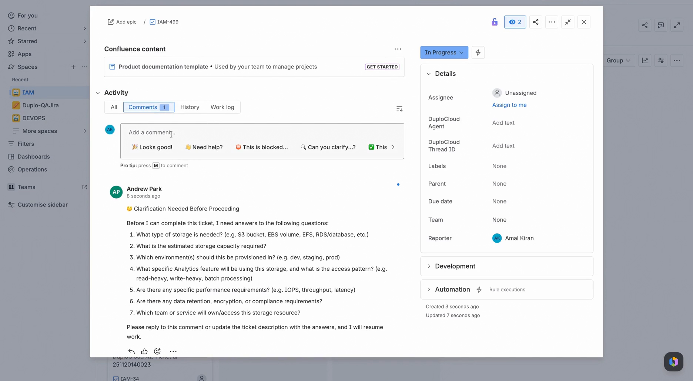

---

## Step 5 — Engineer Answers in Jira

The engineer reviews the questions and fills in the answers directly in Jira:

- S3 bucket, ~100 MB
- Production AWS environment
- Write-heavy, low-latency, 90-day data retention
- Used by the order service team

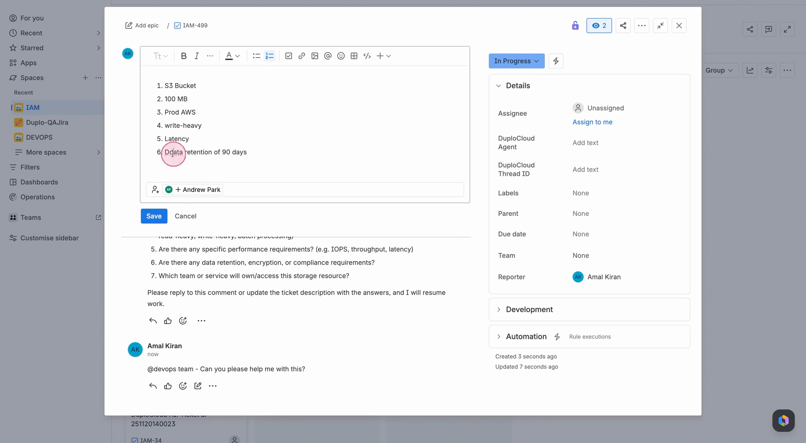

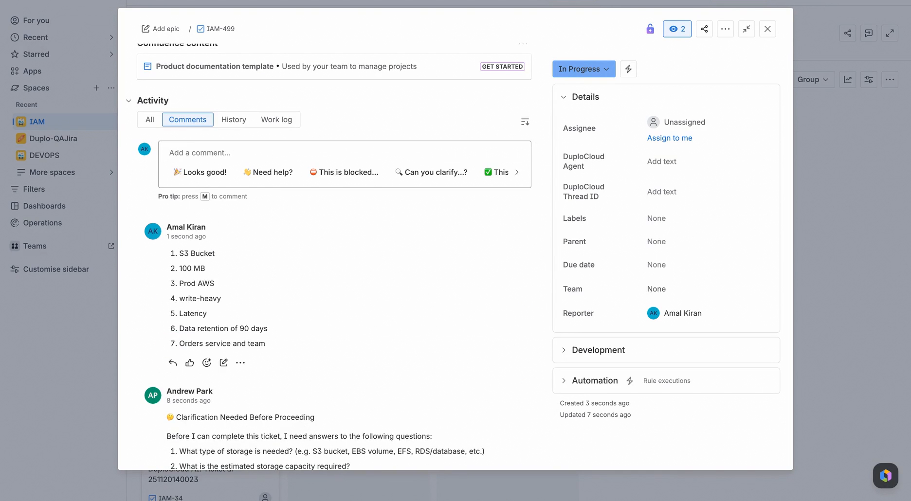

---

## Step 6 — Back in DuploCloud: Check for Updates

The DevOps engineer returns to DuploCloud and asks the agent if there are any updates. The agent checks the Jira ticket and reports back.

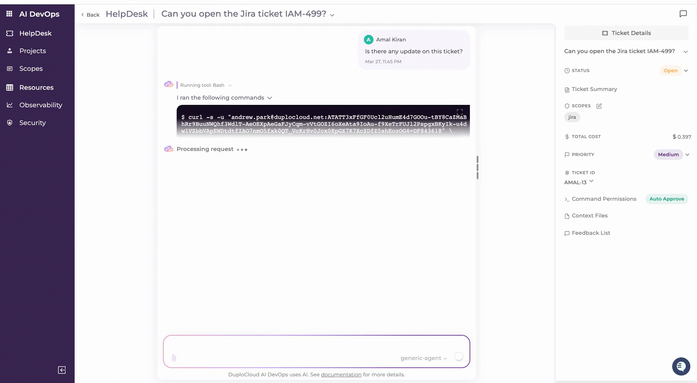

The agent confirms the engineer has responded with answers to all the questions. The task can now proceed.

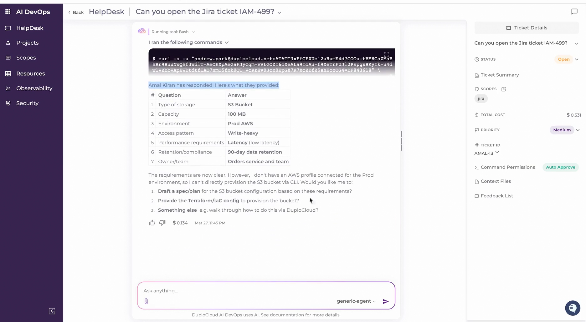

---

## Step 7 — Write Terraform and Create a Pull Request

The DevOps engineer asks the agent to write the Terraform code for the task and open a pull request on GitHub.

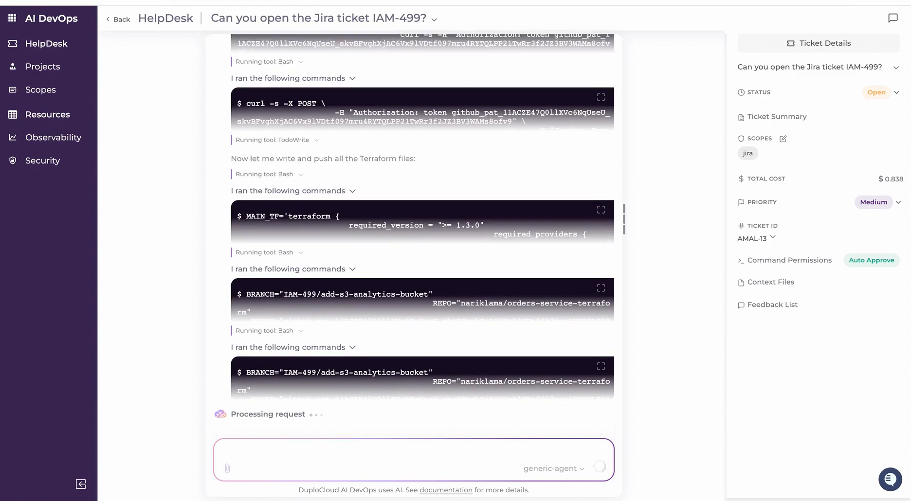

The agent completes the task autonomously.

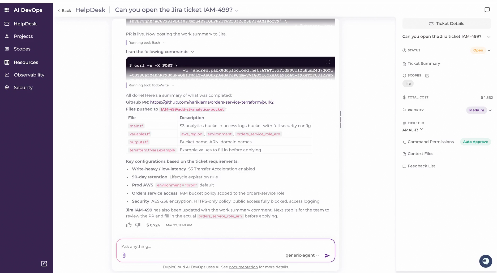

---

## Step 8 — Verify on GitHub

Switching to GitHub confirms a pull request has been created. The branch contains all the files generated by the agent.

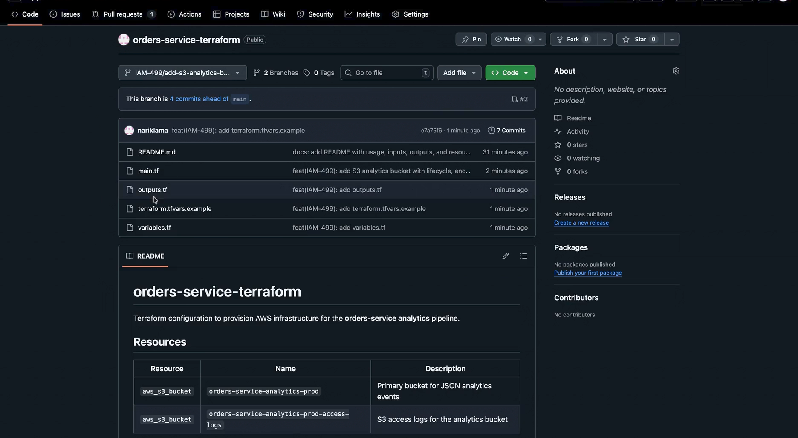

---

## Step 9 — Jira Updated Automatically

Back in Jira, the ticket has been automatically updated with a link to the pull request — closing the loop without any manual steps.

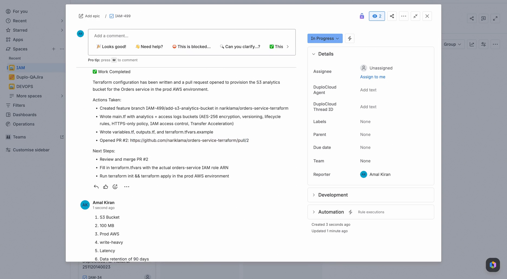

---

## Bonus — Works From Slack Too

The entire workflow can be initiated from Slack. The DevOps engineer can start a session with DuploCloud via the Duplo Slackbot and complete tasks without ever leaving Slack.

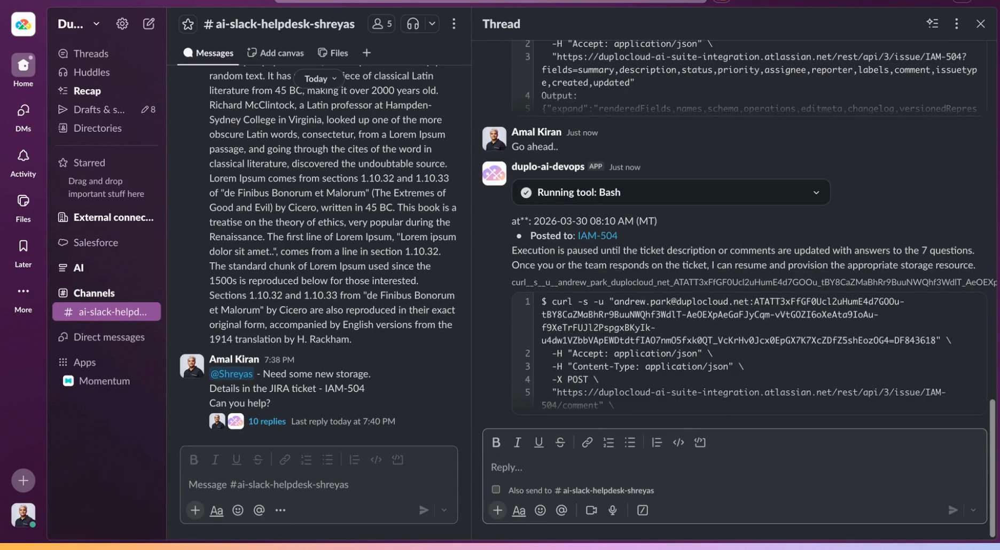
