# DuploCloud — Security and Compliance with GRC Integration

This walkthrough shows how DuploCloud can automate your security and compliance work — connecting to a GRC provider, identifying failing controls, and resolving them end to end, including Terraform changes via a GitHub pull request.

---

## The Scenario

Your team needs to meet SOC 2 requirements on AWS. Rather than manually auditing controls and filing tickets, you connect DuploCloud to your GRC tool and let the agent do the work.

---

## Step 1 — Connect a GRC Provider

DuploCloud supports GRC tools like Vanta and Drata. For this demo, Vanta has already been connected — credentials provided and scopes defined so DuploCloud knows what it can access.

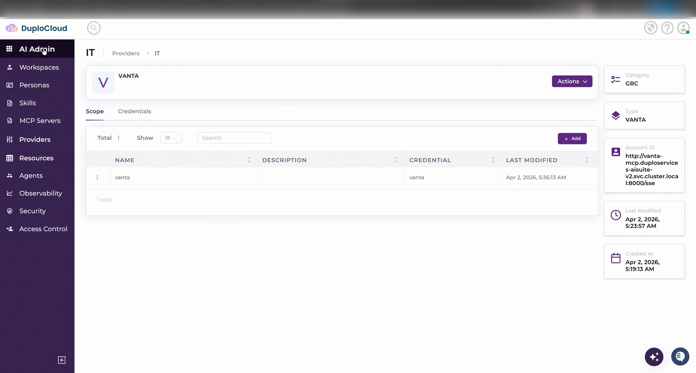

---

## Step 2 — Check Compliance Status

Select the SOC 2 framework on AWS and create a ticket asking DuploCloud to fetch the current compliance status.

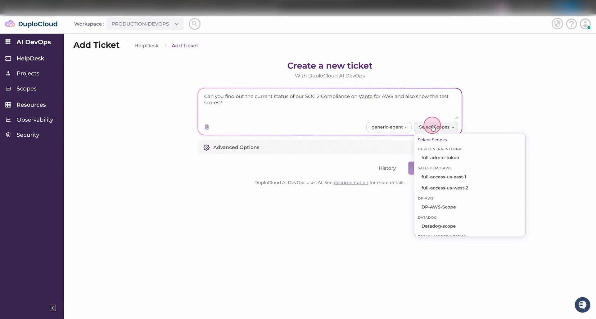

The agent connects to Vanta and retrieves your current compliance status, test scores, and details on which tests are passing or failing.

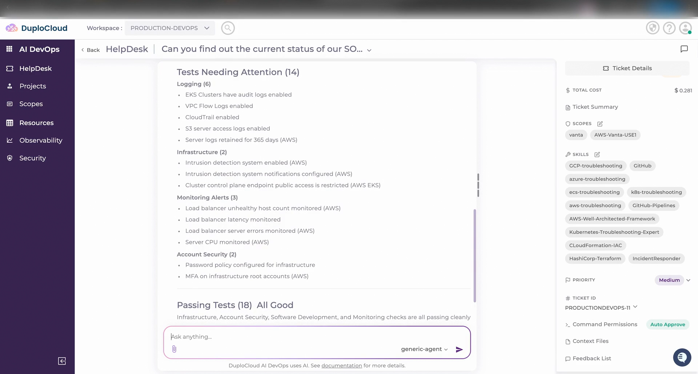

It then categorises the failing controls into buckets so you know where to focus first.

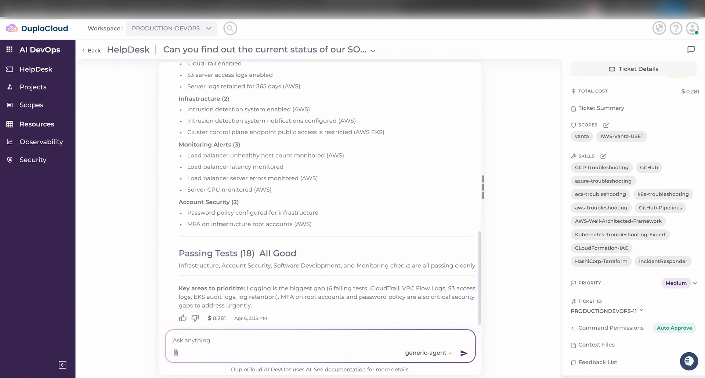

---

## Step 3 — Fix Infrastructure Issues: GuardDuty

Ask DuploCloud to resolve the infrastructure issues identified. The agent connects to AWS, checks GuardDuty status across all regions, and deploys it where it is missing.

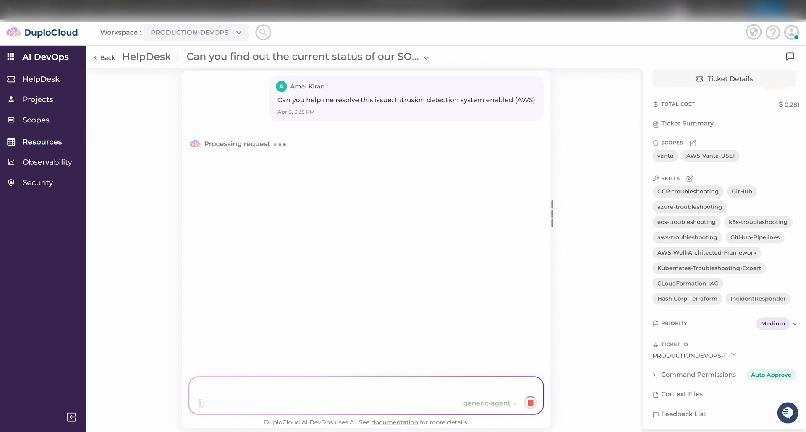

GuardDuty is now deployed across all four required regions.

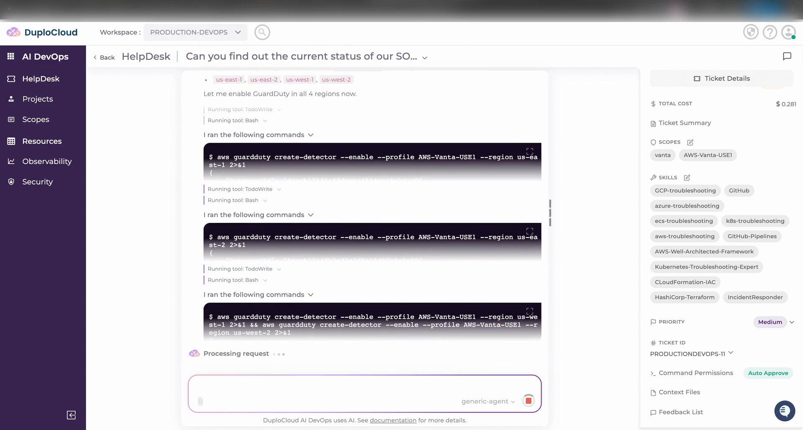

The agent then resolves the next issue — enabling GuardDuty notifications in all four regions.

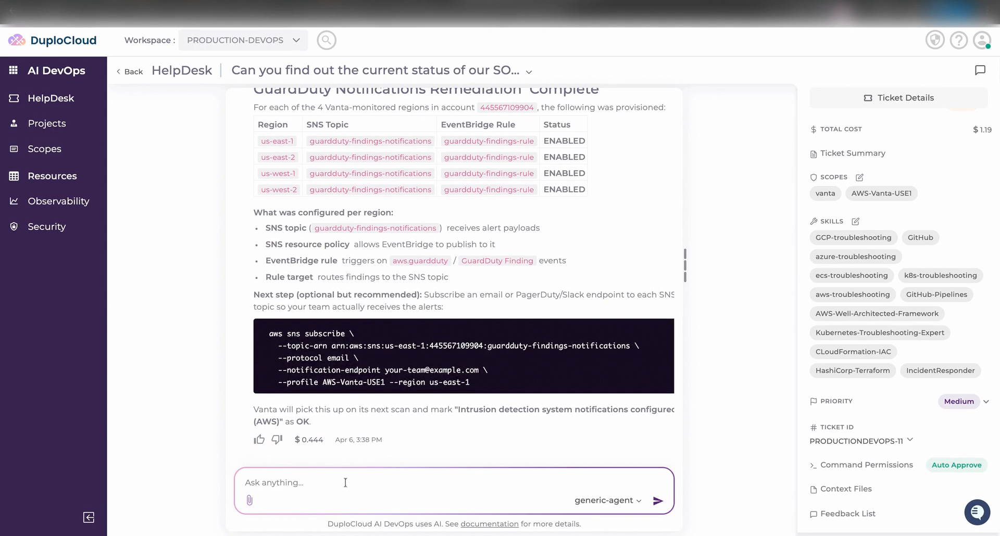

---

## Step 4 — Verify the Score Improvement

Ask DuploCloud to re-check the Vanta scores and compare against the baseline.

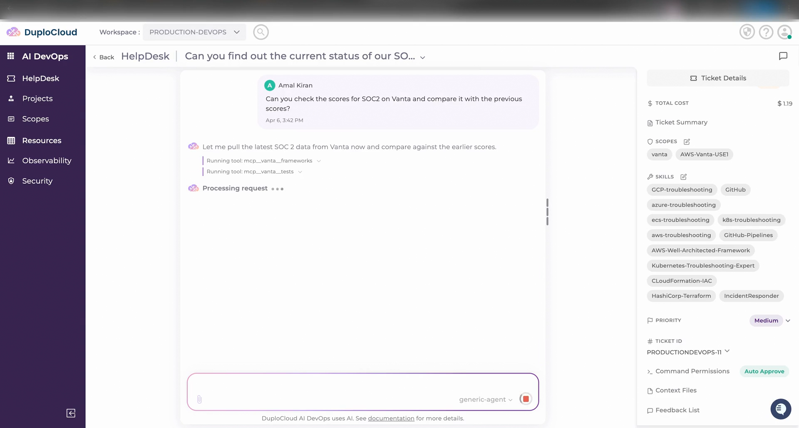

The score has improved after the GuardDuty fixes were applied.

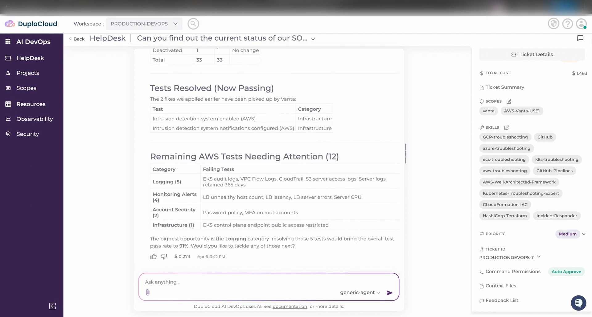

---

## Step 5 — Fix Logging Issues from the IDE

Switch to your IDE. DuploCloud has already pulled in all the context from the ticket — it knows what was done and what still needs attention.

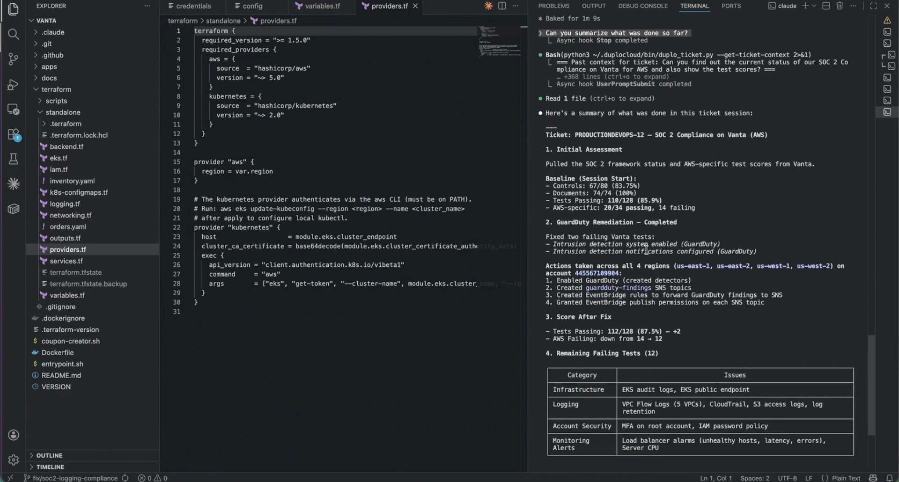

Ask the agent to resolve all remaining logging issues. The plan: write Terraform, open a pull request on GitHub, and apply once approved.

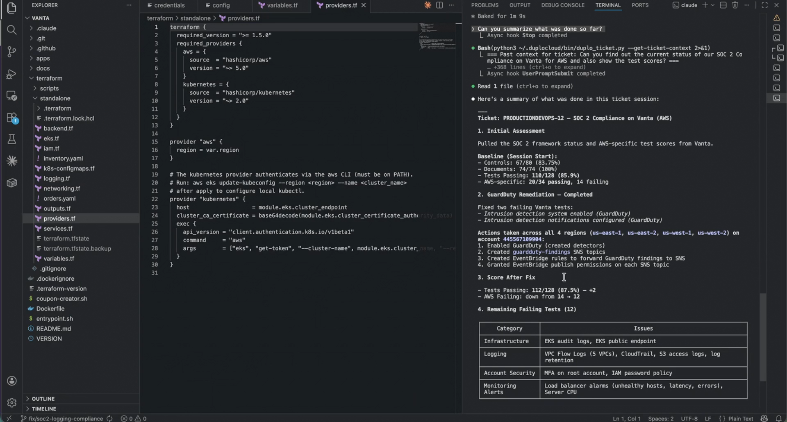

---

## Step 6 — Agent Writes Terraform

The agent runs discovery, then generates all the Terraform required for the logging changes.

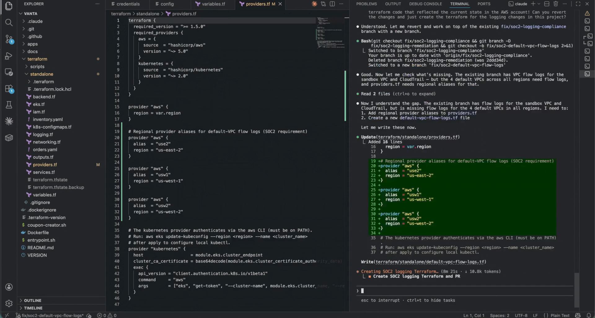

Once the code is ready, the agent commits the changes to GitHub and opens a pull request.

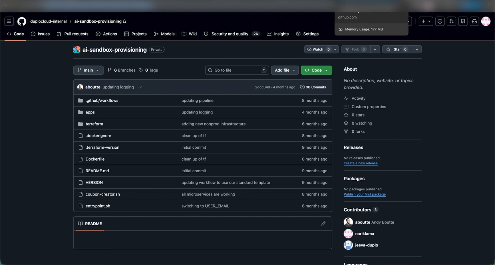

---

## Step 7 — Review and Merge the Pull Request

Switch to GitHub to review the pull request.

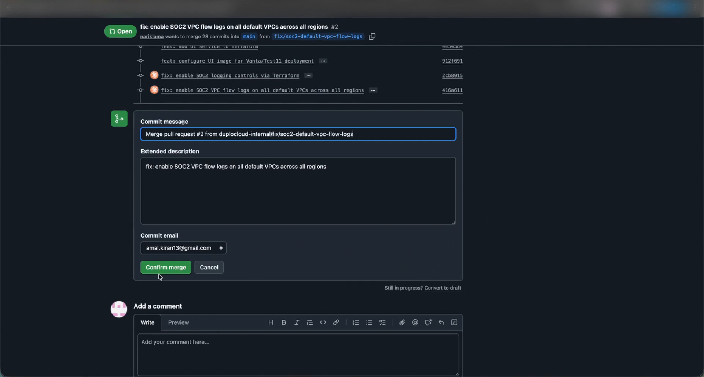

Merge the PR and return to the IDE, tell the agent the PR has been merged and ask it to apply Terraform. The agent applies all the logging changes.

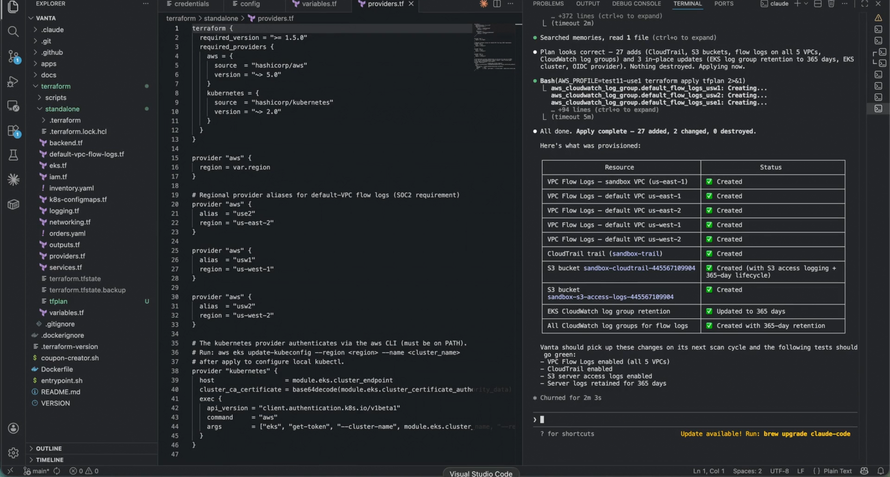

---

## Step 8 — All Activity Reflected in the Ticket

Head back to the ticket. Everything done in the IDE — every action the agent took — is reflected here automatically.

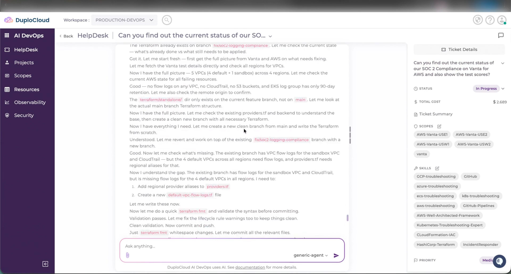

---

## Step 9 — Final Score Check

Ask DuploCloud to pull the latest scores from Vanta one more time. The scores have improved again — showing exactly how DuploCloud can get you to full compliance, step by step.

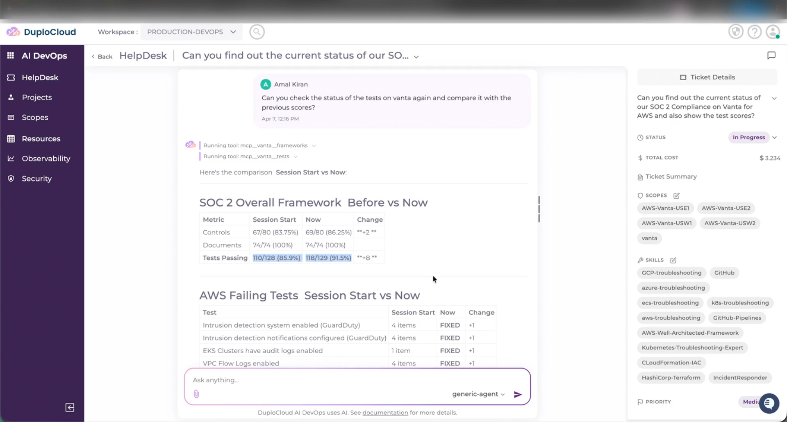
