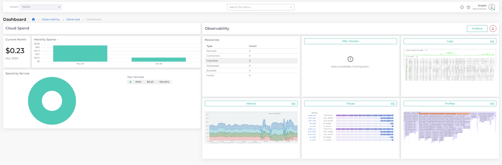

# Advanced Observability Suite

DuploCloud's Advanced Observability Suite (AOS) is an add-on service crafted to boost your monitoring and troubleshooting abilities. Built on OpenTelemetry, our AOS leverages Prometheus and Grafana to deliver robust, real-time observability for your cloud infrastructure. It includes real-time anomaly detection and customizable alerts and unifies metrics, traces, logs, and profiles to easily track all aspects of your environment. The Grafana-powered dashboards can be customized to spotlight key metrics and visualize trends in real-time, empowering swift, data-driven decisions. DuploCloud’s AOS simplifies troubleshooting and enhances system health by providing a holistic view of your application and infrastructure performance.

### OpenTelemetry

OpenTelemetry is an open-source project from the Cloud Native Computing Foundation (CNCF) that supports multiple programming languages and environments. It provides a flexible, vendor-neutral framework for monitoring and analyzing application performance. Designed for high scalability, OpenTelemetry is ideal for distributed applications and helps reduce costs by using open-source components instead of expensive proprietary systems. See the [OpenTelemetry documentation](https://opentelemetry.io/docs/what-is-opentelemetry/) for more.

## AOS Dashboards and Features&#x20;

The AOS includes two advanced dashboards that offer detailed insights into cloud spending and observability metrics. The Admin AOS Dashboard displays cloud data across all resources, while the Tenant AOS Dashboard displays data for a specific Tenant. &#x20;

## Accessing the Admin AOS Dashboard

The **Admin AOS Dashboard** displays comprehensive cost spending data across all resources, and observability metrics by Infrastructure. This dashboard is accessible for administrators only.

To access the Admin AOS Dashboard, navigate to **Administrator** -> **Observability** -> **Advanced** -> **Dashboard**.

<figure><figcaption>
The <strong>Admin AOS Dashboard</strong> in the DuploCloud Portal
</figcaption></figure>

### Viewing Admin Cloud Spend Data

The **Cloud Spend** area, on the left side of the **Advanced AOS Dashboard**, offers a comprehensive, real-time view of expenses across all resources.&#x20;

* **Fin Ops**: The **Fin Ops** button, in the **Cloud Spend** header, opens the DuploCloud **Billing** dashboard, which displays billing details including billing summaries by month or Tenant, billing alerts, and DuploCloud license usage information.&#x20;
* **Current Month**: Displays cloud expenditures for the current month.
* **Monthly Spend**: Displays spending by month. Use the **Monthly Spend** list box to display spending by week or day.&#x20;
* **Spend By Service**: Displays a breakdown of cloud spending by Service.
* **Spend By Tenant**: Highlights expenditures by Tenant.

<figure><figcaption>
The <strong>Admin AOS Dashboard</strong>, <strong>Cloud Spend</strong> area
</figcaption></figure>

### Viewing Admin Observability Data

The **Observability** section, on the right side of the **Advanced AOS Dashboard**, gives real-time health and usage data across resources.&#x20;

* **Infrastructure**: In the **Observability** header, the **Infrastructure** list box allows you to select the Infrastructure for which you wish to view observability details.&#x20;
* **Grafana**: The **Grafana** button, in the **Observability** header, opens the Grafana console where you can add, customize, or edit your AOS dashboards, query your logs, metrics, and traces, and more. For additional information, see the [Grafana documentation](https://grafana.com/docs/grafana/latest/).&#x20;

Under the **Observability** header are data cards displaying the following metrics:

* **Resources**: Lists the type and number of DuploCloud resources, such as Tenants, Services, etc.&#x20;
* **K8s/Docker**: Shows Kubernetes and Docker metrics, providing visibility into containerized workloads.
* **Logs**: Displays logs for troubleshooting and compliance checks across all resources.
* **Metrics**: Displays rate, errors, and duration metrics across Services.
* **Traces**: View traces to monitor request flows and latency, supporting application performance analysis.
* **Profiles**: Access profiling data for in-depth application insights, allowing performance tuning.

For Grafana-generated metrics (e.g., **K8s/Docker**, **Logs**, **Metrics**, **Traces**, **Profiles**), you can click on the card (visual data or header) to open the corresponding detailed view in the Grafana console. Additionally, you can [add custom links to the data cards](advanced-observability-suite.md#adding-custom-links-to-aos-dashboards).&#x20;

<figure><figcaption>
The <strong>Admin AOS Dashboard</strong>, <strong>Observability</strong> area
</figcaption></figure>

## Accessing the Tenant AOS Dashboard

The **Tenant AOS Dashboard** provides cost and observability data by Tenant for granular infrastructure management. This dashboard is acccessible to non-administrators.&#x20;

To access the **Tenant AOS Dashboard**, navigate to **Observability** -> **Advanced** -> **Dashboard**.

<figure><figcaption>
The <strong>Tenant AOS Dashboard</strong> in the DuploCloud Portal
</figcaption></figure>

### Selecting a Tenant

* Use the **Tenant** list box at the top of the **Tenant AOS Dashboard** to select the Tenant for which you wish to view metrics.

### Viewing Tenant Cloud Spend Data

The **Cloud Spend** area, on the left side of the **Tenant AOS Dashboard**, offers a comprehensive view of expenses for the selected Tenant. It includes the following expenditure categories:

* **Current Month**: Displays the current month’s spend for the selected Tenant.
* **Spend By Service**: Displays a breakdown of cloud spending by Service.

<figure><figcaption>
The <strong>Tenant AOS Dashboard</strong>, <strong>Cloud Spend</strong> area
</figcaption></figure>

### Viewing Tenant Observability Data

The **Observability** area, on the right side of the **Tenant AOS Dashboard** gives health and performance data for a selected Tenant.&#x20;

**Grafana**: The **Grafana** button, in the **Observability** header, opens the Grafana console where you can add, customize, or edit your AOS dashboards, query your logs, metrics, and traces, and more. For additional information, see the [Grafana documentation](https://grafana.com/docs/grafana/latest/).&#x20;

Under the **Observability** header are data cards displaying various metrics.

* **Resources**: Lists the type and number of DuploCloud resources, such as Services, containers, and Ingresses, in the selected Tenant.&#x20;
* **K8s/Docker**: Kubernetes and Docker metrics specific to the Tenant, assisting in container workload management.
* **Logs**: Access Tenant-specific logs for tracking, troubleshooting, and compliance.
* **Metrics**: Displays performance metrics relevant to the Tenant’s resources.
* **Traces**: View traces specific to the Tenant for performance and latency monitoring of the Tenant’s applications.
* **Profiles**: Access profiling data for in-depth application insights and performance tuning.

For Grafana-generated metrics (e.g., **K8s/Docker**, **Logs**, **Metrics**, **Traces**, **Profiles**), you can click on the card (header or visual data) to open the corresponding detailed view in the Grafana console. Additionally, you can [add custom links to the data cards](advanced-observability-suite.md#adding-custom-links-to-aos-dashboards).&#x20;

<figure><figcaption>
The <strong>Tenant AOS Dashboard</strong>, <strong>Observability</strong> area
</figcaption></figure>

## **Customizing Dashboards**

AOS dashboards allow for customization by adding, removing cards, or creating customized links and metrics.&#x20;

### Managing AOS Dashboard Metrics

1. From the DuploCloud Portal, navigate to the Admin AOS Dashboard (**Administrator** -> **Observability** -> **Advanced** -> **Dashboard**) or the Tenant AOS Dashboard (**Observability** -> **Advanced** -> **Dashboard**).
2. Click the **Grafana** link in the **Observability** header on the upper right. The Grafana console displays.&#x20;
3. Select the **Dashboards** tab in the navigation menu on the left. You can work with the folders here to add new cards (metrics) to your AOS dashboard, delete existing cards, rearrange cards, or customize the specific metrics displayed in each card on your DuploCloud dashboards.  For more, see the [Grafana documentation](https://grafana.com/docs/grafana/latest/dashboards/).

### Adding Custom Links to AOS Dashboards

Link external data sources to AOS dashboards by adding custom links to data cards.&#x20;

#### Adding Custom Links for Administrators

1. From the DuploCloud Portal, navigate to **Administrator** -> **Observability** -> **Advanced** -> **Dashboard**.
2. Click the link icon () in the header of the card to which you wish to add a custom link. The **All Admin Custom Links** pane displays.
3. Select the **Admin** tab to add a custom link only to the Administrator AOS Dashboard, or the **Common** tab to include the custom link on the Tenant AOS Dashboard.
4. Click Add. The **Add profiles Custom Link** pane displays.
5. Enter a **Name**, **URL**, and **Description** for the custom link.&#x20;
6. Click **Submit**. The custom link is added to the data card on the AOS Dashboard(s).&#x20;

<figure><figcaption>
The <strong>Logs</strong> data card with the clink icon highlighted
</figcaption></figure>

#### Adding Custom Links for Non-Administrators

1. From the DuploCloud Portal, navigate to **Observability** -> **Advanced** -> **Dashboard.**
2. Click the link icon () in the header of the card to which you wish to add a custom link. The **All Admin Custom Links** pane displays.
3. Click Add. The **Add profiles Custom Link** pane displays.
4. Enter a **Name**, **URL**, and **Description** for the custom link.&#x20;
5. Click **Submit**. The custom link is added to the data card on the Tenant AOS Dashboard.&#x20;

## **Configuring Alerts**

Set up alerts for key observability metrics (e.g., high CPU or memory usage) to be proactively notified of potential issues.

1. From the DuploCloud Portal, navigate to the Admin AOS Dashboard (**Administrator** -> **Observability** -> **Advanced** -> **Dashboard**) or the Tenant AOS Dashboard (**Observability** -> **Advanced** -> **Dashboard).**
2. Click the Alert icon ()near the upper right in the **Observability** header.
3. The Grafana **Alert rules** page displays, allowing you to view, add, delete, or modify alerts. For more, see the [Grafana alert documentation](https://grafana.com/docs/grafana/latest/alerting/alerting-rules/).&#x20;

## Additional Functions

From the Grafana console, you can perform a variety of tasks to customize your observability experience and proactively manage system health. For additional information, see the [Grafana documentation](https://grafana.com/docs/grafana/latest/).&#x20;

## Use Cases

### Real-Time Monitoring and Observability

* **System Health Check**: Track real-time metrics like CPU usage, memory consumption, network traffic, and error rates across services to ensure that applications are healthy.
* **Latency Tracking**: Monitor request latencies to identify performance bottlenecks, particularly in services where latency spikes might indicate an issue.
* **Error Rate Analysis**: Track error counts and types to ensure services operate as expected and identify critical failure points.

### End-to-End Tracing and Dependency Mapping

* **Request Flow Visualization**: Visualize the path of requests through different services to understand interdependencies and identify which services may contribute to slowdowns or failures.
* **Service Dependency Mapping**: See which services interact with each other, allowing for a clear view of critical service dependencies and helping identify potential cascading failures.
* **Root Cause Analysis (RCA)**: Trace issues back to the source by identifying slow, failed, or error-prone transactions and drilling down to pinpoint problematic services or infrastructure.

### Performance Optimization

* **Identify Performance Bottlenecks**: Detect slow components, such as long-running queries, network delays, or overloaded services, and make data-driven decisions to optimize them.
* **Capacity Planning**: Use metrics to analyze usage patterns, forecast demand, and optimize resource allocation, helping avoid over-provisioning or under-resourcing.
* **Compare Release Impact**: Measure the impact of new releases on system performance by comparing metrics before and after deployments.

### Alerting and Incident Management

* **Set Alerts for Key Metrics**: Define thresholds and set alerts for anomalies in critical metrics, such as high error rates or slow response times, so that teams can act quickly.
* **Incident Response and Remediation**: Enable responders to access context-specific insights that accelerate incident response, diagnostics, and resolution times.
* **Service-Level Agreement (SLA) Monitoring**: Track SLA compliance metrics, such as uptime and latency, to ensure the system meets contractual obligations.

### User Experience Insights

* **Track User Journey Metrics**: Analyze performance metrics specific to different user journeys (e.g., checkout flows) to understand the impact of backend performance on user experience.
* **End-to-End Latency Perceptions**: Collect latency and success metrics for critical user actions to help understand where improvements could enhance user satisfaction.

### Security and Compliance Monitoring

* **Detect Anomalous Behavior**: Set up alerts on unusual patterns or outliers in metrics that could indicate potential security incidents.
* **Audit Logging**: Track API call/sensitive event logs (e.g., login attempts) to assist in compliance reporting and security auditing.

### Custom Business and Operational Metrics

* **Monitor Business KPIs**: Track custom metrics like transaction success rates, revenue per minute, or user engagement rates to tie technical performance to business outcomes.
* **Cost Optimization**: Identify underused resources or inefficient services to optimize operational costs and improve infrastructure utilization.

### Other Duplo-Specific Use Cases

* Request new capabilities via DuploCloud/Using the OpenTelemetry open-source API.
