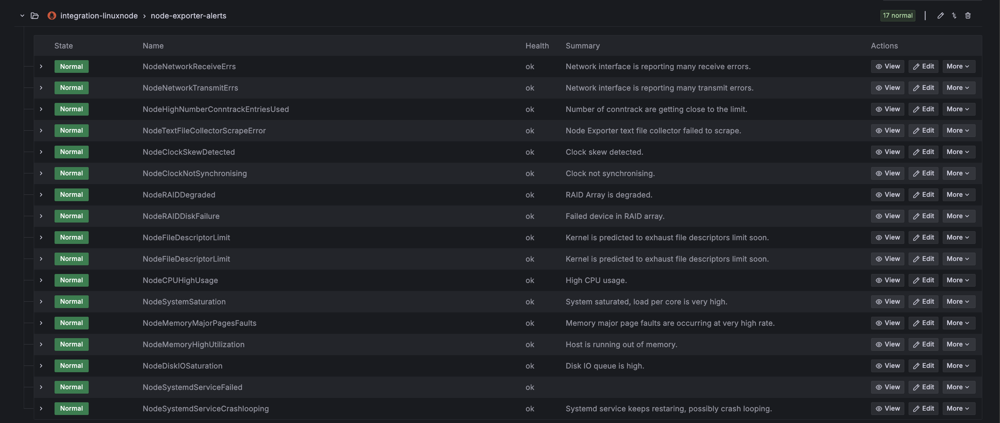
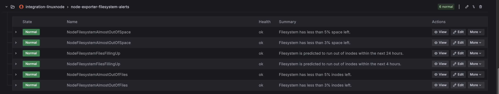
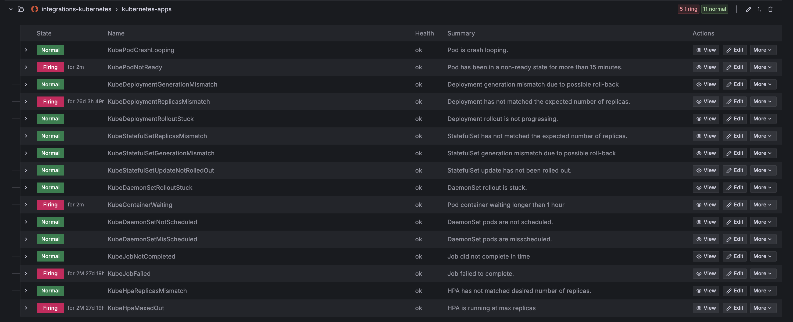
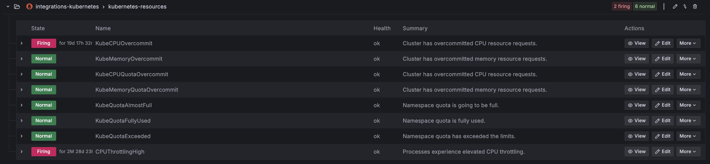
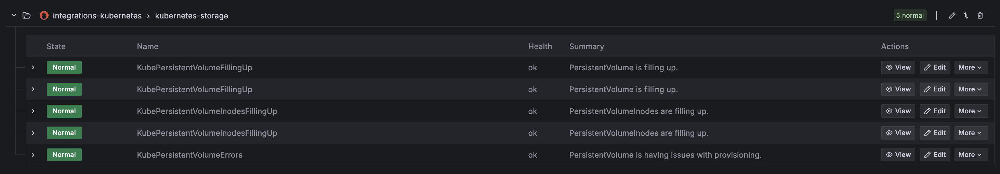

# Alerts with Alert Manager

Grafana's native Alert manager is used for alerting within the DuploCloud Advanced Observability Suite (AOS). DuploCloud's AOS includes a default set of alerts based on best practices and compliance standards. Custom alerting can also be set up to meet your unique needs based on log strings, metrics, etc.

## Default Alerts

When you enable AOS, a set of alerts is automatically available in Grafana. These alerts cover common health and performance issues for Linux nodes and Kubernetes clusters, helping you monitor critical infrastructure without extra setup.

The default alerts include:

Linux Node Alerts

<figure><figcaption></figcaption></figure>

Linux Filesystem Alerts

<figure><figcaption></figcaption></figure>

Kubernetes Application Alerts

<figure><figcaption></figcaption></figure>

Kubernetes Resource Alerts

<figure><figcaption></figcaption></figure>

Kubernetes Storage Alerts

<figure><figcaption></figcaption></figure>

These alerts are provided automatically in Grafana for AOS. Any additional alerts beyond these categories must be manually created.

## Configuring Custom Alerts

Any alerting beyond the default node and Kubernetes integrations must be created manually. For example, you might add alerts based on:

* Application-specific error logs (e.g., HTTP 500 spikes).
* Business KPIs (e.g., queue depth, transaction rates).
* Service-level metrics such as latency or availability.

These types of alerts can be defined directly in Grafana to suit your organization’s needs. To create or manage them, follow these steps:

1. From the DuploCloud Portal, navigate to one of the following dashboards:
   * Admin AOS Dashboard: **Administrator** → **Observability** → **Advanced** → **Dashboard**
   * Tenant AOS Dashboard: **Observability** → **Advanced** → **Dashboard**
2. Click the **Alert** icon ( ) on the right end of the **Observability** header.
3. The Grafana **Alert rules** page displays, allowing you to view, add, delete, or modify alerts. For detailed instructions, see the [Grafana alert documentation](https://grafana.com/docs/grafana/latest/alerting/alerting-rules/).&#x20;

<figure><figcaption>
Grafana <strong>Alert rules</strong> page
</figcaption></figure>
