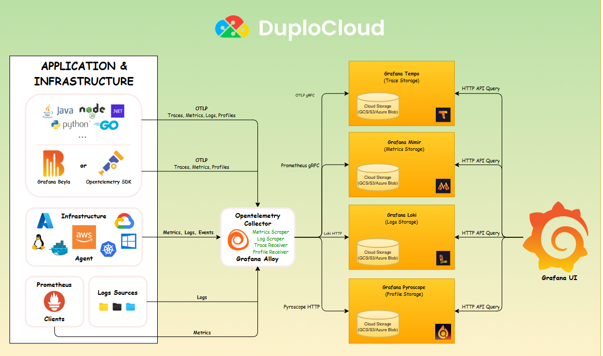

# Architecture

Advanced Observability Suite (AOS) is based on OpenTelemetry. The following graphic shows the various components.


The OTEL stack is made up of 50 or more components and hundreds of configurations. If you need to change your OpenTelemetry configuration, work with your DuploCloud support team.


<figure><figcaption>
DuploCloud Advanced Observability Suite Architecture
</figcaption></figure>

To view the complete deployment of the OpenTelemetry stack, see the setup under the tenant where OTEL is deployed under the Kubernetes menu. Data is stored in S3 buckets that you can find under Cloud services --> Storage --> S3. The setup is deployed and managed via Flux Helm release infrastructure.

The folllowing graphic shows a list of Kubernetes deployments, containers, and S3 buckets that are invovled in this OpenTelemetry deployment.

<figure><figcaption></figcaption></figure>

<figure><figcaption></figcaption></figure>

<figure><figcaption></figcaption></figure>
