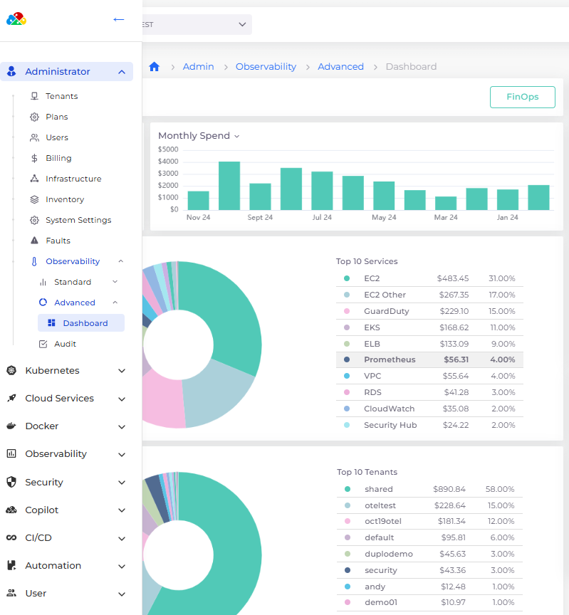
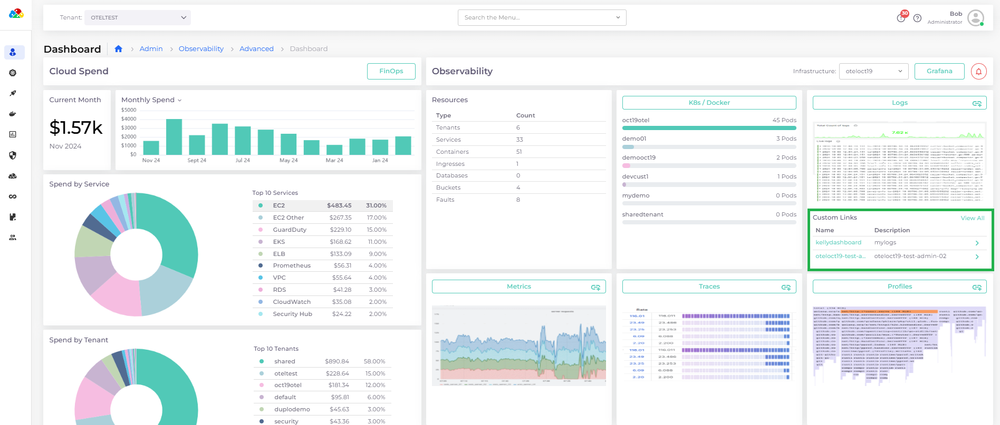

# Dashboards

The DuploCloud AOS dashboards are a gateway to the detailed Grafana dashboards, serving two purposes:

* **SSO and Authentication Proxy**: The Grafana dashboards reside on a private network. DuploCloud acts as an authentication layer, connecting the same single sign-on (the DuploCloud login) to a Grafana session.
* **Summarizing Links**: While AOS contains many pre-configured Grafana dashboards, you can create quick links with descriptions of the ones you use most frequently.&#x20;

## Administrator and Tenant AOS Dashboards

Depending on your [role ](../../../access-control/)(Administrator or User), you can access the Advanced Observability Suite dashboard from two locations in the DuploCloud Portal.

1. The [Administrator AOS Dashboard](admin-dashboard.md) displays cloud data across all resources and allows you to select DuploCloud Infrastructures. To use it, navigate to  **Administrator** -> **Observability** -> **Advanced** -> **Dashboard** in the DuploCloud Portal.&#x20;
2. The [Tenant AOS Dashboard](tenant-dashboard.md) displays data for specific Tenants. To use it, navigate to **Observability** -> **Advanced** -> **Dashboard** in the DuploCloud Portal. &#x20;

<figure><figcaption>
Navigating to the Adminstrator AOS Dashboard
</figcaption></figure>

<figure><figcaption>
Navigating to the Tenant AOS Dashboard
</figcaption></figure>

## Adding and Modifying Custom Dashboard LInks

To add custom links to a Grafana dashboard, you can add a dashboard link:&#x20;

1. In the DuploCloud Portal, navigate to **Administrator** -> **Observability** -> **Advanced** -> **Dashboard**.
2. Click the card button to select one of the dashboards (**K8s/Docker**, **Metrics**, **Logs**, **Metrics**, **Traces**, and **Profiles**). The Grafana dashboard opens.
3. See the [Grafana Documentation](https://grafana.com/docs/grafana/latest/dashboards/build-dashboards/manage-dashboard-links/#manage-dashboard-links) for detailed steps for creating and modifying dashboard links. Links that you add will display under **Custom Links** in the respective AOS Dashboard card, as shown in the graphic below.

<figure><figcaption>
<strong>Custom Links</strong> created in the <strong>Logs</strong> card in the DuploCloud AOS dashboard
</figcaption></figure>
