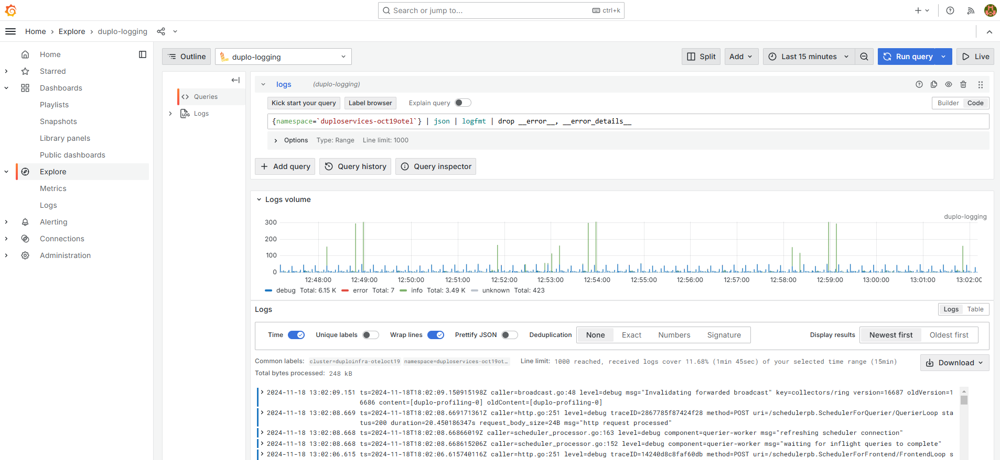
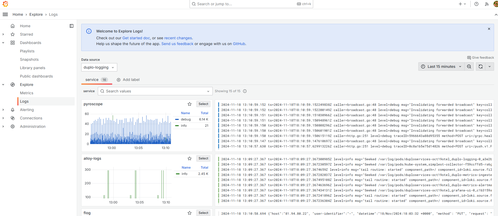

# Logging with loki

Grafana [loki](https://grafana.com/docs/loki/latest/) is the backend component that provides logging setup, using Grafana as the visualization tool. Grafana [Alloy ](https://grafana.com/docs/alloy/latest/)is the collector which collects the logs.

DuploCloud orchestrates the configuration to automatically insert metadata such as Tenant name, Namespace, container, Host, etc. Links can be set from logs to maps to traces and then metrics.

## Displaying Logs in the DuploCloud Advanced Observability Suite

1. In the DuploCloud Portal, navigate to **Administrator** -> **Observability** -> **Advanced** -> **Dashboard**. The AOS Dashboard displays.
2.  Click the **Logs** card button. The Grafana **Logging** dashboard displays.\

    <figure><figcaption>
Grafana <strong>Logging D</strong>ashboard
</figcaption></figure>

3. Select the **Namespace** you want to view from the Namespace list box.

## Exploring Detailed View of Logs

From the Grafana **Logging** Dashboard, click **Open in Explore**. The **Explore** view opens so you can view data from your **Data source** (**duplo-logging** in the example below).

<figure><figcaption>
<strong>Explore</strong> view of the Grafana <strong>Logging</strong> Dashboard
</figcaption></figure>

For more information about performing logging tasks, such as querying, filtering, and viewing logging visualizations, refer to the [Grafana Logging documentation](https://grafana.com/docs/grafana-cloud/visualizations/simplified-exploration/logs/).

Using the left navigation pane in the Grafana dashboard, select **Logs** to view logs from numerous sources, including ready-made (and customizable) visualizations.

<figure><figcaption>
<strong>Logs</strong> option in the Grafana Explore view navigation
</figcaption></figure>

<figure><figcaption></figcaption></figure>
