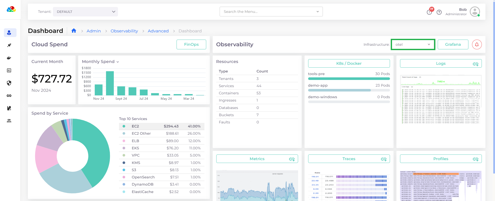
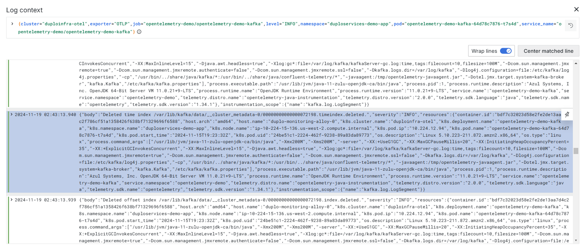

# Logging with loki

Grafana [loki](https://grafana.com/docs/loki/latest/) is the backend component that provides logging setup, using Grafana as the visualization tool. Grafana [Alloy ](https://grafana.com/docs/alloy/latest/)is the collector which collects the logs.

DuploCloud orchestrates the configuration to automatically insert metadata such as Tenant name, Namespace, container, Host, etc. Links can be set from logs to maps to traces and then metrics.

## Displaying Logs in the DuploCloud Advanced Observability Suite

1. In the DuploCloud Portal, navigate to **Administrator** -> **Observability** -> **Advanced** -> **Dashboard**. The AOS Dashboard displays.
2. Select your Infrastructure from the Infrastructure list box.
3.  Click the **Logs** card button. The Grafana **Logging** dashboard displays various widgets and views, including **Live logs**.\

    <figure><figcaption>
Grafana <strong>Logging D</strong>ashboard
</figcaption></figure>

4.  Adjust the time interval list box in the top right corner of the Grafana dashboard (**Last 30 minutes** in the above graphic) to display data for the period of your choice.\

    <figure><figcaption>
<strong>Infrastructure</strong> list box on the DuploCloud AOS Dashboard
</figcaption></figure>

5. You can refine your view by selecting a specific Namespace from the **Namespace** list box or using the default value of **All**.

## Exploring Detailed View of Logs

From the Grafana **Logging** Dashboard, click **Open in Explore**. The **Explore** view opens to view data from your **Data source** (**duplo-logging** in the example below).

<figure><figcaption>
<strong>Explore</strong> view of the Grafana <strong>Logging</strong> Dashboard
</figcaption></figure>

The [Grafana Logging documentation](https://grafana.com/docs/grafana-cloud/visualizations/simplified-exploration/logs/) provides more information about logging tasks, such as querying, filtering, and viewing logging visualizations.

Using the left navigation pane in the Grafana dashboard, select **Logs** to view logs from numerous sources, including ready-made (and customizable) visualizations.

<figure><figcaption>
<strong>Logs</strong> option in the Grafana Explore view navigation
</figcaption></figure>

## Examining Log Entries in Detail

If you have administrator privileges, you can click any log entry for more details about the events that triggered it.

1.  Click on any log entry for more details about the event that triggered it. Detailed data will be displayed, as in the graphic below.

    <figure><figcaption>
Close-up of <strong>Live logs</strong> on the Grafana Logging Dashboard
</figcaption></figure>
2. Click the context icon (  ) to open the **Log context** window for complete contextual detail.

<figure><figcaption></figcaption></figure>

