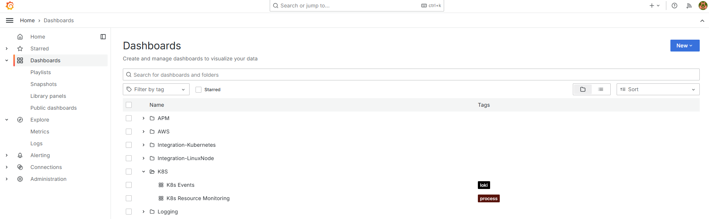
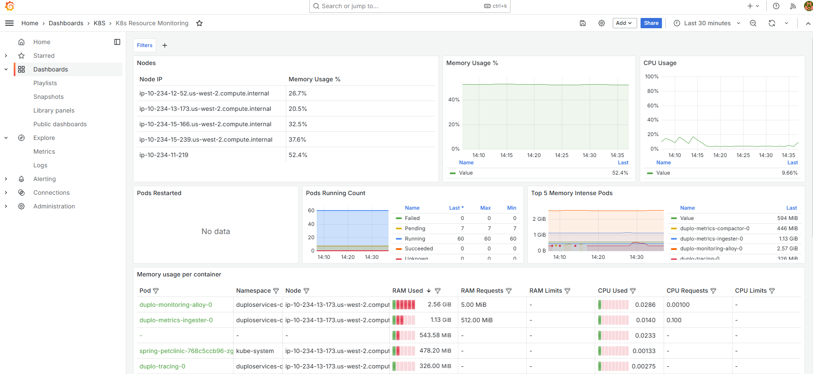

# Metrics with Mimir

DuploCloud's AOS uses Grafana [Mimir](https://grafana.com/docs/mimir/latest/manage/monitor-grafana-mimir/collecting-metrics-and-logs/) as the backend for metrics setup, Grafana as the visualization tool, and Grafana Alloy as the metrics collector. Grafana Alloy bundles Beyla, allowing you to instrument your applications while you instrument your infrastructure.

## About RED Metrics

RED metrics (Rate, Errors, Duration) are critical for monitoring and understanding the health and performance of distributed systems and microservices. When integrated into a **Grafana dashboard** using **OpenTelemetry**, they provide essential insights for diagnosing issues and optimizing performance.&#x20;

* **Rate**: Tracks the number of requests per second, indicating the system's throughput. A sudden drop can highlight service degradation or bottlenecks.
* **Errors**: Measures the percentage or count of requests that fail. This helps quickly identify stability issues or breaking changes in your service.
* **Duration**: Monitors the time to process requests, providing insights into system latency. High durations can indicate inefficiencies or resource constraints.

Focusing on these metrics in Grafana can enhance system reliability, improve user experience, and proactively address performance challenges.

## Displaying Metrics in the DuploCloud Advanced Observability Suite (AOS)

1. In the DuploCloud Portal, navigate to **Administrator** -> **Observability** -> **Advanced** -> **Dashboard**. The AOS Dashboard displays.
2. Click the **Metrics** card button. The Grafana **APM** -> **RED Metrics** Dashboard displays. The graphic below shows the **RED** (Request, Error, Duration) Dashboard.

<figure><figcaption>
<strong>Beyla RED Metrics</strong> Dashboard
</figcaption></figure>

## Exploring Detailed Metrics

From the Grafana **Beyla RED** Dashboard, navigate to Grafana **Dashboards** in the left pane. Various out-of-box metrics and visualizations are available to you without creating specific queries.&#x20;

<figure><figcaption>
Grafana <strong>Dashboards</strong> page.
</figcaption></figure>

For example, by selecting **K8s Resource Monitoring** from the **Dashboards** page, you can view numerous Kubernetes widgets depicting resource usage of Kubernetes Pods and containers, among other helpful performance data.&#x20;

Click the **Add** button and select from the displayed list to add additional customizations and visualizations.

<figure><figcaption>
<strong>K8s Resource Monitoring</strong> metrics page
</figcaption></figure>
