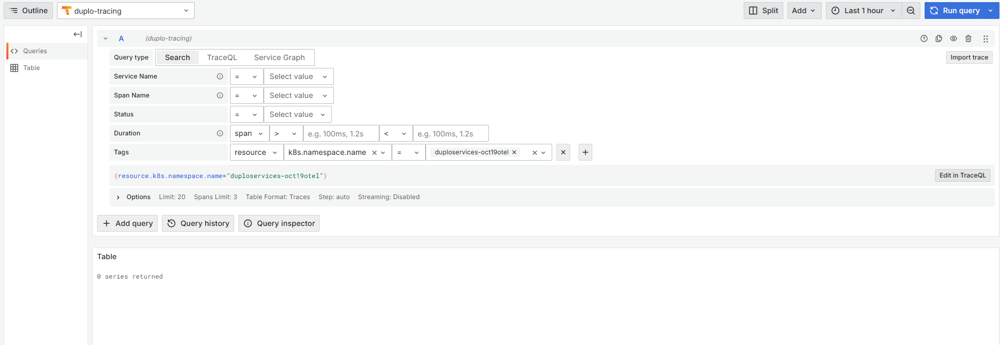

# Tracing with Tempo

DuploCloud's Advanced Observability Suite (AOS) utilizes [Tempo ](https://grafana.com/oss/tempo/)as the tracing backend, with Alloy and Beyla as the collectors. They use eBPF technology to collect traces without requiring instrumentation.

Grafana Beyla is utilized for tracing. Beyla uses eBPF (extended Berkeley Packet Filter) to collect observability data directly from the kernel without modifying the application code.&#x20;

eBPF allows Beyla to attach to system-level events, such as network requests or function calls, and gather metrics and traces efficiently. You can fine-tune the application with OTEL SDK, receive detailed traces, and include traces in the logs.

## What Tracing Can Tell You

Running a trace in a Grafana dashboard with OpenTelemetry is useful in scenarios where you want to identify, analyze, and resolve performance issues or understand the flow of requests through a distributed system. Tracing is helpful for:

* Debugging latency issues
* End-to-end visibility of requests across services
* Analyzing errors and failures
* Capacity planning and optimization
* Root Cause Analysis (RCA)
* Performance tuning new features
* Validating SLAs
* Exposing misconfigurations
* Understanding user behavior

Using OpenTelemetry with Grafana, you can collect and visualize traces alongside other observability data like metrics and logs, providing a unified view for effective troubleshooting and optimization.

## Creating Traces in the DuploCloud Advanced Observability Suite (AOS)

1. In the DuploCloud Portal, navigate to **Administrator** -> **Observability** -> **Advanced** -> **Dashboard**. The AOS Dashboard displays.
2. Click the **Traces** card button. The Grafana **Tracing** dashboard displays.

<figure><figcaption>
Grafana <strong>Tracing</strong> dashboard
</figcaption></figure>

<figure><figcaption></figcaption></figure>

One can go from traces to metrics

<figure><figcaption></figcaption></figure>

