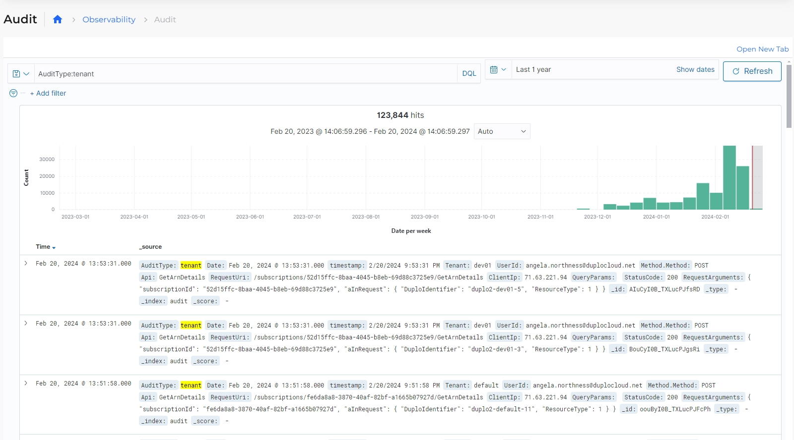

# Auditing

## Viewing detailed auditing diagnostics

To view complete auditing reports and logs, navigate to the **Observability** -> **Audit** page in the DuploCloud Portal.

<figure><figcaption>
<strong>Audit</strong> page in the DuploCloud Portal
</figcaption></figure>
