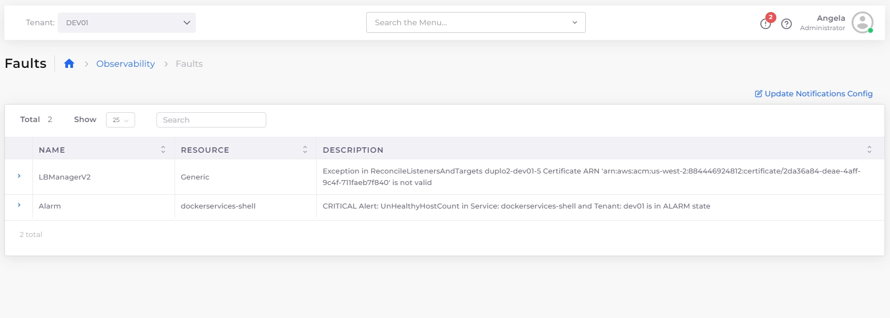
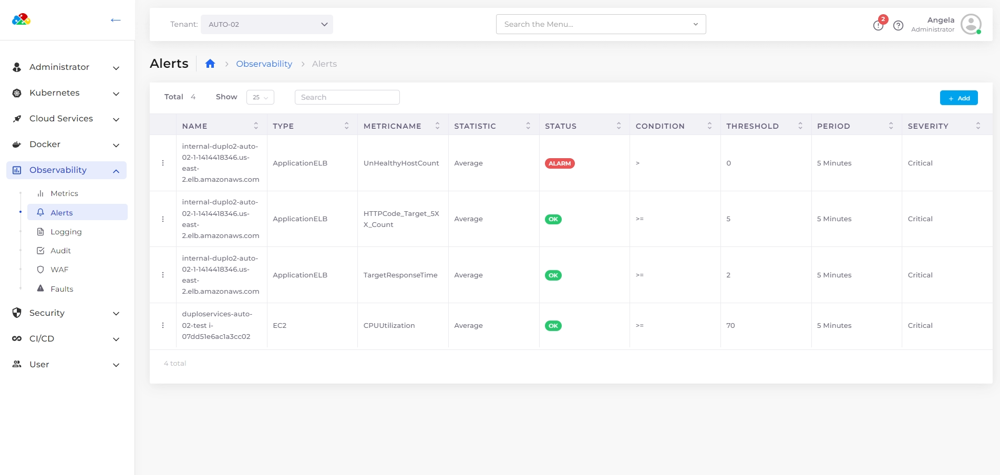
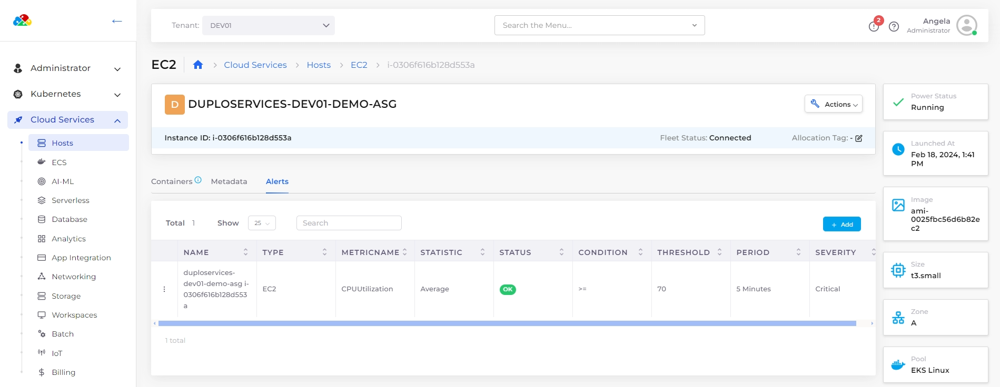

# Faults and Alerts

## Introduction 

Faults that happen in the system, be it Infrastructure creation, container deployments, Application health checks, or any Triggered Alarms can be tracked in the DuploCloud portal under Faults Menu.

## Viewing Faults 

You can look at Tenant-specific faults under **Observability** -> **Faults** or all the faults in the system under **Administrator** -> **Faults**.

<figure><figcaption>
The <strong>Faults</strong> page showing faults for the DEV01 Tenant
</figcaption></figure>

## Creating Alerts 

You can set the AWS Alerts for the individual metrics, click on the bell icon on any of the metrics. A form to create an alert shows up. You can provide the necessary information and create the alert.

## Viewing Alerts

* View general alerts from the DuploCloud Portal in the **Observability** -> **Alerts**.
* Select the **Alerts** tab for alerts pertaining to a specific resource, such as **Hosts**.

<figure><figcaption>
General <strong>Alerts</strong> page under <strong>Observability</strong> in the DuploCloud Portal
</figcaption></figure>

<figure><figcaption>
<strong>Alerts</strong> tab under <strong>Cloud Services</strong> -> <strong>Hosts</strong> in the DuploCloud Portal
</figcaption></figure>
