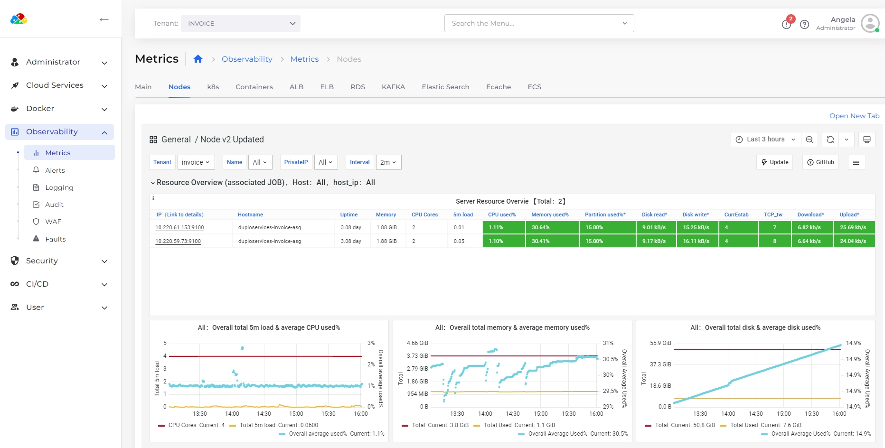

# Metrics Dashboard

Under **Observability** -> **Metrics** we have the various metrics per Tenant.&#x20;


While there are 8-10 out-of-box dashboards for various services, one can add their own dashboards and make them appear in Duplo Dashboard through a configuration&#x20;


<figure><figcaption></figcaption></figure>
