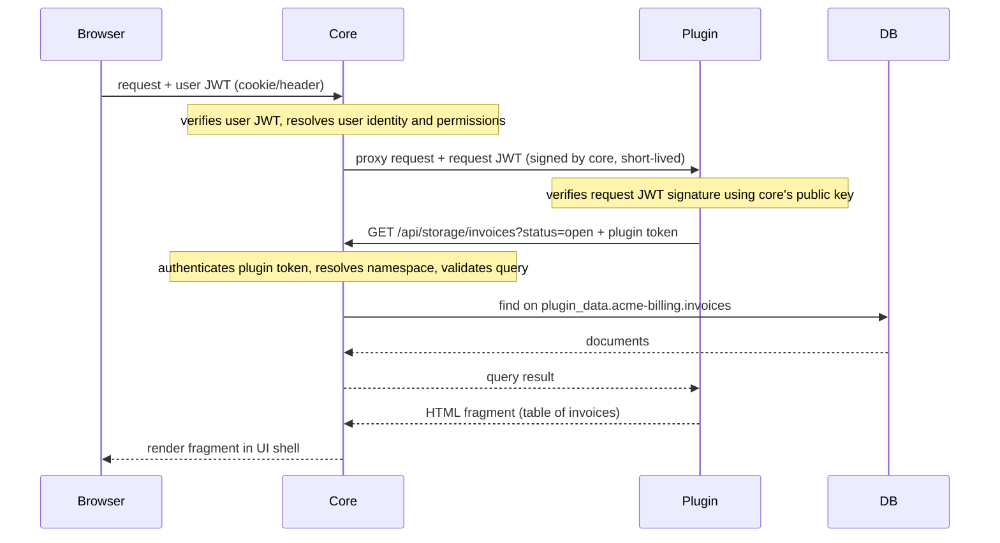

# Authentication

The plugin architecture uses three distinct tokens, each with a different issuer, audience, and lifetime. Mixing them up is the most common integration bug.

## Three Tokens

| Token | Issued to | Carried in | Purpose |
|---|---|---|---|
| User JWT | The user (after login) | Browser cookie or `Authorization` header from browser to core | Identifies the human making the request |
| Request JWT | Plugin (per request) | `Authorization` header from core to plugin | Tells the plugin which user is calling and what scopes they have. Short-lived, signed by the core. Plugin verifies with the core's public key. |
| Plugin token | Plugin (at registration) | `Authorization` header from plugin to core's storage API | Identifies the plugin to the storage API. Determines which namespace it can touch. Long-lived. |

## Token Boundaries

**User JWT** — never leaves the browser-to-core boundary. The core reads it to identify the user and check permissions, but it is never forwarded to a plugin. A plugin that receives a user JWT directly is a configuration error.

**Request JWT** — this is what the plugin sees. The core mints a new request JWT for every proxied request, signed with the core's private key. It encodes the user identity and granted scopes. The plugin must verify the signature using the core's public key (available at the core's JWKS endpoint) before trusting any claim in it. The request JWT is short-lived; the plugin must not cache or reuse it.

**Plugin token** — this is what the plugin uses to call back to the storage API. It is issued once at registration and is long-lived. It identifies the plugin (not the user) and is scoped to the plugin's namespace. The plugin must store it securely. It must never be sent to a browser or included in a response.

None of the three tokens are interchangeable. Using the user JWT to call the storage API will fail authentication. Forwarding the plugin token to the browser exposes write access to the plugin's entire namespace.

## Runtime Flow

The diagram below shows where each token appears at each hop during a typical read-then-render flow.

For write flows, the plugin performs its business logic (validation, computation, external calls) before calling `POST /api/storage/{collection}` with the plugin token. The core validates the body against the registered schema before executing the insert.
