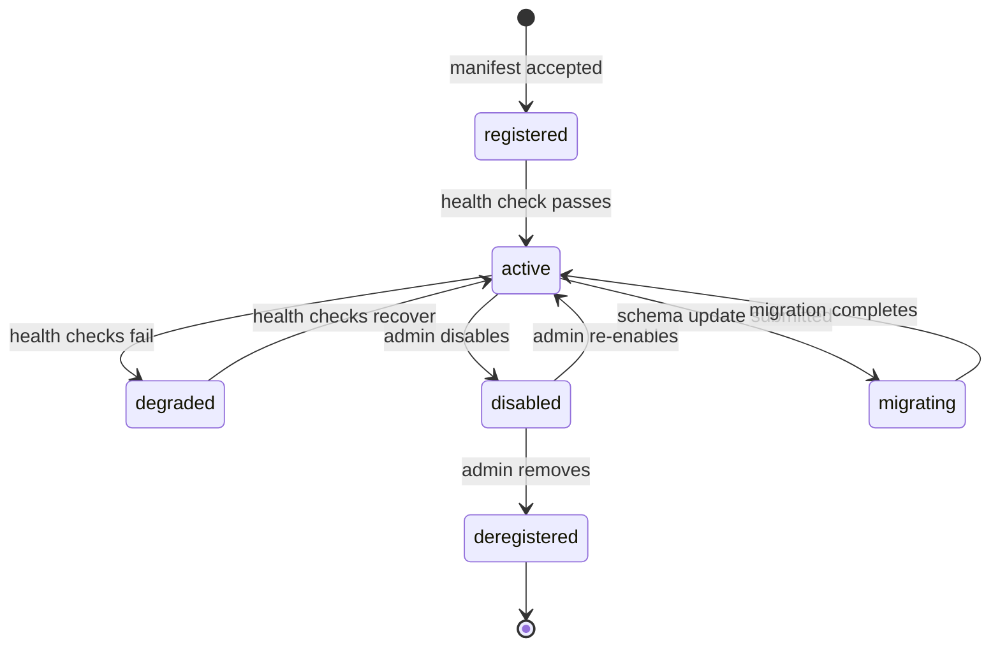

# Lifecycle States

Every plugin moves through a defined set of lifecycle states. The state determines whether menus are visible in the UI shell and whether the plugin's storage namespace is open for reads and writes, read-only, or frozen.

## State Diagram

## State Descriptions

| State | Menus | Storage | Description |
|---|---|---|---|
| `registered` | Hidden | Closed | Manifest accepted and persisted; collections provisioned; awaiting first successful health check. |
| `active` | Visible | Open | Plugin is healthy. Menus appear in the UI shell. Reads and writes proceed normally. |
| `degraded` | Hidden | Open | Health checks are failing. Menus are hidden to prevent new user interactions. Storage remains open so any in-flight writes can complete without data loss. |
| `disabled` | Hidden | Read-only | An administrator has explicitly disabled the plugin. Menus are hidden. Existing data is preserved and readable, but writes are rejected. |
| `migrating` | Hidden | Frozen | A schema update is in progress. Menus are hidden and all storage operations (reads and writes) are blocked until the migration handler signals completion. |
| `deregistered` | Hidden | Per policy | The plugin has been removed from the registry. Data disposition is determined by the uninstall policy set by the administrator for that tenant: `retain`, `archive`, or `purge`. See [Schema Versioning — Uninstall Policies](schema-versioning.md#uninstall-policies). |

## Operational Notes

**Degraded vs. disabled:** `degraded` is an automatic state — the core moves the plugin there when health checks fail and moves it back when they recover. `disabled` is an explicit administrative action. A degraded plugin cannot be re-enabled by a health check recovery if an admin has also disabled it; the admin action takes precedence.

**Migrating is blocking:** While a plugin is in `migrating` state, the core rejects all storage requests for that plugin's namespace with `503 Service Unavailable`. The plugin must complete the migration handler before storage reopens. If the migration handler returns an error, the plugin stays in `migrating` state and requires manual intervention.

**Health checks:** The core probes the plugin's `/health` endpoint on a configurable interval. A `200` response moves or keeps the plugin in `active`. Non-`200` or timeout moves it toward `degraded`. The number of consecutive failures required before the state transition is configurable per deployment.
