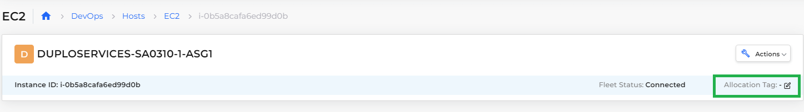

# Allocation Tagging for Hosts

By default, DuploCloud spreads container replicas across hosts. Using an Allocation Tag, you can pin a container to a set of hosts using a specific tag.&#x20;

## Adding an Allocation Tag to a Host

1. In the DuploCloud Portal, navigate to **DevOps** -> **Hosts**. The **Hosts** page displays.
2. Select a Host from the **Name** column. If the Host is part of an Auto-Scaling Group (ASG), select the **ASG** tab and select the ASG.
3.  Click the **Allocation Tag** Edit Icon ( ). The **Set Allocation Tag** displays.\

    <figure><figcaption>
Allocation Tag Edit Icon
</figcaption></figure>

4. In the **Allocation Tag** field, enter a tag name. Use only alphanumeric characters. Hyphens ( **-** ) are supported as special characters if needed. For example, **highmemory-highcpu** is a valid tag name.
5.  Click **Set**. The Allocation Tag that you set displays in the heading banner for the Host or ASG you select.\

    <figure><figcaption>
Auto-Scaling Group (ASG) with <strong>Allocation Tag</strong> set
</figcaption></figure>

6. Create a [Service](../aws/aws-services/). During creation, on the **Add Service** page, enter the tag name you created in the **Allocation Tag** field. DuploCloud attempts to select a host or ASG with a matching tag.

## Editing or deleting an Allocation Tag

Use the **Metadata** tab to edit or delete an existing Allocation Tag, after selecting a host or ASG.

