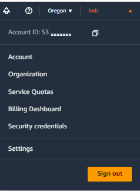

# Free Trial Edition


Go to [https://duplocloud.com/free-trial/](https://duplocloud.com/free-trial/) to begin your free trial of DuploCloud!


## What DuploCloud does for you

When you [sign up for your free 30-day trial of DuploCloud](https://duplocloud.com/free-trial/), you'll experience a faster, more secure, time-to-market when deploying your cloud apps. Some of the DuploCloud advantages you'll notice during the trial period include:

* Simplified creation of a Virtual Private Cloud [infrastructures ](aws/use-cases/disaster-recovery.md)with just a few clicks
* Abstracted complexity in deploying ready-to-use and customizable [services](aws/aws-services/)
* Transparent, maintenance-free updating and monitoring of [compliance](aws/broader-scenarios/security-and-compliance.md) controls&#x20;
* White-glove support from our staff of dedicated DuploCloud engineers

DuploCloud is your all-in-one DevOps/SecOps self-service Platform Engineering solution. Try it free today, with no obligations.

## What you need for the DuploCloud 30-day trial

To participate in the free 30-day DuploCloud trial, you must have:

* An active [Amazon Web Services subscription and account](https://aws.amazon.com/free/?trk=78b916d7-7c94-4cab-98d9-0ce5e648dd5f\&sc\_channel=ps\&ef\_id=CjwKCAjwpuajBhBpEiwA\_ZtfhU8KT036RgM6RbsbKcPmNuRz49DKHeb0LfMuQ5n--Iuhf064JpgG-hoCQtEQAvD\_BwE:G:s\&s\_kwcid=AL!4422!3!432339156162!e!!g!!aws%20sign%20up!9572385111!102212379327\&all-free-tier.sort-by=item.additionalFields.SortRank\&all-free-tier.sort-order=asc\&awsf.Free%20Tier%20Types=\*all\&awsf.Free%20Tier%20Categories=\*all)
* An email account with a corporate domain, such as _user@companyname.com_

## Sign-up for the trial

1.  Navigate to the [free trial sign-up form](https://duplocloud.com/free-trial/) and complete it using your corporate email address. Select the checkbox to consent to receive communications from DuploCloud so that we can store and process your personal information within the 30-day trial period.

    <figure><figcaption>
<strong>DuploCloud 30-day Trial</strong> sign-up form
</figcaption></figure>
2.  Click **Register for free trial**. A **Thank you for signing up** page is displayed with instructions to check your email inbox for account activation and setup instructions. The page also contains a link to the [AWS Quick Start Guide](aws/quick-start/).

    <figure><figcaption>
<strong>Thank you for signing up</strong> page displays after successful sign-up
</figcaption></figure>

## What happens after I sign-up?


The AWS CloudFormation must be running in the **us-west-2** region. Please do not change any AWS CloudFormation parameters.


1.  You receive an email from DuploCloud with an Activation Link. When you click the link, a browser instance launches, and the **Thank you for signing up** web page displays.\

    <figure><figcaption>
Initial email from DuploCloud with Activation Link highlighted 
</figcaption></figure>
2. On the **Thank you for signing up** web page, under **Register Your AWS Account**, click the **Sign In** hyperlink in Step **1**. A browser instance launches that opens your AWS Portal and logs you into your AWS account.&#x20;
3.  On the **Thank you for signing up** web page, under **Register Your AWS Account**, click the hyperlink to **run CloudFormation on your AWS test account**. A browser instance launches and the **Quick create stack** page displays. This page runs a script that provisions an instance of DuploCloud in AWS, using [AWS CloudFormation](https://aws.amazon.com/cloudformation/). \

    <figure><figcaption>
<strong>Thank you</strong> <strong>for signing up</strong> web page 
</figcaption></figure>

4.  In the **Quick create stack** page form, scroll to the bottom of the page and select the two Acknowledgement checkboxes. Do not modify any of the other fields on the **Quick create stack** page.\

    <figure><figcaption>
Acknowledgement checkboxes selected on the AWS Portal <strong>Quick create stack</strong> page
</figcaption></figure>

5.  At the bottom of the **Quick create stack page**, click **Create Stack**. The **Stacks** page launches, which you will use to monitor the progress of DuploCloud's CloudFormation provisioning.\
    &#x20;\
    Notice that there are two columns on the **Stacks** page: one for **Stacks** creation and one for **Events** creation. Wait until all **Stacks** creation tasks display a status of **CREATE\_COMPLETE** (about 20 to 30 minutes) before proceeding to the next step. It is not necessary to wait until the **Events** creation tasks display a status of **CREATE\_COMPLETE** to proceed to the next step.\

    <figure><figcaption>
AWS Portal <strong>Stacks</strong> page with <strong>Stacks</strong> tasks highlighted, displaying status <strong>CREATE_COMPLETE</strong>
</figcaption></figure>

6.  In the AWS Portal, click your AWS Profile _username_, to the right of the **Oregon** region name. The AWS Profile list box expands, listing your **Account ID**.

    <figure><figcaption>
AWS Profile list box expanded with <em>username</em> and <strong>Account ID</strong> highlighted
</figcaption></figure>
7. From the AWS Profile list box, copy your AWS **Account ID** to the clipboard by clicking the Copy Icon (  ).
8. Return to the **Thank You for signing up** page to complete the setup.
9.  In Step **3** on the **Thank You for signing up** page, paste the AWS **Account ID** that you copied to your clipboard. \

    <figure><figcaption>
Step <strong>3</strong> on the <strong>Thank You for signing up</strong> page, where you paste the AWS <strong>Account ID</strong> you copied from the AWS Profile
</figcaption></figure>

10. In the AWS Portal, on the **Stacks** page, confirm that all your **Stacks** tasks show a status of **CREATE\_COMPLETE**. \
    \
    If so, click **Continue** In Step 4 of the **Thank You for signing up** page to complete the registration process. The web page below is displayed with a message indicating that **Your DuploCloud Portal is being provisioned**. Click the **Get Latest Status** button to check the status of the provisioning process. \

    <figure><figcaption>
Web page with <strong>Your DuploCloud Portal is being provisioned</strong> message
</figcaption></figure>

11. When your DuploCloud portal is successfully provisioned, you will receive a confirmation email from DuploCloud, as shown below. Click the **https** link in the email to launch the DuploCloud Portal. \

    <figure><figcaption>
Confirmation email from DuploCloud after DuploCloud Portal is provisioned
</figcaption></figure>

12. The DuploCloud Portal launches, set to the **Default** Tenant. &#x20;

<figure><figcaption>
<strong>Tenant</strong> list box, highlighted, set to the <strong>Default</strong> Tenant
</figcaption></figure>


Congratulations! Your Free Trial Edition has been activated and is ready for use.


## Exploring DuploCloud

Once AWS CloudFormation provisioning is complete, you can begin using DuploCloud.

Explore the DuploCloud Documentation to learn more about DuploCloud's capabilities, with hands-on tutorials to help familiarize you with the DuploCloud Portal.

* AWS [Quick Start Guide](aws/quick-start/)
* Overview of [DuploCloud Terminology](aws/container-deployments/concepts.md) and Concepts
* [General FAQ](faq.md), including what to expect in the DuploCloud Onboarding process after purchasing the product.
* [AWS FAQ](aws/aws-faq.md)
* AWS [Use Cases](aws/use-cases/)
* AWS [Services](aws/aws-services/)
* [Terraform](aws/terraform-support/) Support

## During the Trial period

* Contact the DuploCloud Support team by emailing [freetrialsupport@duplocloud.net](mailto:freetrialsupport@duplocloud.net).
* You will receive an email from DuploCloud confirming that you have access to the portal, including instructions for getting support for any issues you may be having.
* Shortly before the trial period ends, you'll receive another email informing you of the trial expiration, including contacts for support and sales. The DuploCloud support and sales team can answer product questions you may have and assist you in extending your trial or purchasing a license.&#x20;

## Before your Trial period ends


While we hope you extend your Trial period or pursue the purchase of DuploCloud, it is critical to do the following, to avoid being billed for resources created in your AWS account relating to your DuploCloud trial:

* Delete the AWS account associated with the DuploCloud Trial Edition, or
* Manually delete all resources in your AWS account that were created by DuploCloud.


## Trial Edition Troubleshooting FAQs

### I'm getting an error message when clicking the CONTINUE button on the THANK YOU page.

Verify that all **Stacks** tasks show a status of **CREATE\_COMPLETE** before clicking **Continue**.

### My AWS Account ID is failing to validate on the THANK YOU page.

Ensure you are using **Paste** and not **Paste as plain text** when pasting your Account ID in Step **3**.
