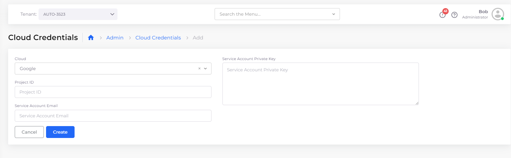
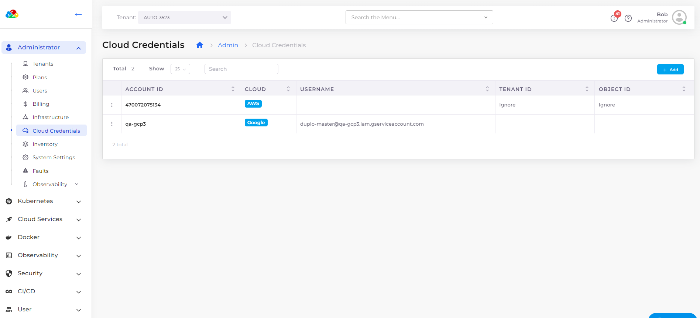

# Cloud Credentials

The DuploCloud rules-based expert system requires GCP Subscription details to effectively manage cloud resources. By adding Cloud Credentials in the DuploCloud Portal, you provide the necessary subscription details for this management.

## Adding Cloud Credentials for GCP Subscriptions

To integrate another GCP project into DuploCloud, follow these steps to add the required cloud credentials:

1. In the DuploCloud Portal, navigate to **Administrator** -> **Cloud Credentials**. The **Cloud Credentials** page displays.
2. Click **Add** to begin the process of adding new cloud credentials.&#x20;
3. Ensure **Google** is selected from the **Cloud** list box to specify the cloud provider.
4. Enter the **Project ID** of the GCP project you wish to add in the **Project ID** field.
5. Provide the **Service Account Email** in the designated field. This email corresponds to a special account used by applications or compute workloads, managed through Identity and Access Management (IAM).
6. In the **Service Account Private Key** field, paste the private key associated with your service account. To extract and copy the private key from a JSON file, you can use the command `jq -r .private_key < filename.json | pbcopy`.

    <figure><figcaption>
<strong>Add Cloud Credentials</strong> page in the DuploCloud Portal
</figcaption></figure>

7. Click **Submit** to save your credentials, which are then displayed on the **Cloud Credentials** page.

<figure><figcaption>
GCP <strong>Cloud Credentials</strong> page in the DuploCloud Portal
</figcaption></figure>

To ensure a smooth integration, it's advisable to create a service account with the IAM Admin Service Accounts role and grant it the Owner role for the necessary permissions. After creating the service account, generate a new private key in JSON format and download it. This JSON file contains the Project ID and Service Account Email, which you will need to enter in the DuploCloud portal. For further integrations, consider creating a GitHub Actions secret named `CLOUD_CREDENTIALS` with the JSON credentials and a GitHub Actions variable named `CLOUD_ACCOUNT` with the project ID or name.

For any additional assistance or clarification, reaching out to DuploCloud customer support is recommended. This ensures that your cloud resources are managed effectively with the correct credentials in place.