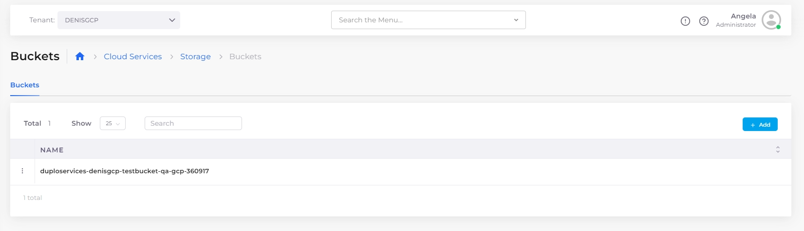
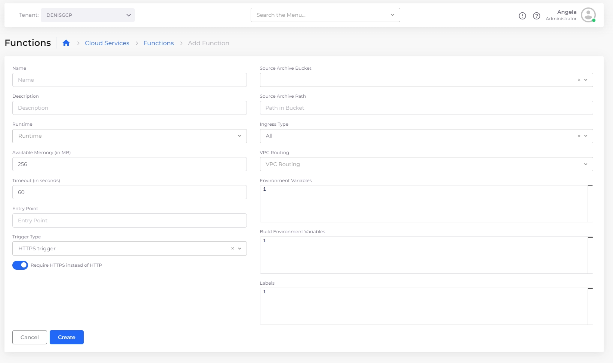

# Cloud Functions

In GCP, Cloud Functions are for serverless execution of code.

## Creating a GCP Cloud Functions

1. In the DuploCloud Portal, navigate to **Cloud Services** -> **Storage**. Create a bucket and upload the code package.

<figure><figcaption>
The <strong>Buckets</strong> page
</figcaption></figure>

2. Next under **Cloud Services** -> **Functions**, click **Add**. The Add Function page displays. Create a new function using the following self-descriptive menu.

<figure><figcaption>
The <strong>Add Function</strong> page
</figcaption></figure>

