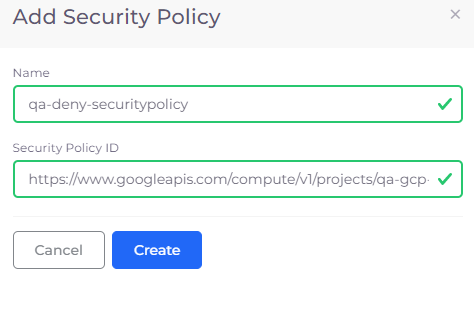
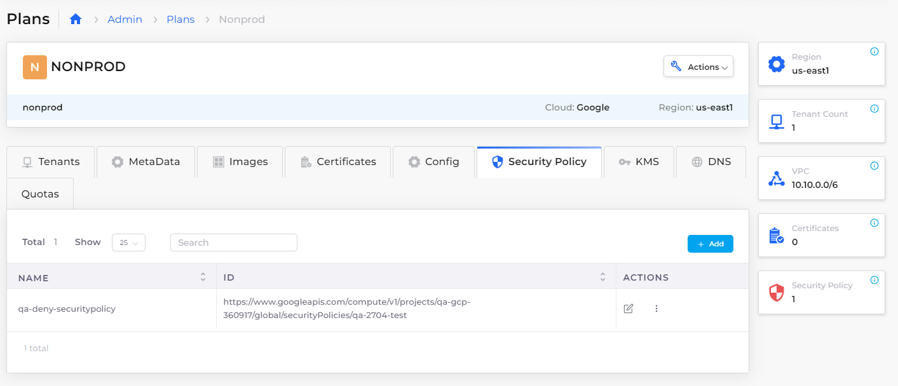
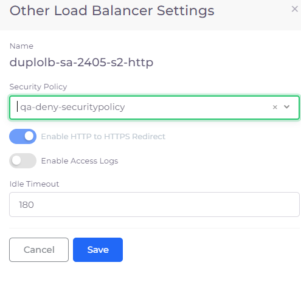
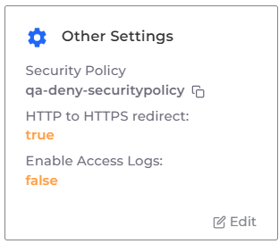
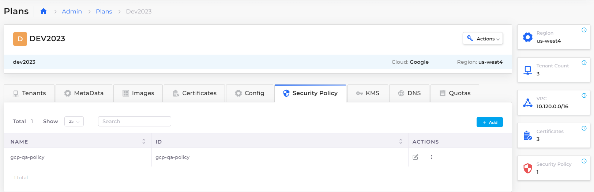
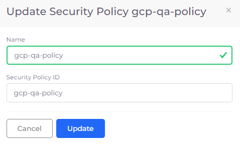

# Cloud Armour

GCP Cloud Armour helps protect your applications and websites against denial of service, web breaches, and cyber-attacks.&#x20;

Use DuploCloud to activate your GCP Cloud Armour software and monitor your cloud infrastructures and deployed services and applications.

## Adding a Security Policy in the DuploCloud Plan

Before you can use DuploCloud with Cloud Armour, define a Security Policy in the DuploCloud Plan that supports your DuploCloud Infrastructure.

1. In the DuploCloud Portal, navigate to **Administrator** -> **Plan**. The **Plans** page displays.
2. From the Name column, select the Plan that corresponds to your Infrastructure. When you create a DuploCloud Infrastructure, a Plan is created with the same name.
3. Click the **Security Policy** tab.
4.  Click **Add**. The **Add Security Policy** pane displays.

    <figure><figcaption></figcaption></figure>
5. In the **Name** field, enter an appropriate name for the Security Policy.
6. In the **Security Policy ID** field, enter the URL that points to your GCP Cloud Armour Security Policy.&#x20;
7.  Click **Create**. The Security Policy that you specified is displayed in the **Security Policy** tab.

    <figure><figcaption>
<strong>Security Policy</strong> tab on the DuploCloud <strong>Nonprod Plan</strong> page
</figcaption></figure>

## Adding the Cloud Armour Security Policy to a Load Balancer

Now that the Cloud Armour Security Policy has been defined in your DuploCloud Plan, add the policy to a Load Balancer so that it can monitor network traffic.

1. In the DuploCloud Portal, navigate to **DevOps** -> **Containers** -> **GKE/Native**.
2. From the **Services** tab, select the Service to which your Load Balancer is attached.
3. Click the **Load Balancer** tab.
4.  In the **Other Settings** card, click **Edit**. The **Other Load Balancer Settings** pane displays.

    <figure><figcaption>
<strong>Other Load Balancer Settings</strong> pane with <strong>Security Policy</strong> selected
</figcaption></figure>
5. From the Security Policy list box, select the [Security Policy you added in the previous step](cloud-armour.md#adding-a-security-policy-in-the-duplocloud-plan).
6. Select the **Enable HTTP to HTTPS Redirect** option.
7. In the **Idle Timeout** field, enter the number of minutes for timeout, in seconds.
8. Click **Save**.&#x20;

The Security Policy displays in the Load Balancer's Other Settings card.

<figure><figcaption>
<strong>Other Settings</strong> card with <strong>Security Policy</strong> displayed
</figcaption></figure>

## Modifying a Cloud Armour Configuration Security Policy

To change your Cloud Armour configuration to use a different security policy, edit the **Security Policy** in the DuploCloud [Plan](infrastructure-virtual-private-cloud.md).

1. In the DuploCloud Portal, navigate to **Administrator** -> **Plans**. The **Plans** page displays.
2. From the **Name** column, select the Plan that corresponds to your Infrastructure.
3.  Click the **Security Policy** tab.\

    <figure><figcaption>
Plan <strong>Security Policy</strong> tab
</figcaption></figure>

4.  In the row listing your security policy, click the Edit Icon (  ) to change the Security Policy ID. The **Update Security Policy** pane displays.\

    <figure><figcaption>
<strong>Update Security Policy</strong> pane
</figcaption></figure>

5. Modify the Security Policy **Name** and the **Security Policy ID** as appropriate.
6. Click **Update**. The changes are saved and displayed in the **Security Policy** tab.

