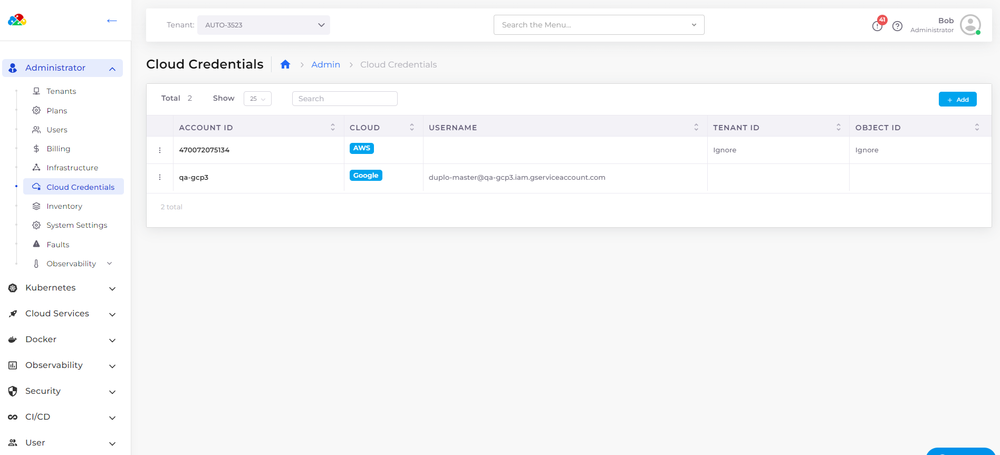

# Cloud Credentials

The DuploCloud rules-based expert needs GCP Subscription details to manage cloud resources. Add Cloud Credentials in the DuploCloud Portal to add subscription details.

## Adding Cloud Credentials for GCP Subscriptions

1. In the DuploCloud Portal, navigate to **Administrator** -> **Cloud Credentials**. The **Cloud Credentials** page displays.
2. Click **Add**.&#x20;
3. In the **Cloud** list box, ensure **Google** is selected.
4. In the **Project ID** field, enter your Google Project ID.
5. In the **Service Account Email** field, enter the Service Account email. A service account is a special account used by an application or compute workload, rather than a person. Service accounts are managed by Identity and Access Management (IAM).
6.  In the **Service Account Private Key field**, enter the private key associated with your service account.\

    <figure><figcaption>
<strong>Add Cloud Credentials</strong> page in the DuploCloud Portal
</figcaption></figure>

7. Click **Submit**. Your credentials are displayed on the **Cloud Credentials** page.

<figure><figcaption>
GCP <strong>Cloud Credentials</strong> page in the DuploCloud Portal
</figcaption></figure>

