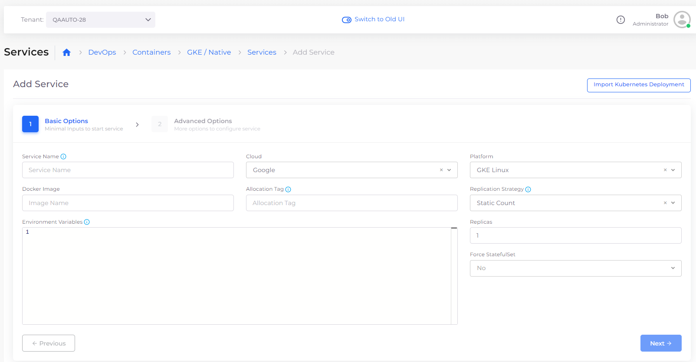

# Containers and Services

## Adding Services

### Docker 

You can deploy any native Docker container in a virtual machine (VM) with the DuploCloud platform.&#x20;

1. In the DuploCloud Portal, select **DevOps** -> **Containers** -> **GKE/Native** from the navigation pane.&#x20;
2. Click **Add**. The **Add Service** page displays.
3. Complete the fields on the page, including **Service Name**, **Docker Image** **name**, and number of **Replicas**. Use **Allocation Tags** to deploy the container in a specific set of hosts.&#x20;


Do not use spaces when creating Service or Docker image names.

The number of Replicas that you define must be less than or equal to the number of hosts in the fleet.


<figure><figcaption>
<strong>Add Service</strong> page
</figcaption></figure>
