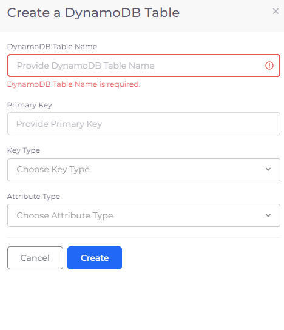

# AWS DynamoDB database tables

When using DynamoDB in DuploCloud GCP, the required permissions to access the DynamoDB from a virtual machine (VM), Lambda functions, and containers are provisioned automatically using Instance profiles. Therefore, no Access Key is required in the Application code.


When you write application code for DynamoDB in DuploCloud GCP, use the IAM role/Instance profile to connect to these services. For example, the AWS SDK constructor which uses the region is recommended.


1. In the DuploCloud Portal, navigate to **DevOps** -> **Database.**
2. Click the **DynamoDB** tab.
3. Click **Add**. The **Create a DynamoDB Table** pane displays.
4. Select the DynamoDB Table Name and other required fields.
5. Click **Create**.
6. Perform more configuration as needed in the AWS Console by clicking the Console **>\_** icon. In the console, you have permission to configure the application-specific details of the DynamoDB. However, no access or security-level permissions are provided.

<figure><figcaption>
<strong>Create a DynamoDB Table</strong> pane
</figcaption></figure>

