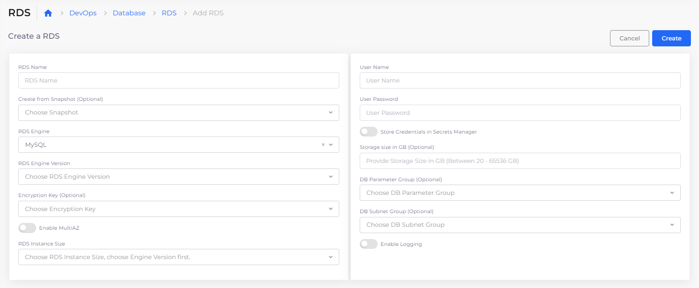

# RDS and SQL databases

DuploCloud supports a number of RDS and SQL databases, including:

* MySQL
* PostgreSQL
* MariaDB
* Microsoft SQL - Express, Standard, and Web
* Aurora, MySQL, and PostgreSQL - Serverless Versions 1 and 2
* Amazon DocumentDB (DocDB)

Use this procedure to set up each database instance.

## Creating an RDS or SQL database

1. In the DuploCloud Portal, navigate to **DevOps** --> **Database**.
2. Click the **RDS** tab.
3. Click **Add**. The **Add RDS** page displays for you to **Create a RDS**.&#x20;
4. Provide the **RDS Name**, **Username**, **Password**, **RDS Engine Version,** and **RDS Instance Size**.&#x20;
5. Click **Submit**.

<figure><figcaption>
<strong>Create a RDS</strong> on the <strong>Add RDS</strong> page 
</figcaption></figure>

