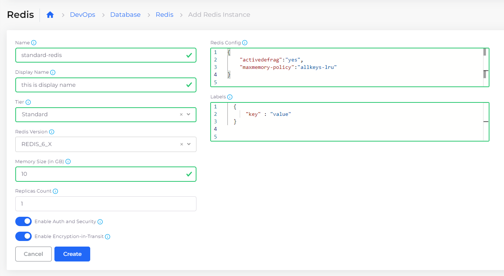
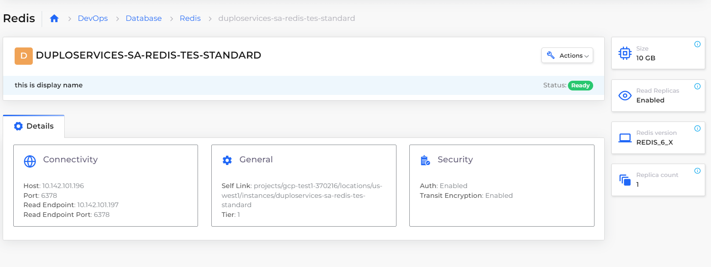

# Redis database instance

DuploCloud supports the [AWS Redis](https://aws.amazon.com/redis/) database instances. Redis stands for Remote Dictionary Server and is a fast, open-source, in-memory, key-value data store. Redis can function as a database, cache, message broker, and queue.

Redis delivers sub-millisecond response times, enabling millions of requests per second for real-time applications.

## Adding a Redis database instance

1. In the DuploCloud Portal, navigate to **Cloud Services** -> **Database**.
2. Click the **Redis** tab.
3.  Click **Add**. The **Add Redis Instance** page displays.\

    <figure><figcaption>
<strong>Add Redis Instance</strong> page
</figcaption></figure>

4. Enter the database **Name**.
5. In the **Display Name** field, enter a useful database name for reference.
6. From the **Tier** list box, select **Basic** for a Tier0 standalone instance; select **Standard** for a Tier1 High Availability primary/replica instance.
7. In the **Memory Size** field, enter memory size in gigabytes (GB).
8. In the **Redis Config** field, specify the Redis configuration.
9. In the **Labels** field, specify `key`/`value` pairs.
10. Select **Enable Auth and Security** to enable OSS Redis AUTH for the Redis instance.
11. Select Enable **Encryption-in-Transit** to select the TLS mode of the Redis instance.
12. Click **Create**. The Redis database **Details** tab displays on the **Redis** tab with **Connectivity**, **General**, and **Security** cards.\

    <figure><figcaption>
<strong>Details</strong> tab for a Redis database instance
</figcaption></figure>
