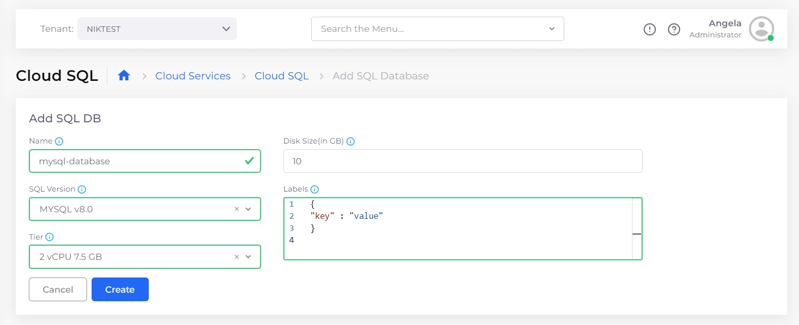
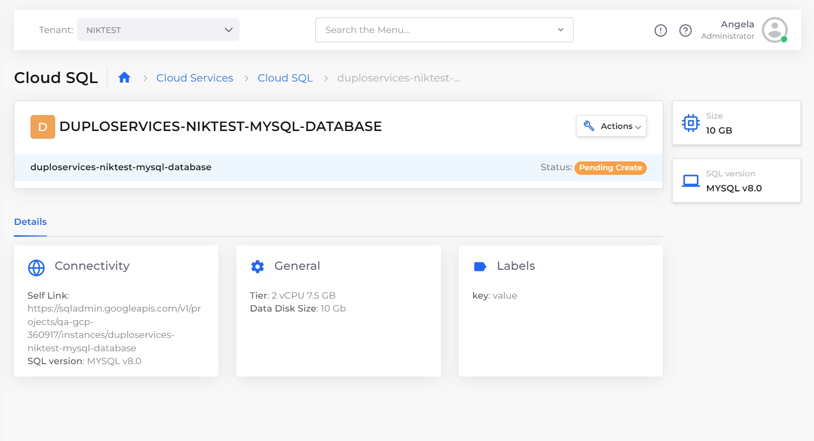
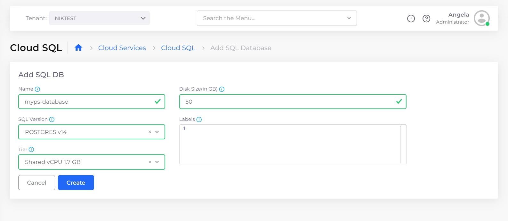
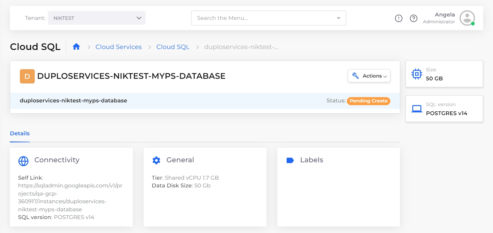
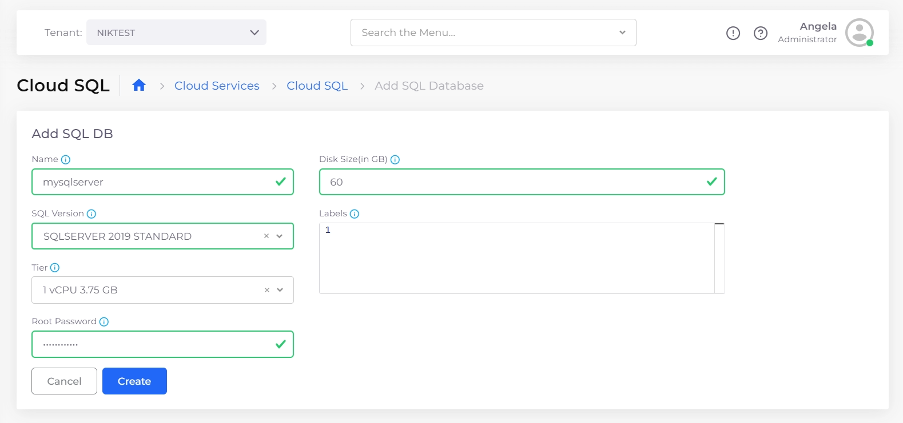
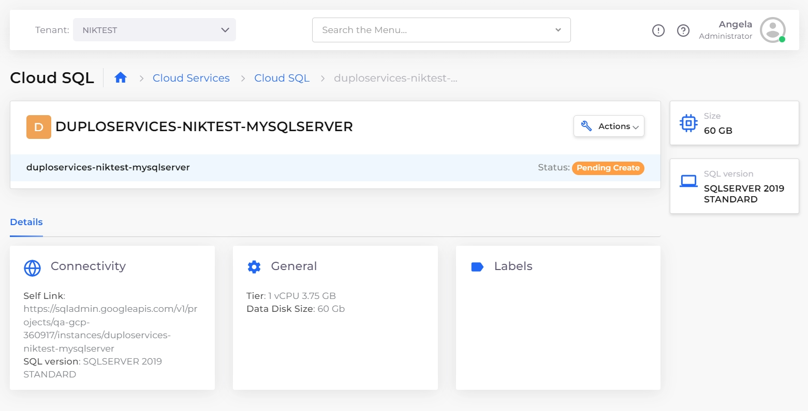

# Cloud SQL

## Creating a SQL database

Use this procedure to create:

* MySQL databases
* SQL databases with PostGres engines
* SQL databases with SQLServer engines

1. In the DuploCloud Portal, navigate to **Cloud Services** -> **Cloud SQL**.
2. Click **Add**. The **Add SQL DB** page displays.&#x20;
3. For MySQL databases and SQL databases with PostGres engines, provide the **Name**, **SQL Version**, and **Tier** (Machine Type/CPU). For SQL databases with SQLServer engines, provide the same inputs, in addition to **Root Password** and **Disk Size** in gigabytes (GB).
4. Click **Create**.&#x20;
5. Select your database from the Name column in the **SQL** tab. The **Details** tab displays information about the database you created.

Refer to the graphics below for examples of creating and displaying the supported SQL databases.

<figure><figcaption>
<strong>Add SQL DB</strong> page for adding a <strong>MYSQL</strong> database
</figcaption></figure>

<figure><figcaption>
<strong>Details</strong> tab for a created <strong>MySQL</strong> database
</figcaption></figure>

<figure><figcaption>
<strong>Add SQL DB</strong> page for adding a SQL database with a <strong>POSTGRES</strong> engine
</figcaption></figure>

<figure><figcaption>
<strong>Details</strong> tab for created SQL database with a <strong>POSTGRES</strong> engine
</figcaption></figure>

<figure><figcaption>
<strong>Add SQL DB</strong> page for adding a SQL database with a <strong>SQLSERVER</strong> engine
</figcaption></figure>

<figure><figcaption>
Details tab for created SQL database with a SQLSERVER engine
</figcaption></figure>

