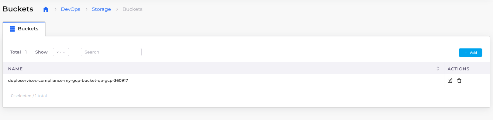
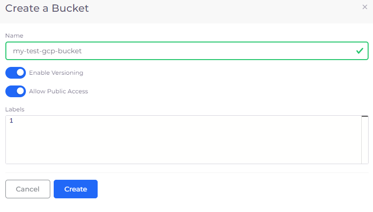

# Storage Buckets

In GCP, Cloud Storage Buckets are containers that hold your data. Everything in Google Cloud Storage resides in a bucket. Learn more about [GCP Cloud Storage](https://cloud.google.com/storage/docs/introduction) and [Cloud Storage Buckets](https://cloud.google.com/storage/docs/buckets).

## Creating a GCP Cloud Storage Bucket

1.  In the DuploCloud Portal, navigate to **DevOps** -> **Storage**. The **Buckets** page displays.

    <figure><figcaption>
<strong>Buckets</strong> page in the DuploCloud Portal
</figcaption></figure>
2.  In the **Buckets** tab, click **Add**. The **Create a Bucket** pane displays.

    <figure><figcaption>
<strong>Create a Bucket</strong> pane 
</figcaption></figure>
3. In the **Name** field, enter a bucket name.
4. Optionally, select **Enable Versioning** or **Allow Public Access;** enter a label string for your bucket in the **Labels** field.&#x20;
5. Click **Create**.&#x20;
