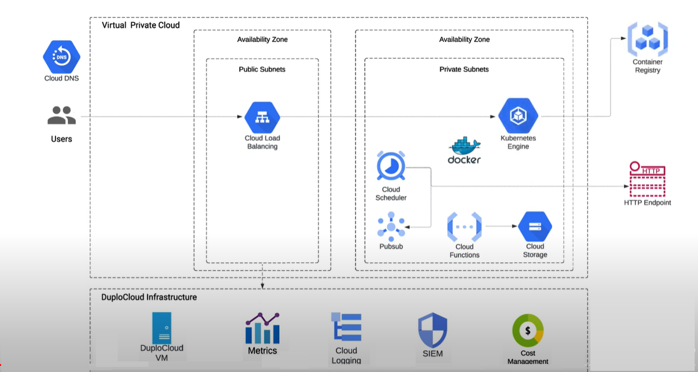

# GCP Overview

The DuploCloud platform installs a Virtual Machine resource within your Azure Subscription. It can be accessed using a web interface, API, and a Terraform provider. Login to the DuploCloud portal via SSO either through your GSuite or O365 login.&#x20;


Read through the [DuploCloud Platform Overview](broken-reference) and are familiar with DuploCloud terms such as [Infrastructure](../getting-started/application-focussed-interface/infrastructure.md), [Plan](../getting-started/application-focussed-interface/plan.md), and [Tenant](../getting-started/application-focussed-interface/tenant.md).


The DuploCloud platform installs a Virtual Machine resource within your Azure Subscription. It can be accessed using a web interface, API, and a Terraform provider. Login to the DuploCloud portal via SSO, either through your GSuite or O365 login.&#x20;

## Prerequisites

Before you begin, ensure that:

* DuploCloud Portal has been set up and you have access to it.
* You have access to your individual Slack channel for 24x7 support from the DuploCloud team.

Behind the scenes, a topology is created similar to the following low-level configuration in GCP.

<figure><figcaption>
DuploCloud Sample Architecture for GCP
</figcaption></figure>
