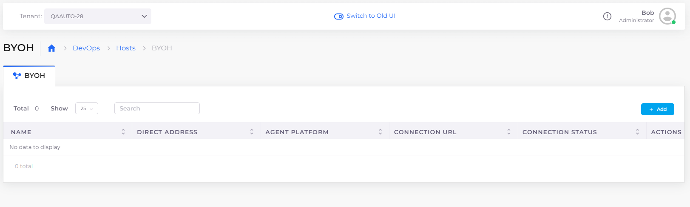

# Hosts (Virtual Machines)

Once we have the Infrastructure (Networking, Kubernetes cluster, and other common configurations) and an environment (Tenant) set up, the next step is to create VMs. These could be meant for:

* Compute Engine virtual machines in GCP
* Worker Nodes (Docker Hosts) if built-in container orchestration is used.
* Regular nodes that are not part of any container orchestration, where a user manually connects and installs applications.&#x20;

## Creating Hosts 

In GCP, you use the BYOH (Bring Your Own Host) option, which allows you to define accessible hosts to the DuploCloud GCP environment.

See the Services documentation for steps to [create Hosts and configure Kubernetes storage options](../gcp-services/containers.md).&#x20;

<figure><figcaption>
<strong>BYOH</strong> host tab on <strong>GCP Hosts</strong> page
</figcaption></figure>

## Host abstraction and isolation&#x20;

While lower-level details such as IAM roles and security groups are abstracted, deriving instead from the tenant, only the most application-centric inputs are required to set up Hosts.&#x20;

<figure><figcaption>
<strong>Add BYOH Hosts</strong> page 
</figcaption></figure>

Most of these inputs are optional and some are available as list box selections, set by the administrator in the Plan (for example, **Image ID**, in Host **Advanced Options**).&#x20;

There is an additional parameter labeled **Fleet Type**. This is applicable if the VM is to be used as a host for [container orchestration](../container-deployments/container-orchestrators.md) by the platform. The choices are:

* **Linux Docker/Native**: To be used for hosting Linux containers using the Built-in Container orchestration.      &#x20;
* **Docker Windows**: To be used for hosting Windows containers using the Built-in Container orchestration.
* **None**: To be used for non-Container Orchestration purposes and contents inside the VM are self-managed by the user.


If a VM is used for container orchestration, ensure that the **Image ID** corresponds to the Image in the container. Any name that begins with **Duplo** is an image that DuploCloud generates for Built-in container orchestration &#x20;

