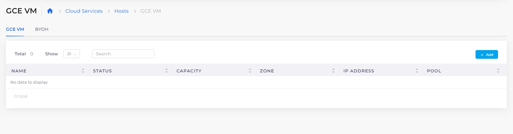
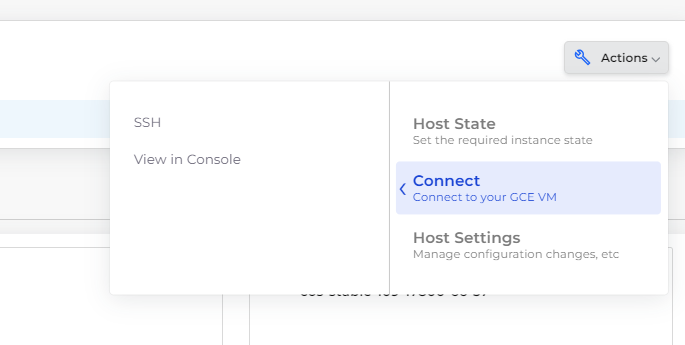

# Hosts (VMs)

Once we have the Infrastructure (Networking, Kubernetes cluster, and other common configurations) and an environment (Tenant) set up, the next step is to create VMs. These could be meant for:

* Compute Engine virtual machines in GCP
* Worker Nodes (Docker Hosts) if built-in container orchestration is used.
* Regular nodes that are not part of any container orchestration, where a user manually connects and installs applications.&#x20;

## Adding a GCP Host 

In GCP, you can use GCE VMs or BYOH (bring your own hosts) to get a Virtual Machine setup. Both of these are available through **Cloud Services** -> **Hosts** menu

See the Services documentation for steps to [create Hosts and configure Kubernetes storage options](../gcp-services/containers/).&#x20;

<figure><figcaption>
Hosts in GCP
</figcaption></figure>

## GCE VM

To create a GCE VM:

1. From the DuploCloud portal, navigate to **Cloud Services** -> **Hosts**, and select the **GCE VM** tab.&#x20;

<figure><figcaption>
The <strong>GCE VM</strong> tab
</figcaption></figure>

2. Click **Add**. The **Add GCE Virtual Machine** page displays.
3. Fill in the required fields.&#x20;

<figure><figcaption>
The filled <strong>Add GCE Virtual Machine</strong> page
</figcaption></figure>

### Supported GCE Host Actions

To access additional host actions, navigate to **Cloud Services** -> **Hosts**, and select your Host's name. From the **Actions** list box, you can select **Host State**, **Connect**, or **Host Settings** to perform the following supported actions:&#x20;

<table data-header-hidden><thead><tr><th width="133"></th><th width="180"></th><th></th></tr></thead><tbody><tr><td><strong>Host State</strong></td><td><strong>Stop</strong></td><td>Pause the GCE VM. </td></tr><tr><td></td><td><strong>Terminate Host</strong></td><td>Permanently delete the GCE VM.</td></tr><tr><td></td><td></td><td></td></tr><tr><td><strong>Connect</strong></td><td><strong>SSH</strong></td><td>Establish an SSH connection to work directly in the Google Cloud Console.</td></tr><tr><td></td><td><strong>View in Console</strong></td><td>View the VM connection details in the Google Cloud Console.</td></tr><tr><td></td><td></td><td></td></tr><tr><td><strong>Host Settings</strong></td><td>Update GCE VM</td><td>Manage/update configuration details for the GCE VM.</td></tr></tbody></table>

<figure><figcaption>
The Host <strong>Actions</strong> menu with <strong>Host State</strong> highlighted 
</figcaption></figure>

<figure><figcaption>
The Host <strong>Actions</strong> menu with <strong>Connect</strong> highlighted
</figcaption></figure>

<figure><figcaption>
The Host <strong>Actions</strong> menu with <strong>Host Settings</strong> highlighted
</figcaption></figure>

## BYOH Hosts

While lower-level details such as IAM roles and security groups are abstracted, deriving instead from the tenant, only the most application-centric inputs are required to set up Hosts.&#x20;

<figure><figcaption>
<strong>Add BYOH Hosts</strong> page 
</figcaption></figure>

Most of these inputs are optional and some are available as list box selections, set by the administrator in the Plan (for example, **Image ID**, in Host **Advanced Options**).&#x20;

There is an additional parameter labeled **Fleet Type**. This is applicable if the VM is to be used as a host for [container orchestration](broken-reference) by the platform. The choices are:

* **Linux Docker/Native**: To be used for hosting Linux containers using the Built-in Container orchestration.      &#x20;
* **Docker Windows**: To be used for hosting Windows containers using the Built-in Container orchestration.
* **None**: To be used for non-Container Orchestration purposes and contents inside the VM are self-managed by the user.


If a VM is used for container orchestration, ensure that the **Image ID** corresponds to the Image in the container. Any name that begins with **Duplo** is an image that DuploCloud generates for Built-in container orchestration &#x20;

